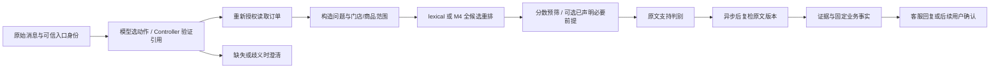

# C1：可信上下文与可配置知识服务

更新：2026-10-07。v2.2、逐候选隔离、typed v5、已声明必要前提门控及 Pi 原生动作工具选择已实现。早期开发记录为真实 Pi Session **10/10 对话、20/20 轮**、MySQL **14/14、24/24、172/172**，见 [Session 结果](./c1-session-results.md) 与 [业务结果](./c1-business-results.md)。**首次新固定验证15/24对话、36/45轮，C1未准入**；后续已曝光 Flash 开发为 **14/24、35/45**，Pro 单变量对照为 **17/24、36/45，另2轮未执行**，仍保留 Flash，见[新验证结果](./c1-session-validation-results.md)、[迭代结果](./c1-next-iteration-results.md)、[模型对照](./c1-agent-model-ablation.md)。竞争引用与精确选择恢复已完成[工程候选](./c1-reference-selection.md#已实现与可复现演示)，不能用工程通过更新上述真实模型成绩。语言诊断7/8、商品类别映射歧义、旧失败与评分修订保留，见 [首次审计](./c1-context-results.md)、[评分合同](./c1-runner-contract.md)。默认仍为 atomic + lexical，没有自动切换 QQ。


最新候选是[咨询问题出处v3](./c1-policy-scope-repair.md#新题真实结果与预算收尾2026-10-06)：在同一Flash主Agent/Pro判别配置下，新6场景、两臂24轮实际全执行，严格业务 **v2 9/12、4/6场景 → v3 11/12、5/6场景**；全轮P50 **4064→5391ms**。107次真实HTTP、四角色合计USD0.0479253/CNY0.0121745，来源/费用和24回复92判据独审通过。这是非盲合成题的整套中性查询、问题解析及恢复对照，只支持下一次有界候选验证；整体C1未准入，默认仍atomic + lexical、memory/id与DeepSeek。两臂005首轮共同宿主提示失败保留；随后共享提示已按下节工程路径修复，但不回写原9/12和11/12、不重跑闭合manifest认领12/12。

2026-10-07，[工作台接线片](./experiment-controls.md#工作台接线收尾与暂停2026-10-07)已完成v3显式候选参数、实际Session/配置快照与已采集四角色费用展示；原生Pi替代HTTP、Kimi K3 Max前端、Chrome合成宽/窄屏和全量validate通过，0业务远程/DB/QQ。这是工程入口交付，不增加真实模型或QQ验收。按用户要求，本轮提交推送后暂停，未完成准入项保留。

## 要解决的问题

用户常常省略对象：“那剩下的一张呢”“另一单已经退过了”“周末也能用吗”。只把历史聊天拼给模型，无法证明对象选对、规则适用或金额可信。另一方面，检索分数很高也可能只找到“此类规则尚未录入”，并没有回答用户索要的事实。

本轮将职责分开：模型选择有界业务引用，宿主验证引用并重新授权读取对象，知识服务再判断当前原文能否支持问题。没有依据时保留未知或澄清；授权、批准、金额、确认和幂等继续由业务边界校验。



必要前提门控只检查已标注的券数与状态约束，不证明全部政策条件成立。比如订单名称为“双人午餐团购券”，不能仅凭相似名称或用户说的“常规午餐”，认定它属于规则中的“常规套餐”。早期declared v1只声明券数和状态；现有显式`declared-v2`候选通过审阅的合成SKU目录，按精确shopId/productId判断规则类别，未知同名SKU不沿用已知类别。目录不保存购买时合同或真实商家商品资料，必要前提门控不证明整篇规则适用或退款批准。默认仍关闭该候选，效果与限制见[商品类别合同](./c1-product-category-guard.md)和[Session对照](./c1-category-session-development.md)。

## 个人实现与复用边界

| 部分 | 本项目实现 | 复用或限制 |
| --- | --- | --- |
| Agent 循环 | Controller 动作协议、前置校验与有限修复、确定性确认路径 | Pi SDK 提供模型调用、工具循环和生命周期；没有 fork Pi。 |
| 可信上下文 | 有界已授权订单候选、宿主实际展示的实付金额引用；当前工程候选另保留最多3个成功政策话题，歧义经实际展示与用户精确选择恢复，每次使用重新取证 | 当前在会话内有效。合法 token 只证明选择来源，不能证明任意自然语言理解正确；跨重启持久恢复仍属于 O4。模型话术不是金额、范围或批准依据。 |
| 知识服务 | 词项/M4 策略、阈值、binary/typed 判别、来源复检、超时及配置快照 | 复用现有百炼客户端和 Pi 模型客户端；不新建向量平台。线上仍使用 8 篇原创政策，参考 corpus 隔离。 |
| 审计和评测 | 原问/实际查询/可信范围、证据版本、逐篇判别、调用归因、失败与成本 | 工作台 UI 由 Kimi K3 Max 实现，Codex 负责后端契约、集成和审查；历史缺失字段不补造。 |

当前解析与证明入口：[`support-question-resolution.ts`](../src/support-question-resolution.ts)校验字面原文、合法前序及哈希；[`support-question-client.ts`](../src/support-question-client.ts)复用Pi无工具调用并处理期限、失败用量与费用；[`c1-session-validation-check.ts`](../scripts/c1-session-validation-check.ts)的`assertC1QuestionEvidence / scoreC1ValidationTurn`从实际原始请求/响应、SDK动作、授权范围及合法历史独立重建。完整审计留在宿主，普通模型工具返回不携带解析trace。

关键基础入口：[`support-context.ts`](../src/support-context.ts)、[`support-reference-selection.ts`](../src/support-reference-selection.ts)、[`support-controller.ts`](../src/support-controller.ts)、[`support-session.ts`](../src/support-session.ts)、[`knowledge-service.ts`](../src/knowledge-service.ts)、[`evidence-support.ts`](../src/evidence-support.ts)、[`knowledge-evaluation.ts`](../src/knowledge-evaluation.ts)。

## 为什么这样设计

**使用有界业务引用。** “另一单”只有在候选唯一时才能定位；并列多单或过多候选需要澄清。金额引用来自宿主真实展示与订单付款明细，缺少折扣分摊、券状态或唯一对象时不猜。展示剩余实付金额不代表支持部分退款，也不代表商家已批准该金额。

**重排与事实支持分别负责相关性和充分性。** M4 在当前小语料上直接重排范围内文档，避免额外检索平台成本。阈值较高可能挡住有效规则；降低门槛会增加候选及判别费用。binary 曾把信息缺失声明当作可答依据，typed 增加可审计分类；typed 首版又误拒了“需要商家确认”这类流程规则。因此新版本区分规则咨询、实例状态和明确的边界问题，效果仍须通过同输入开发对照及新的固定验证证明。

**逐候选错误与语义错误分开。** typed 输出的一项引文不合法，不应丢掉另一项已经逐字验证的有效证据。宿主先校验整个 JSON 与 ID 集，再隔离可归属的无效项；全项无效仍不可用。业务可以凭剩余正例继续，但这轮判别完整性仍失败，不将 invalid 算作正确拒收。相同历史输出的零网络回放验证了这个工程收益；新实测仍单列分类、引用和模型动作失败。

**当前对象资格需要完整适用前提。** 只摘取规则中的通用句，可能把多券或已核销规则用于单张未核销券。当前 Controller 将本轮授权的券状态数量提供给知识服务，typed v4 区分当前资格和一般条件咨询。它帮助模型判断适用性，但不是宿主对任意规则的确定性语义证明；缺失用户指代也不能从候选文档反推。v4 MySQL 单券咨询仍接收了多券规则，而现有业务断言未覆盖这一项，说明继续堆提示不能提供确定性保证。本轮增加可显式启用的 declared 候选：在独立 JSON 中声明有原文哈希、范围和逐字依据的必要前提，由宿主核对 fresh 券库存；一般规则咨询保留原模型判别。历史v1只表达最少券数及指定状态是否存在；随后declared-v2增加已审阅shop/SKU类别目录，源码为`loadKnowledgeApplicabilitySnapshot(2)`及`gateKnowledgeApplicability`，未知类别保守排除。两版都不按 sourceId 写业务分支，也不将通过当作整篇规则适用或退款批准。它需要人工审阅与原文变更时重新标注；工程实现和本轮验证见下节。

**原文版本在异步前后复检。** 提供商调用期间规则可能变化，当前服务在完成后再次读取并比较作用域内文档。发生变化就停止采用旧依据；已完成的旧输入判别仅作审计。没有保存历史交易规则快照，不能据此宣称能恢复购买时政策。

**协议修复发生在业务动作锁前。** 模型可以在预算内修复未执行的错误动作引用。业务操作一旦启动，结果或失败即锁定，防止把不确定执行当作“换个参数再试”。这项改动来自真实业务回归里的唯一焦点失败，不绕过金额、身份或幂等保护。

**取消阻止晚结果发布。** 实际 Session + faux 检查复现了取消后订单结果仍写入焦点的问题。修复在服务返回和异步焦点写入后核对取消与轮次身份，延后发布会话结果；旧轮失败不会清除新轮引用。已经完成的操作审计和固定收据保留，已开始的存储写入不能宣称被取消回滚。

## 验证与面试演示

面试主线先从已验证的[售后演示路线](./after-sales.md#面试演示路线)开始，串起成功、澄清、越权与失败恢复，再解释 C1 正在解决的多轮引用问题。售后平台结果属于历史默认架构，本页 Controller/检索候选另有合同和失败记录；2026-10-06 补材料时只静态核对命令、源码与记录，没有重验真实 QQ，也没有给历史结果追加当前通过标记。

| 讲解入口 | 调用链、取舍与证据 |
| --- | --- |
| 谁负责循环，谁负责业务安全？ | [`createSupportSession`](../src/support-session.ts) 复用 [`createSession`](../src/agent.ts) 的 Pi 工具循环和请求生命周期，只暴露 `support_action`；`SupportController.createTurn → validate/execute → getOrder/searchKnowledge` 负责有界协议和本轮证据。确认与幂等在[售后 Store 边界](./after-sales.md#面试讲解的源码入口)，不是 Prompt 保证，也没有自行重写 Pi 核心。 |
| 多轮上下文如何被使用？ | `rememberReferenceChoice → 实际候选展示 → 用户单行选择 → host receipt → 下一轮重新授权取证`，见[竞争引用合同及演示](./c1-reference-selection.md)。成功 previous 更新同一分支和真实原问链；v2完整新问题可以查询，但不会清掉尚未解决的选择；v3在宿主原文/引用校验成立且返回含已解析问题的ready结果时，才解除当前policy待澄清；实验评分随后独立重建原始HTTP/SDK出处，不能任意清除竞争引用。保留自然只读续问的代价是 `focus/standalone` 仍有模型语义误选可能。 |
| 为什么检索命中还不能答？ | [`buildSupportEvidenceBinding`](../src/support-evidence-context.ts) 绑定真实原问、fresh 订单事实和范围，`KnowledgeService.search` 再执行候选排序、必要前提、支持判别和来源复检。与仅按分数接收相比，增加判别费用、延迟及人工标注维护；[A1 支持性结果](./a1-support-results.md)是离线结果，[C1 首次验证](./c1-session-validation-results.md)保留在线语境的误拒和引用失败。 |
| v3多一次解析，收益和代价是什么？ | [`SupportController`](../src/support-controller.ts)先按当前原问或合法previous取得问题出处，再生成中性fresh查询；[`SupportSession`](../src/support-session.ts)清理旧话题或解除已证明的待澄清。新题严格9→11/12，解决省略误收及恢复失败；增加11个question HTTP、P50约1.33秒，仍有共同初次提示失败。比较的是整套方案，不能单独归因于解析模型。公开[24轮结果](../data/c1-question-session-development-results.json)不含完整raw证明，完整原生审计在本机忽略目录。 |
| 为什么不直接换更大的 Agent？ | [Flash/Pro 单变量开发对照](./c1-agent-model-ablation.md#实际结果与选型)记录通过对话14/24→17/24，但两组仍未准入，Pro另有2轮未执行。批次估算从 USD 0.050437296 + CNY 0.032034 到 USD 0.131307264 + CNY 0.0352745；币种不换算，不能由一次开发对照宣称泛化提升。 |
| 证明了什么，还有什么没做？ | [首次固定验证](./c1-session-validation-results.md)、[后续迭代失败](./c1-next-iteration-results.md)与[工程选择恢复](./c1-reference-selection.md#已实现与可复现演示)分开。样例通过、实际回复审阅、QQ 平台验收和商业运行是不同层级；当前没有真实商家外呼或资金接口，O4/O5及新题准入继续待做。 |

无需真实模型或数据库的候选展示可运行 `node scripts/support-reference-selection-check.ts`、`node scripts/support-reference-session-check.ts`：前者检查绑定/版本/有效期，后者通过实际 Pi/faux 检查展示回执、连续恢复、错误选择和 fresh 读取。它们是确定性工程演示，不评价模型理解自然语言的正确率。主业务演示、真实模型脚本的准备条件和历史指标复用[售后说明](./after-sales.md#面试演示路线)，无需另建一套面试应用。

当前工程验证包括 `npm run validate`、真实 MySQL 的 business/refund/merchant-notifications 检查；它们验证所列工程合同，不抵销陌生问法上的失败。此前 typed v2 / 旧协议业务 run 为 `990dac49-10c3-46ab-a6dd-fdcb6e0c8f69`，24 轮 P50/P95 为 1767/4069 ms，估算 $0.015789492 + ¥0.0030625。它是单组最终候选，历史 lexical 结果不能充当同代码配对。

工程检查验证身份、范围、状态、超时与协议；上下文 runner 调用真实 rerank/support，但订单和动作由 fixture 驱动；业务 runner 另外执行真实模型、MySQL 和本地 QQ handler。三者不合并成一个“生产成功率”。业务和资金都是合成的，真实 QQ 传输/手机显示另行验收。

可按以下顺序演示：

1. 查询本人订单，再用省略问法追问；展示当前授权对象、实际检索问题和规则版本。
2. 切换到另一已授权订单；多个候选时展示澄清，跨用户指令展示拒绝。
3. 询问未录入的具体政策事实，对照相关文档与最终拒收；再问明确流程条件，展示保留限制的有效证据。
4. 商家批准后先生成待确认方案，明确确认后执行一次模拟退款，重复确认只返回原结果。
5. 工作台查看 A/B 的成功、失败、延迟、分类理由与分币种成本，解释增加判别模型的代价。

复现命令见 [实验开关](./experiment-controls.md#c1-业务知识服务开关) 及两份结果报告。每次真实运行都会产生新请求和隔离订单，不能保证模型输出逐字相同。


### 最新v3路径与0远程复现

调用链为 `prepareSupportPrompt → 原生Pi support_action → SupportController重新授权读取 → questionResolver.resolve → buildSupportEvidenceBinding → KnowledgeService.search → 宿主实际Reply`。解析只接当前原问和合法同范围前序原问，不接订单事实、检索文档或模型改写。实例范围变化或无法完整解析时清除旧政策引用并要求重述；当前完整问题经宿主出处/引用校验且得到ready结果才解除policy待澄清；原始HTTP/SDK的独立重建是事后实验评分，不是运行时调用checker。问题完整性、资料充分性、商家批准、用户确认是各自独立的检查。

工程演示可运行：

```sh
node scripts/support-clarification-check.ts
node scripts/support-question-session-check.ts
node scripts/support-question-evidence-check.ts
node scripts/support-question-experiment-check.ts
```

第一条检查默认v2/显式v3的实际宿主完整重述提示，模型即使生成完整说明及伪造退款也不能替代固定Reply；澄清阶段业务/FAQ/解析均0。第二、三条通过原生Pi替代HTTP演示合法续问、完整重述恢复、跨单/过期范围及费用/来源篡改拒绝；第四条验证通用实验执行器同一接线的参数生效、取消账本与跨轮隔离。这些固定工程输入不评价模型自然语言能力，不连接数据库或QQ。真实语义证据只能引用上述已关闭新题结果，不能重新运行它的live命令；显式本机CLI候选另见[客户端与费用入口](./c1-policy-scope-repair.md#真实解析客户端费用与独立v3证明2026-10-06工程候选)，该入口会使用本机业务库并实际请求模型。

## 保留的限制与下一阶段

2026-10-07新增[有界到账咨询](./c1-channel-consultation-contract.md#已实现路径与复现2026-10-07)：CLI/QQ宿主处理完整`查询到账 [订单号] 银行卡|电子钱包`，复用Pi会话、现有KnowledgeService词法范围/原文复检及Reply渲染。个人新增原始输入/条件合同、独立合成渠道规则的全篇hash绑定、整个目录冲突及末次授权后的版本复核。真实只读MySQL唯一批次11/11、相关选中状态不变，Pi/faux与QQAgent本地发送证明实际回执及咨询不能变成退款批准；DB批次在最后版本窗口修复前，修复另有离线负控。不含普通自然语言修复、远程模型或真实QQ成绩，也没有银行到账查询；trace仅为可选宿主观察，未接工作台持久化。

- **商品类别仅有已审阅目录的候选能力。** `declared-v2`按精确shop/SKU目录检查，未知同名SKU不套用旧类别；模型productMention或规范名称匹配都不能替代目录。目录是合成资料，缺少购买时政策绑定，不能把必要前提通过解释为完整当前资格。
- **动作完成已复用 Pi 请求扩展点。** 1.0.0 的 `before_provider_request` 在首个有效动作开始前指定 `support_action`，开始后恢复 auto。本轮真实 MySQL 批次实际观察到 23 次指定工具、21 次 auto；仍需单独评分动作类型。仅用于 openai-completions 非 thinking；其他适配器保留原行为。保留修复上限、取消及操作锁，业务失败不会强制重复操作，没有另造 Agent 循环。
- 历史开发回归未评自然语言完整性；首次固定24对话/45轮验证已按预声明标准逐轮审阅实际回复，36/45轮通过。它是Codex审阅供人复核，仍不等于真人满意度或生产答案准确率。
- 未实现部分退款执行、购买时规则快照、核销争议调查或银行到账查询。相似公开场景与差异见 [真实业务约束](./realistic-business-cases.md)。
- 20/40/80 轮、通知期间切单及跨重启的可信焦点恢复由 O4 验证；24 个固定业务对话 / 79 轮仍待 O4/O5 的共同合同验收。
- 当前样本很小，所有公开开发结果都不是泛化保证。原始失败与已曝光固定验证保留；修改后的方案使用独立版本和后续新题，不回写旧标签。
- 固定业务验证的数据与 manifest 未改；旧 checker 对全文件哈希的核验仅允许精确的一项成本来源元数据扩展 `price_estimate`，去除该单一扩展后须仍匹配原始哈希。任何其它合同改动继续拒绝，这不是放宽业务评分。


## 早期候选：动作完成与declared v1必要前提

2026-10-06，工程检查、单次开发 Session 与 MySQL 回归已完成；下列实现及开发结果不代表 C1 新固定验证已准入。

- 动作完成复用 Pi 1.0.0 `before_provider_request`：首个合法动作开始前指定 `support_action`，schema / 引用错误仍在原预算内修复。合法动作开始（包括业务拒绝或异常）后恢复 auto，避免强制重复操作；取消和初始化失败也不强制调用。服务端若忽略 tool choice，保留真实失败收据，不补造成功动作。
- 商品描述无法对应时，固定回执展示本轮授权订单及规范商品名，要求用户完整重述订单、商品和问题。未建立成功政策话题，不能把一个“是的”解释为已验证的旧话题。原周末题及首轮期望保留，新交互需独立验证。
- 必要前提声明位于 [`knowledge-applicability.json`](../data/knowledge-applicability.json)，由 [`knowledge-applicability.ts`](../src/knowledge-applicability.ts) 读取及校验；旧 seed、原始 corpus 和 gold 不变。先保留原 rerank / 分数 / Top5，再筛前提、做 support、复检原文。被排除的位置不补位，raw rank 与候选 rank 保留。
- fresh 事实检查订单 / 券 ID、券与订单项关联、数量完整性、单一商品范围和 asOf；用户或模型报的数量不进入门控。这里只数存储状态：unused 加已过期日期不能自动改写为 expired。因此过期规则的必要状态投影容许 unused 或 expired，日期适用性仍需后续判断。
- 结果分为 matched、mismatched、unknown、not_checked、none_declared。仅 mismatched 是已知前提不符；unknown 暂缓，其他有效证据可继续返回但严格完整性失败，无有效证据则 unavailable。none_declared / not_checked 不等于已证明适用。current-order 候选缺少元数据或绑定失效整次不可用；无实例语境的未登记 reference 文档仍走原判别。
- 快照绑定原文、title、tags、scope、status 和依据引文，每服务实例只加载一次；变更需新建服务。模型判别和原文异步复检保持原行为。评分器重建本轮可信事实和相同门控，校验冻结快照及实际轨迹，不能靠 trace 自报排除项过关。

对照维度为 `knowledgeApplicability=model_only|declared`，默认 model_only，见 [实验配置](./experiment-controls.md#c1-业务知识服务开关)。固定业务授权、范围、确认和幂等不受该开关影响。新阶段没有额外 LLM 请求，但是否节省实际费用、是否降低误接收，以及 Top5 不补位的召回代价，都必须以真实运行报告为准。
