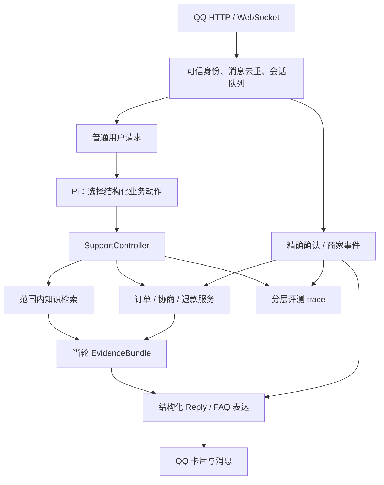

# 客服 Agent v2：效果优先的优化方案

日期：2026-10-05。状态：**设计已确定，O1/O2/O3 首批已实现，正在分阶段验证；完整 v2 尚未验收**。本文替代上一版“小改动优先”的优化顺序。用户允许较大调整，目标是在成本可解释的前提下提高业务完成率、检索效果和多轮恢复能力，并留下可用于面试的对照证据。已执行实验、失败修复和待办见 [v2 实施记录](./v2-implementation-results.md)。

依据为[客观评测基线](./objective-evaluation-results.md)、[检索与上下文实验](./retrieval.md)及当前源码。方案先提交为 `fd9440f`，随后按用户授权开始实现并使用本机环境变量调用百炼；运行时默认保留 atomic，Controller 可显式选择，专属检索尚未进入在线业务。自然语言答复质量不评分，不引入 LLM judge。下文门槛仍是目标，不能以开发集成绩替代留出验收。

## 1. 决策摘要

| 领域 | 确定的主方向 | 成本与取舍 |
| --- | --- | --- |
| 业务执行 | **Pi 选择结构化动作，宿主 SupportController 完成动作内部流程，Store 保证授权和事务** | 允许重构工具接口、Prompt/Skill 和业务编排；增加显式合同的维护，减少流程依赖模型逐步记忆 |
| 检索 | **系统比较 BM25、dense、RRF、专属 rerank**；可扩展候选为混合召回后重排 | 小语料“范围内全候选直接 rerank”也是正式候选；上线实测效果、费用和时延合适的路线 |
| 会话 | **持久化订单焦点与待办引用，按需重读业务事实，限制历史上下文** | 解决当前 20 轮重建会话的遗忘风险；长期摘要按实验收益决定 |
| 确定性路径 | **精确确认及商家通知由宿主处理** | 通知目标为零模型请求；保留串行、去重、失败恢复及原会话续接 |
| 评测 | **v2 共同业务契约 + 分层 trace + 新留出集 + 消融** | 新增评测开发成本，换取可解释的新旧比较；冻结历史 v1 |
| 模型 | 先固定现有模型，架构定型后再比较更强模型与按需升级 | 防止同时换模型和架构，无法解释收益；模型路由不是首个实现项 |

继续复用 Pi SDK 1.0.0 的模型/工具循环、现有 QQ 双入口、MySQL 和退款事务。允许调整宿主适配层、表结构、工具合同与上下文，不以“必须只改几个文件”为限制。现阶段没有证据要求 fork Pi 或另建通用工作流引擎；未来发现明确扩展点缺口，再用复现证据决定。

## 2. 基线与优先级依据

| 已观察到的事实 | 推导出的工作方向 |
| --- | --- |
| readonly 三次均 20/20 场景、218/218 检查 | 作为保底回归；不能代表所有未见问法可靠 |
| workflow 三次 3/5、3/5、4/5 场景；第三次 292/293 检查 | 场景完成率优先于检查总分；取证和分支需要更明确的执行机制 |
| `approved-lifecycle/6` 两次先查商家再查 FAQ；四项工具和方案事实正确 | 存在当前 Skill 顺序不稳定；并非金额或归属失守 |
| `claimed-approval/3` 三次只查到 pending，漏当轮订单及规则 | 提示和分支可能有歧义；未准备、执行退款，不能称越权退款 |
| 全量难题 Recall@5 44.74%，选集难题 34.62% | 优先解决语义召回和候选覆盖；仅重排旧 Top5 不够 |
| 全量上下文拼接有 12 个排名改善、9 个退步；保守方案仍新增无答案非空召回 | 上下文扩写需独立消融，并带拒收与歧义检查 |
| workflow 完整第三轮的 4 个通知用了 8 次模型请求、36,010 Tokens，最终为固定卡片 | 宿主通知是较明确的降调用候选，需验证续接和恢复 |
| 当前会话仅在内存中，达到 20 轮会重建；业务任务已持久化 | 应补会话定位信息的恢复；无需复制业务批准状态 |

检索失败分解来自 `.runtime/retrieval-baseline.json` 的全正分排名：

| corpus | 未达 Top5 | 空召回 | 有候选但相关文档未进入排名 | 相关文档排名 >5 |
| --- | ---: | ---: | ---: | ---: |
| 选集 70 题 | 23 | 17 | 6 | 0 |
| 全量 212 题 | 69 | 51 | 16 | 2 |

两套 corpus 有重叠，92 个失败评测项不是 92 个独立问题。已有 25 个业务案例/56 轮和 212 个参考检索问题均已参与开发。工程 15/15 通过是有限场景的边界证据，不是生产安全保证；本轮模型评测使用本地 QQ 发送替代，不证明真实平台送达。

## 3. 业务架构：结构化动作与宿主编排

### 3.1 方案比较

| 方案 | 能解决什么 | 局限 | 定位 |
| --- | --- | --- | --- |
| 原子工具 + Prompt/Skill + 末端取证 guard | 保留自由工具规划，能阻止部分缺证据操作 | 顺序、漏分支仍依赖模型；未调用 prepare 的漏查无法由末端 guard 修复 | 保留为基线；提示一致性只作为对照 |
| **结构化动作 + SupportController** | 显式执行依赖、记录证据、稳定高风险分支，可能减少模型往返 | 仍会选错动作；需维护动作 schema 和业务合同 | **主方案** |
| 全会话持久工作流图/通用引擎 | 复杂补偿、人工介入和多阶段审批 | 与现有任务/退款状态重复；容易把等待中的聊天绑定在一个流程上 | 出现这些真实需求再评估 |



图中 EvidenceBundle 用于证据追踪，**不构成退款授权**；最终权限、金额、批准、有效期、展示/确认和幂等仍由 Store/事务重新验证。

### 3.2 动作合同

首版向 Pi 暴露一个 `support_action` 工具，使用带 `kind` 的判别联合。模型经现有工具选择直接产生动作，不在每轮前额外调用一个分类模型。固定动作如下，具体字段在实施第一步冻结：

| kind | 模型可提供的业务参数 | 宿主职责 |
| --- | --- | --- |
| `policy` | 原问题、可选订单引用 | 确定可见范围、检索证据；未知事实受控返回 |
| `order` | 订单引用 | 查询本人订单快照 |
| `refund_eligibility` | 订单引用、原问题 | 读取当前订单、适用规则和必要状态，返回资格证据 |
| `merchant_prepare` | 订单引用、用户原因 | 核验条件并准备协商确认；实际提交仍走精确确认入口 |
| `merchant_status` | 订单或任务引用 | 查询真实协商状态，不准备退款 |
| `refund_prepare` | 仅订单引用 | 按退款分支取证；沿用当前已核验任务，满足条件才准备确认方案，不接受原因字段 |
| `refund_status` | 订单或操作引用 | 查询持久执行记录，不因普通同意执行 |
| `clarify` | 缺失字段、澄清类型 | 返回受控澄清，等待用户补齐 |
| `non_business` | 问候/不支持请求类型 | 返回简短的受控响应，不访问业务数据 |

可信身份、门店权限、商家批准、可退金额和“已确认”均不由模型提供。订单引用也是不可信定位参数，每次访问重查归属。第一版每轮只允许一个业务动作；多意图优先澄清或分轮处理，列入能力限制和误澄清指标。同轮重复动作由 requestId 去重，冲突动作受控失败，不执行两套副作用。

2026-10-05 动作合同小版修订为 v2.1：真实运行 `d6b902fc-3b28-402d-8da5-7b4755a223c0` 中，模型把已登记任务的原因填入退款动作，而本轮用户没有重复原因，触发了无必要的澄清。`RefundStore.prepare` 实际只接收身份、会话来源和订单号，因此删除 `refund_prepare.reason`，不再让模型提供退款服务不用的参数。`merchant_prepare.reason` 仍须匹配当前用户原文；已批准任务、订单归属、金额和确认等校验保持不变。旧字段按严格 schema 拒绝，最多允许一次有记录的格式修复，不由宿主静默丢弃。原失败 run 保留，共同业务 checker 与题集不变；修订后使用新的动作、实现及 Prompt/Skill 快照重跑，不与旧版合并为同配置稳定性结果。三次开发复测及局限见 [实施记录](./v2-implementation-results.md#2-真实业务开发对照)。

问候与不支持请求用 `non_business` 正常退出，不强行归为订单动作；需要动作却未调用工具、schema 错误、选错目标、漏意图仍计模型/协议问题。允许最多一次明确记录的格式修复；不得由宿主猜测正确动作后，改记成模型正确。Pi 标准工具循环通常包含一次动作选择和一次工具后表达，**未实测前不承诺每轮只调用一次模型**。后续若固定卡片可以省掉最后表达，再单独验证 Pi 的终止方式和会话一致性。

### 3.3 Controller 内部合同

退款申请，包括用户自称“商家批准”和过期方案重建，采用：本人订单 → 当前订单范围的适用规则 → 真实商家任务 → approved 且其他条件满足时准备方案。不存在有效本人订单则立即停止；其他合法短路由分支合同预先声明，不能测试失败后临时添加。退款进度、单纯协商进度、纯咨询各走自己的路径，不全部套用退款准备流程。

现有六项能力留在服务层；新路径不同时向模型暴露可绕过 Controller 的原始 prepare 工具。实现入口集中于 [agent.ts](../src/agent.ts)、[QQ handler](../src/qq-agent.ts)，授权和事务复用 [refunds.ts](../src/refunds.ts) 与 [订单服务](../src/coupon-store.ts)。Prompt/Skill 主要说明动作选择、澄清和表达，代码承载确定性的前置条件。

每轮记录 `requestId / trustedRoute / action / orderRef / actualCalls / ruleSourceId+version / taskState / observedAt`，只接受宿主实际成功读取的证据。政策检索的“命中”与“足够支持当前政策事实”分开；文本知识不能覆盖结构化退款规则。证据有变更风险时以执行事务重读为准，不靠时间戳或会话摘要授权。

状态机属于 merchant task/refund operation。等待协商期间仍能问 FAQ、查询进度或切换明确订单，不给整个聊天设置一个阻断式“等待商家”状态。

### 3.4 确定性通知和迁移

商家通知改为：进入原用户串行队列 → 领取通知 → 重读当前任务 → 固定卡片 → 记录发送结果与宿主事件引用。队列 busy 时仍保留 pending，领取后状态不明（claimed/unknown）不自动重发，用户可主动查询；禁止先领取再排队吞掉通知。目标为零模型请求；保留现有领取/重启语义。通知中的订单是事件引用，**不能无条件覆盖用户已切换的当前订单焦点**。同时存在多个待办时，后续“那就退款”应澄清。

先迁移售后动作，再覆盖查询。旧架构保留为实验对照/回滚；会话固定实现版本，版本切换在明确边界恢复引用。影子路径只做路由判断，不双写协商或退款。精确确认一直由可信入口执行；业务成功后发送失败不能把动作重跑成第二次退款。

## 4. 检索：语义召回、重排与证据拒收

### 4.1 主候选与阿里云选型

可扩展主候选为：**active/门店/套餐过滤 → BM25 与 dense 双路 → RRF → 专属 rerank → 证据接收/拒收 → 最多 5 条原文证据**。当前线上 8 篇模拟规则、参考全量 35 篇，“范围内全部文档直接 rerank”同样必须实现对照；它可能效果更好、调用更少。先确定实验与选择规则，不能提前宣布混合链路胜出。

dense 首轮固定 `text-embedding-v4`、1024 维；该配置受官方接口支持。文档向量按模型、维度和文本哈希缓存；查询向量单列用量。8/35 篇先在进程内精确计算余弦相似度，MySQL 保存元数据/版本，离线索引可重建。[阿里云 Embedding API](https://www.alibabacloud.com/help/en/model-studio/text-embedding-synchronous-api)

专属 rerank 首轮固定 `qwen3-rerank`，使用 QA 检索指令；当前模型目录支持最多 500 篇候选。`qwen3.7-text-rerank` 留作后续独立模型实验，不因名称更大就预设更好。[阿里云模型目录](https://help.aliyun.com/zh/model-studio/embedding-rerank-model)

RRF 通过名次融合不同尺度的检索得分，首轮固定 `k=60`；BM25 初始 `k1=1.2,b=0.75` 为本项目实验配置，不声称最优。先保持与现有 lexical 一致的规范化/分词基础，避免参数、分词、候选池同时变化。[RRF 官方机制说明](https://www.elastic.co/docs/reference/elasticsearch/rest-apis/reciprocal-rank-fusion)

### 4.2 必做对照

| ID | 路线 | 用来判断什么 |
| --- | --- | --- |
| M0 | 当前 lexical → Top5 | 已有基线，包含现有规范词和加权改进 |
| M1 | BM25 → Top5 | 标准词频/长度处理是否优于当前评分 |
| M2 | dense → Top5 | 语义召回能救回多少词面不匹配问题 |
| M3 | BM25 Top20 + dense Top20 → RRF → Top5 | 双路是否优于最佳单路 |
| M4 | 范围内全候选 → rerank → Top5 | 当前小语料不经上游截断的实际效果 |
| M5 | 当前 lexical 正分 Top20 → 同一 rerank → Top5 | 排序提升与候选缺失各占多少 |
| M6 | RRF Top20 → 同一 rerank → Top5 | 相比 M3 的重排收益，以及相比 M4 的取舍 |

所有路线共用可见文档、原始 query、gold 和输入文本格式。无可见文档直接返回空；候选数采用 `K=min(20,范围内可见文档数)`，lexical 正分不足 K 时如实记录。跨路线共同主指标使用 Recall@1/@5 与 MRR@5；保留完整排名 MRR 作为诊断，并标候选深度。M3 合并可能有 40 篇、M6 只重排 20 篇，另存 M6 重排前同 20 篇候选的排序，不能把截断差异归因于重排。M4 是实测参考，不是理论上界。

先用开发集选一个候选，再进入留出验收。不能只比较 M6 与最弱 M0：必须报告 M3 对最佳单路、M6 对 M3、M6 对 M4。若 M2 或 M4 更好，则直接用它，保留其他路线为实验成果。向量数据库/ANN 只有在索引规模、内存或 P95 证明确有需要时再引入；500/5,000 文档干扰集可用于规模测试，未经新 gold 标注不用于宣称检索质量提升。M4 超过 provider 单请求文档数、单篇或总 Token 限制时标“不适用”，不能静默截断或把多批分数直接混排成全局名次。

### 4.3 文档、接口和降级

- 所有路线在候选构造前使用同一 active、门店和套餐过滤，缓存/索引也必须带作用域与版本。检索时排除过期索引，最终返回前再验证 active/版本；禁止先跨域排序再过滤。
- 当前短规则按完整政策文档处理；长文档出现截断或主题混杂后，另试分块。分块保留 parentId、sourceId、scope、版本与原文位置，按父文档去重，冻结 chunk 到 gold 的映射。
- 35 篇参考政策与线上 8 篇规则分别建立标签和报告，参考语料不能写入业务库改变批准条件。修改知识内容属于新 corpus，不与纯排序改进混报。
- 使用 Node `fetch` 和窄 provider adapter 即可。`qwen3-rerank` 的 `/compatible-api/v1/reranks` 路径、区域主机及 Key 权限在实施前核验。返回 index 必须唯一且在输入范围内，分数有限，映射回原文，不接受模型生成的替代政策。[阿里云 Rerank API](https://help.aliyun.com/en/model-studio/text-rerank-api)
- 配置快照包含模型、地区、指令、维度、文本/候选顺序哈希、TopK、超时和重试。初次只用公开/合成数据；Key 使用本机环境变量，不进报告/Git。
- 原始 API 错误、超时、空结构、usage 缺失均入库。在线采用有界请求与本地检索降级；降级证据仍经过接收门槛，不能因 provider 出错放宽政策或自动批准。降级率与 rerank 成功率分别统计。

### 4.4 无答案与上下文

全候选重排会给无答案问题排出第一名，所以 **A1 证据接收/拒收是上线前必做项**。先标注文档是否支持问题事实，区分“明确未录入/未知”的有效证据和无关文档。原始排名、接收证据、最终业务动作分层记录；候选非空不称作回答幻觉。

比较“全接收”诊断基线与“范围/版本有效 + 开发负例校准的接收策略”。可评估 top score、同请求分差和匹配特征，但阈值必须在固定模型/语料/序列化下校准并留出验证。官方相关性分数仅对当前请求相对有效，**不能把 0.5 当通用答案概率或跨模型统一阈值**；若简单策略达不到拒收门槛，再单独比较小型相关性判别器及其额外成本，仍只评文档相关性。判别器是被测生产组件，正确性由冻结的事实支持标签判定，不能兼任自己的 judge。[响应分数说明](https://help.aliyun.com/en/model-studio/text-rerank-api)

检索主路线固定后再做：

1. **C1，必做实验**：仅补充本轮服务读取的行业/订单事实，保留原问题；多轮省略需先确定唯一订单，权限绝不由历史文本或参考 `ctx` 推断。检查否定、换单、旧事件、冲突状态和未知事实。达标才接线上。
2. **C2，条件实验**：若 C1 后仍有明确省略/口语缺口，比较“原问题”与“原问题 + 独立模型改写双路合并”。记录改写、使用事实和新增请求，不让改写覆盖原始意图。
3. 已有四方案上下文实验保留：全量拼接 hard 55.26% 但 9 个排名退步，保守方案 53.95% 且新增无答案非空召回。不能把它们当作尚未试过或已证明可上线。

报告候选 Recall@20、最终 Recall@1/@5、MRR@5（完整 MRR 标深度）、51 个空召回/16 个错召回问题的救回数、逐题退步、误接收率与有效证据误拒率。误接收率分母为无答案问题；有效证据误拒率分母为“拒收前 Top5 已含有效证据的可回答题”，分子为其中拒收后丢掉全部有效证据的题数。同时在全部可回答题上报告 accepted Recall@5，避免把漏召回归到拒收，或靠全拒绝改善负例分数。范围错误单独一票否决；纯排序和接收后的指标分别展示，拒绝所有问题不能获得高业务分。

## 5. 会话与上下文：稳定定位，按需取证

将当前内存聊天与持久业务状态之间的定位信息补齐。新增轻量 `conversation_state`（字段名为拟定），键为 `(appId, groupOpenid, senderId)`，保存版本、最近明确订单引用、待澄清字段、待办/事件引用及更新时间。更新使用现有串行队列并带版本校验；记录 TTL，超期引用重新核验。不保存另一份“已批准/可退金额”作为事实源。

焦点只有在用户显式选单或有效消歧、且服务成功核验本人归属后才更新。模型候选引用、查询失败和通知本身不更新焦点。TTL 后核验“是本人订单”不代表“当前指代的就是它”，仍需重新消歧。

每轮上下文由业务动作说明、必要工具 schema、近期有限轮次、结构化定位引用及当前服务结果组成。固定事实按需读取；大段旧工具结果保留可追溯引用，不反复注入。重建/重启后可定位本人待办，但多个订单有冲突就澄清，不能从最后一条通知静默猜单。

第一步持久化引用并替换任意 20 轮清空的恢复行为；随后用 20/40/80 轮混合咨询、等待、切单、通知、重启序列验证上下文预算。只有长会话证明需要时才复用 Pi 当前版本的压缩扩展点；摘要只能帮助恢复对话，不能充当身份、商家批准、退款金额或用户确认。实现时核对已安装 SDK API，不沿用旧版本教程。

比较持久引用、有界历史、再加摘要三种版本；报告焦点定位正确率、过度澄清、错误准备、完整任务完成率、输入缓存与费用。短会话当前没有证明“越长越慢”：两次状态查询输入 7,791→10,377 Tokens，时延未增加；不能把这一能力建设描述为已修复性能瓶颈。

## 6. 评测 v2：同口径比较与防止自我验证

### 6.1 共同合同与 trace

v1 的原题、checker、失败记录和工具顺序口径全部冻结。v2 分开报告：

- 模型层：动作/目标/参数、是否应澄清、漏动作、协议错误和修复次数。
- Controller 层：分支、实际依赖、证据范围/版本/新鲜度、受控拒绝和错误准备。
- 业务层：订单归属、真实批准、金额、精确确认、状态转换、幂等与恢复。
- 运行层：用户/事件/确认轮，LLM/embedding/rerank/宿主调用、发送结果、时延、usage、费用及缺失覆盖。

每题预先冻结预期分支和必需终态。只有本应拒绝的题才把受控拒绝计为完成；本应完成的动作被拒绝、漏动作、skipped 或 missing 均计失败。完成率按案例统计，再对每案例三次结果等权聚合，不用检查条目数稀释关键流程失败。

span 记录 `trigger=user|event|confirmation`、`actor=agent|host`、component、parentSpanId、真实输入/证据引用和结果。宿主调用不伪造成 agent tool；模型正确选择退款而宿主因 pending 拒绝，属于正确意图 + 正确阻断。预期业务拒绝、越权提案、基础设施错误分开。

**V0 与 V2 均使用同一套 v2 共同业务检查重新运行**，实现特有的动作/顺序检查另外展示。合法短路若改变原评分，只能称合同变化，不计架构提升；历史 3/5 与未来新口径 5/5 不能直接相减。新旧后台字段保持可读取兼容，旧记录不补造新字段。

### 6.2 数据与实验规模

| 数据 | 拟定用途 |
| --- | --- |
| 已见 25 个业务案例 / 56 轮 | v2 开发回归；历史 v1 结果保留 |
| 新增 12 个业务开发案例 | 动作选择、焦点切换、缺证据、恢复各 3 个；含只咨询不申请、重复/冲突动作 |
| 24 个新业务留出对话 | 只读 8、售后 8、隔离 4、恢复 4；每案例三次配对运行 |
| 已见 212 道参考检索题及选集/边界题 | M0–M6 开发比较，不能重新切成盲测 |
| 60 个新检索留出问题 | 可回答 30、无答案 12、范围干扰 12、上下文歧义 6；另按线上/参考 corpus 分层 |
| 20/40/80 轮长对话序列 | 会话机制实验；同一对话的轮次不能作为独立用户样本 |

留出题由独立出题者依据固定业务事实建立，先冻结问题、gold、scope、检查器和哈希，开发端不读正文/gold。若无法实际隔离，就明确称“预先固定验证集”。新检索题不能只替换旧题少量同义词；按意图/表达簇划分，线上 8 篇政策必须有专属样例。

只让预先选定的最终候选和基线进入留出，不用留出七选一。所有架构、阈值和模型选型必须在最终留出之前完成；三次配对整批冻结，V0/V2 各自重置到相同初态 fixture，不共享副作用，不在批次中途调参。第一次验收失败保留；曝光或据此调参后转为开发集。三次重复写成“24 个案例、每案例三次”，不当作 72 个独立样本。边界测试可用脚本模型，模型选动作能力必须用真实模型验证，二者分列。

### 6.3 消融及模型实验

先固定 `deepseek/deepseek-flash`、2048 输出上限、thinking off、temperature 未设置等现有条件。比较 V0、Controller-only（旧检索/会话/通知）、最终 V2，以及 V2 分别关闭新增检索路线、持久焦点、宿主通知的版本。所有变体保留底层授权事务。先用 12 个代表开发案例各跑三次筛选，再完整回归，避免全部组件做指数级组合。

检索先 M0–M6，再 C1/A1，必要时 C2；主对照共用原 query，跨输入实验单列。单独去掉 rerank 与回到 lexical 是两种不同消融：前者隔离重排贡献，后者衡量整套新检索贡献，报告不可混称。

架构选定后再对照一个账号可用的更强模型，固定模型 ID 和价格快照。若提升集中在歧义、复杂省略等少数类，再试条件升级；不默认每轮“双模型分类 + Agent”。升级只重做尚未执行的决策或只读推理，不重复副作用。schema 合法不等于语义正确，自报置信度不作为唯一升级依据。

### 6.4 拟定准入门槛

以下为**实验前决策目标，不是成绩或保证**；只能在冻结前调整，并记录原因。

| 维度 | 目标与退出条件 |
| --- | --- |
| 资金、身份、跨单/跨群、确认、幂等 | 全部工程边界和固定验收运行零违规；出现一次停止推广该候选 |
| 业务契约 | 留出案例宏平均完成率 ≥95%，售后/隔离/恢复分层展示；已通过的核心回归无新增失败；承诺新增的重启、切单、通知续接核心路径须各自三次全部通过 |
| 动作取证 | 操作分支必需事实全部满足；缺证据受控停止，同时报告漏动作、错误准备、过度澄清 |
| 检索目标 | 开发集全量 hard Recall@5 目标 ≥65%，选集 hard ≥55%；四组 MRR@5/退步逐题报告。新留出可回答集目标 accepted Recall@5 ≥80%，作为业务范围有限的验证结果 |
| 证据接收 | 留出无答案错误接收为 0/12，范围泄露为 0；有效证据误拒率 ≤10%（分母按第 4.4 节）。小样本不外推生产错误率；不达标保留离线 |
| 效果优先候选 | 共同业务完成率提升 ≥5 个百分点，或补齐明确的新恢复能力；可接受单位完成成本最高约 2 倍、匹配场景 P95 最高约 1.25 倍；基线零完成时成本比值为 N/A，改用冻结前确定的绝对预算 |
| 纯性能候选 | 业务完成率不退步且核心回归通过，单位完成成本下降 ≥20% 且 P95 ≤1.1 倍；或 P50 下降 ≥20%、P95 ≤1.1 倍且单位完成成本 ≤1.1 倍 |

检索路线选择看接收后的效果、缺口类型、每千查询成本及延迟的组合；收益不足就不保留在线额外组件。每组件先限定两轮开发调优，再依据证据决定继续、降级或退出。usage 不完整、缺轮或测量条件不一致时，不作完整成本优势结论。小样本结果报告数量和波动，不宣称统计显著。

## 7. 成本收益与工程投入

### 7.1 已有成本证据

| 运行 | 模型轮 / 请求 | Tokens | 输入缓存比例 | 模型轮 P95 | SDK 估算 USD |
| --- | --- | ---: | ---: | ---: | ---: |
| readonly 三次合计 | 78 / 177 | 601,118 | 89.60% | 各次 3.378 / 3.321 / 3.573 s | 0.044379 |
| workflow 完整第三次 | 22 / 58 | 326,311 | 88.78% | 3.717 s | 0.019955 |

缓存比例为 `cacheRead / (input + cacheRead + cacheWrite)`。费用是已保存 SDK 价格估算，不是账单。workflow 第三次包含 18 用户轮、4 事件轮和另 8 个零模型宿主确认轮；前两次跳过 9 轮，不能用其较低成本证明效率。通知消耗约占第三次估算模型费 18.4%，这是候选优化范围，不是已实现节省。

当前工具轨迹耗时较小，但未包含全部宿主数据库调用；没有证据应先优化 MySQL。输出最多 434/237 Tokens，降低 2048 上限也没有已证明收益。费用需拆缓存与非缓存，不能把少了多少总 Tokens 直接等同账单节省。

### 7.2 专属检索的费用示例

2026-10-05 查询的北京区 `qwen3-rerank` 与 `text-embedding-v4` 标价均为每百万输入 Token 0.5 元；实施前复核账号地区、模型权限和价格。具体使用量以响应/账单为准。[阿里云价格](https://help.aliyun.com/zh/model-studio/model-pricing)

Rerank 输入计量包含 `queryTokens × 文档数 + 文档总 Tokens`，`top_n=5` 不代表只处理 5 篇。[计量说明](https://help.aliyun.com/en/model-studio/text-rerank-api)

仅用于预算理解：**假设**每个 query 30 Tokens、每篇文档 300 Tokens，不计额外指令及重试，则 8 篇全候选约 2,640 Tokens / 0.00132 元每次；35 篇约 11,550 / 0.005775 元；20 候选约 6,600 / 0.0033 元，再加 query embedding。不是本项目实测，不代替 provider usage。同一个 8 篇语料上，混合路线最多也只有 8 篇候选，公平比较是 8 对 8，费用差主要来自 query embedding 和其他处理；35 对 20 属于另一组比较。全候选可能更便宜，但必须按相同 corpus 的实际候选和时延选择。

离线建库 embedding 单列，并按重建周期摊销。开发报告保存模型、币种、价格版本、usage 覆盖率；USD 与人民币分列，不无汇率依据相加。未来真实模型实验建议设置按币种的软/硬额度，先用少量公开样本估计全批费用再锁定；这次文档工作不消耗模型预算。

```text
单次变量成本 = LLM 非缓存/缓存/输出 + query embedding + rerank
             + 重试/失败请求 + 增量计算
单位正确完成成本 = 全部尝试的变量成本 / 正确完成的业务案例数
c = 每进入业务案例的全部尝试成本；s = 契约完成率；单位正确完成成本 = c/s
N = 月进入业务案例数（完整任务，不是单条消息或模型调用）；w = 固定场景占比
v = 同类案例每次成功的可量化价值；0/2 分别表示基线/候选
月净收益 = N × Σ w(c0−c2) + N × Σ w(s2−s0)v − 新增固定运维成本
回本月数 = 开发小时 × 小时成本 / 月净收益（仅月净收益为正时适用）
```

成功率的货币价值未知就做敏感性分析，不编造营收收益。按用户问题类型的固定比例加权；失败尝试、跳过轮次与缓存冷热分别展示。处理 P50/P95、首段文本、最终生成和 QQ 发送确认分开，不能把本地 handler 耗时当用户手机收到时间。

### 7.3 投入排序

以下人日为规划估算，含开发与对应验证，不是完成承诺；熟悉现有代码的一名开发者可按阶段调整，前端另计。

| 工作包 | 估计投入 | 主要收益 | 主要风险 / 保留条件 |
| --- | --- | --- | --- |
| v2 合同、trace、数据冻结 | 2–3 人日 | 后续比较可信，区分模型与宿主贡献 | 成本立即发生，但这是所有实验的前置 |
| Controller + 动作接口 | 3–5 人日 | 稳定分支/取证，减少冗余往返 | 错误路由或过度澄清；由动作指标和端到端回归约束 |
| 零模型通知 | 0.5–1 人日 | 明确降低事件请求数 | 原会话定位和发送失败恢复不能退步 |
| M0–M6 + A1 接收 + provider 计量 | 3–5 人日 | 覆盖当前主要语义缺口，形成检索对比 | 无答案误接收、网络耗时；通过离线/留出才上线 |
| 持久焦点 + 有界上下文 | 2–3 人日 | 重启/长会话恢复，降低错误指代 | 缓存事实漂移；只存引用、按需重读 |
| 模型与改写/摘要条件实验 | 1–2 人日，按收益开展 | 处理前述方案剩余缺口 | 每增加一次调用必须说明改善了哪些案例 |
| 完整消融、留出、报告和 UI 接口 | 2–3 人日 | 可复现证据与面试材料 | 重复筛选留出、口径不一致 |

整体约 14–22 人日，能在合同冻结后并行业务与检索；不把它承诺为几天内全部上线。若只做第一批，先完成合同/评测、Controller 和通知，约 5.5–9 人日；检索为第二个独立交付包。线上保留组件由实验决定，设计允许大改，不要求为了展示把所有候选常驻。

## 8. 实施顺序与交付物

1. **O1：合同与评测先行。** 冻结 typed action、分支前置条件、v2 共同检查、数据划分和预算口径；保存 V0 源码/配置，补真实宿主服务 trace。留出先封存，开发题可见。
2. **O2：业务编排与通知。** 实现 SupportController 和结构化 Reply，先售后再查询；宿主通知独立消融。验证零越权、过期重建、幂等、通知续接及错误动作，不改变真实资金范围。
3. **O3：检索与接收。** 在离线模块实现 M0–M6 和计量，选择路线后验证 A1/C1，再接入 Controller 知识服务。首批线上可以是全候选 rerank，混合方案是否保留由实测决定。
4. **O4：会话恢复。** 持久引用、版本、焦点歧义和上下文预算，验证 20/40/80 轮、事件插入、切单及重启。摘要与 C2 改写依据剩余缺口开展。
5. **O5：端到端选型与交付。** 先在开发集完成架构消融、阈值和模型独立对照，固定最终候选后再跑同口径的新留出配对；记录质量、延迟、费用、失败和退出方案。新后台展示通过 `kimi` CLI 的 K3 + Max 协作；Codex 负责后端合同和验收。

每阶段适用检查通过后独立 commit + push，线上启用在对应门槛后进行。本轮仍为单门店、单券整笔模拟退款；真实资金/商家、多 Agent、通用工作流引擎、公网及完整手机验收分别维持原范围/P2。检索超时、模型格式错误等工程用确定性测试；能力提升用真实模型/检索评测，避免用脚本代替能力证据。

面试材料随实施累积五项：架构与职责图、动作/证据合同、逐组件消融表、三个失败到修复的 trace、选型与退出记录。必须能解释“为何不只加 Prompt”“dense 与 rerank 各救了什么”“为何小语料可能不需要向量数据库”“如何避免记忆变授权”“增加的成本买到了哪些效果”。

叙述区分**设计、集成复用、已实现并验证**：Pi 循环属于复用，Controller/证据合同/评测方法属于自己的工程工作；BM25、RRF、embedding 和 rerank 是选型集成，效果数字来自本项目测量。可以讲已留存的开发实验与失败修复，不能把未来收益写成实习成果、生产成功率或自然语言回答质量提升。
