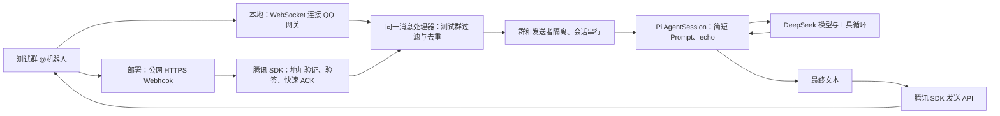

# QQ 开放平台接入调研

核对日期：2026-10-02。依据当前官方协议、腾讯 SDK 源码、后台操作与真实群联调。独立测试机器人已创建，凭据与群 OpenID 白名单仅写入被 Git 忽略的本机 `.env`。WebSocket → 嵌入式 Pi SDK → DeepSeek → QQ 已通过真实群内回答与 echo 工具循环验收；公网 Webhook 与两用户真实隔离尚未实测。账号状态仅代表检查时的后台展示。

## 接入方案

在 dave-agent 的 Node.js 服务中使用腾讯 QQ SDK 负责通信，宿主按群和发送者路由到 Pi AgentSession SDK 的模型与工具循环。无需运行 OpenClaw，也无需独立启动 Pi CLI。**本地默认 WebSocket，部署默认 HTTP Webhook；两种模式共用消息处理器和发送 API。** 接收方式不决定 QQ 客户端是否支持流式显示，当前群聊入口只发送完整文本。

首版已固定安装 `@tencent-connect/qqbot-nodejs@1.0.4`，固定回复已替换为 Pi 对话。[npm 发布信息](https://registry.npmjs.org/@tencent-connect%2Fqqbot-nodejs/1.0.4)与 GitHub main 不完全一致，落地以安装的发布包为准。本轮对照 GitHub commit 为 `ca55d9c395b582b7fcfad0ec27209c35dd04e0b3`；Webhook、发送和去重源码已与发布包比对，QQBot 全文件并不完全相同。参考腾讯的 [Webhook 示例](https://github.com/tencent-connect/qqbot-nodejs/blob/ca55d9c395b582b7fcfad0ec27209c35dd04e0b3/examples/webhook/index.ts)；按运行模式配置 `transport`，Webhook 再配置监听端口和路径，并关闭 Markdown，先验证纯文本。

### 当前启动与配置

| 项目 | 约定 |
| --- | --- |
| 本地启动 | `npm run qq`，默认 `websocket`，无需公网回调地址 |
| 部署启动 | `npm run qq:deploy`，设置 `NODE_ENV=production`，默认 `webhook` |
| 显式覆盖 | `QQ_TRANSPORT=websocket` 或 `webhook`，优先于环境默认；`.env.example` 中仅留注释 |
| 凭据 | `QQBOT_APP_ID`、`QQBOT_APP_SECRET`，仅运行时读取 |
| 测试群 | `QQ_ALLOWED_GROUPS`，逗号分隔群 OpenID；为空时仅记录被拦截群的 OpenID，不回复 |
| Webhook 监听 | `QQBOT_WEBHOOK_PORT=8080`、`QQBOT_WEBHOOK_PATH=/qq/callback` 为默认值，外层配置公网 HTTPS 反向代理 |
| 模型配置 | 默认 `deepseek/deepseek-flash`，读取运行时 `DEEPSEEK_API_KEY`；`MODEL_PROVIDER`、`MODEL_ID`、`MODEL_API_KEY` 可显式覆盖 |
| 回复内容 | Pi/模型生成的最终纯文本；仅开放 echo 工具，不加载 CLI 客户身份、订单工具或电商 Skill |
| 离线检查 | `npm run check:qq` 检查协议，`npm run check:qq-agent` 检查会话入口；`npm run validate` 包含类型与全部离线检查，本轮已通过 |

两种模式都只处理白名单测试群的 `@` 纯文本，当前已接真实模型，不接订单查询或私聊流式消息。后台事件接收方式需与运行模式一致；切换程序配置不会自动修改开放平台配置。WebSocket 需要进程主动访问 QQ 网关，Webhook 需要平台访问公网回调入口；后台设置服务器 IP 列表后，两者的 API 出口 IP 都必须匹配。未设置列表时，后台说明允许所有请求来源 IP。

## 开放平台需要准备什么

| 条件 | 准备方式 / 核实状态 |
| --- | --- |
| 机器人应用 | 已为 dave-agent 成功创建独立测试机器人 |
| AppID / AppSecret | 用户已重置 AppSecret 并填入本机 `.env`，QQ API 鉴权已成功；后台不保存可查看的密钥明文，密钥不进入 Prompt、日志或 Git |
| 群聊能力 | 机器人已添加到内部测试群并收到真实 `GROUP_AT_MESSAGE_CREATE`；公开服务开关保持关闭 |
| 测试成员和测试群 | 已完成目标测试群接入，从真实 @ 事件取得 OpenID 并加入本机白名单；此前旧版沙箱要求管理员为群主/管理员、群成员不超过 20 人，配置时以当前后台提示为准 |
| HTTPS 回调 | Webhook 入口可用，旧版表单要求 HTTPS；新机器人默认 WebSocket，未切换接收方式 |
| API 出口 IP | 新机器人服务器 IP 列表为空；后台明确说明未设置时允许所有请求来源 IP。已设置列表的机器人需匹配实际出口 IP，后台支持最多 50 个 IP |
| 域名 / 备案限制 | 查看到的表单未展示备案条件；具体校验仍待准备实际 HTTPS 地址后确认，尚未验证任何隧道或域名 |

Webhook 协议允许回调端口 `80/443/8080/8443`，要求 HTTPS。可以由公网入口终止 TLS，再转发到 SDK 的本地 HTTP 监听端口。WebSocket 由服务主动连接 QQ 网关，不配置公网回调地址。[事件订阅与通知](https://bot.q.qq.com/wiki/develop/api-v2/dev-prepare/interface-framework/event-emit.html)

后台路径：新版「我的机器人 → 机器人详情 → 开发设置 → 事件订阅与回调地址」；旧版「开发 → 沙箱配置 / 回调配置」。旧版回调表单的群事件标签中可见群 @ 事件，Webhook 勾选与提交仍待部署验收时进行。

旧版沙箱说明仍包含 AIGC 机器人进入社群及全量公开使用的限制，而新版个人认证页面给出公开群聊能力。两处说明存在差异，公开发布 AIGC 服务的适用范围仍待确认；首版只做内部测试群。本轮已通过添加到群入口完成测试群接入，并验证实际群消息投递。

## 接收与回复协议

| 字段 / 事件 | 用途 |
| --- | --- |
| `GROUP_AT_MESSAGE_CREATE` | 用户在 QQ 群 @ 机器人；与频道 `AT_MESSAGE_CREATE` 区分 |
| 外层 `payload.id` | 推送事件 ID，可用于入站关联与去重 |
| `payload.d.id` | 原始用户消息 ID，发送被动回复时使用的 `msg_id` |
| `payload.d.group_openid` | 群路由标识，不是界面显示的 QQ 群号 |
| `payload.d.author.member_openid` | 发送者标识，不是昵称或可自行填写的 QQ 号 |

每个进程只服务一个 AppID，因此当前会话键采用 `group_openid + member_openid`，机器人身份由进程隔离。不同用户隔离，同一用户消息串行；业务回调续接与内部客户映射在后续业务阶段补齐。当前不开放订单工具。官方文档说明群 @ 的 `content` 已去掉机器人 mention 前缀；过滤依据可信事件类型，不能把文本中的昵称当作身份。[群 @ 事件](https://bot.q.qq.com/wiki/develop/api-v2/autogen/event/group_at_message_create.html)

群 OpenID 与 AppID 相关：更换机器人后，即使目标 QQ 群不变，也需通过新机器人的入站事件重新取得 OpenID。[唯一身份机制](https://bot.q.qq.com/wiki/develop/api-v2/dev-prepare/api-call-guide.html)

群回复调用 `POST https://api.bot.qq.com/v2/groups/{group_openid}/messages`，纯文本使用 `msg_type: 0`，携带原消息 `msg_id`；同一消息的多次回复需要区分 `msg_seq`。首版经 SDK 的 `sendText(msg.replyTarget, text)` 发送，保留入站 SDK 给出的回复目标，不自行拼接群号。

**被动回复窗口是 5 分钟，每条消息最多回复 5 次。** 相同 `msg_id + msg_seq` 不能重复发送，群消息不支持流式参数。因此只发送最终文本；必要的“已受理”提示也计入次数。商家结果超过窗口时先保存，等同一用户再次 @ 查询；主动通知能力未核实前不作为首版前提。[发送群聊消息](https://bot.q.qq.com/wiki/develop/api-v2/autogen/api/v2_groups_group_openid_messages.post.html)

## 腾讯 SDK 与宿主的职责

腾讯 SDK 已实现地址验证 `op:13`、普通事件 Ed25519 验签、事件分发和 HTTP ACK。当前 Webhook 实现将事件处理放到后台，立即返回 HTTP 200 与 `{"op":12,"d":0}`；普通事件缺失或错误签名会返回 401。地址验证走独立路径，不能把它当成用户消息交给 Pi。[Webhook 源码](https://github.com/tencent-connect/qqbot-nodejs/blob/ca55d9c395b582b7fcfad0ec27209c35dd04e0b3/src/protocol/transport/webhook.ts)

ACK 只说明收到事件，不证明模型成功、退款成功或事件已持久保存。当前宿主负责测试群白名单、Pi 会话队列、模型超时与发送失败记录，Webhook 请求体限制为 64 KiB。最多 20 个内存会话，每会话最多 3 条在途消息（含正在处理）；模型限时 60 秒，空闲 30 分钟清理，20 轮后换新上下文。自动压缩关闭，模型输出最多 2048 token，最终发送最多 1000 个 Unicode 码点，并在发送前重新检查原消息仍处于 4 分 30 秒回复余量内。SDK 去重中间件使用进程内状态，重启后丢失，不能替代业务幂等或持久事件队列。

发布包的 `msg_seq` 由时间和随机数生成，并非每个原消息的持久递增计数；重新调用发送会生成新序号，不能把 SDK 发送当成业务幂等保障。SDK 的群级并发中间件也不能替代我们的“群＋发送者”会话队列；初期不用 SDK 自带历史缓冲，由 Pi 统一管理对话。[发送实现](https://github.com/tencent-connect/qqbot-nodejs/blob/ca55d9c395b582b7fcfad0ec27209c35dd04e0b3/src/protocol/api/routes.ts)、[并发中间件](https://github.com/tencent-connect/qqbot-nodejs/blob/ca55d9c395b582b7fcfad0ec27209c35dd04e0b3/src/middleware/concurrency-guard.ts)

普通回调的签名使用时间戳和原始请求体字节，不能先解析再重新序列化后验签。首版直接使用 SDK，不再写一份密码学实现。[安全和授权](https://bot.q.qq.com/wiki/develop/api-v2/dev-prepare/interface-framework/sign.html)

API 当前通过 `AppID + AppSecret` 获取 AccessToken：`POST https://api.bot.qq.com/app/getAppAccessToken`，请求字段为 `appId/clientSecret`；调用 API 使用 `Authorization: QQBot <AccessToken>`。有效期按返回的 `expires_in` 处理，通常不超过 7200 秒，接近到期 60 秒内可获取新 token。优先复用 SDK 的缓存和刷新；不要沿用已弃用的静态 Token 方案。[接口调用与鉴权](https://bot.q.qq.com/wiki/develop/api-v2/dev-prepare/interface-framework/api-use.html)

SDK `1.0.4` 的默认 API / Token 域名仍是 `api.sgroup.qq.com` / `bots.qq.com`，与当前文档有差异。实例的 `baseUrl` 和 `tokenBaseUrl` 均已设为 `https://api.bot.qq.com`，真实获取 token、网关连接和群消息发送已成功。旧地址是否继续兼容，本轮没有实际调用证据；无需为这个差异 fork SDK。[配置透传对照](https://github.com/tencent-connect/qqbot-nodejs/blob/ca55d9c395b582b7fcfad0ec27209c35dd04e0b3/src/QQBot.ts)，该段已同时核对 npm 发布源码和编译产物。

## 最小验收顺序

1. 准备独立机器人、AppSecret 与内部测试群，管理员担任群主/管理员。若后台配置服务器 IP 列表，核对实际 API 出口 IP；不公开凭据。本地 WebSocket 联调不需要公网地址。
2. 填写 QQ 凭据，保留已有 `DEEPSEEK_API_KEY`，确认后台使用 WebSocket，运行 `npm run qq`；先留空群白名单，在测试群 @ 后从日志取得新机器人的群 OpenID，填入白名单并重启，再验证模型纯文本回复和“请调用 echo 回显：dave-agent 基座联调成功”。
3. 运行 `npm run validate`，覆盖协议与会话离线检查；确认两名成员不串历史、同一成员消息串行、只发送最终文本。核对 QQ 入站、模型处理和平台返回消息 ID，群内实际可见回复才是最终证据。
4. 部署时用 `npm run qq:deploy`，配置公网 HTTPS 回调并切换后台接收方式，通过地址验证和真实群投递。验签与慢处理 ACK 的离线结果不能替代真实网络联调；重复事件处理也要在联调中验证。
5. 后续进入异步业务时，用模拟后台任务验证结果回到原会话；单独检查回复窗口过期及 Pi 回调续接的实际上下文。

2026-10-02 验收：QQ API 鉴权成功，WebSocket gateway READY；从测试群真实 @ 事件取得 OpenID 并加入本机白名单。普通介绍请求已收到 DeepSeek 中文回答；第二条要求调用 echo，群内可见回复 `DAVE-QQ-PI-20261002`，服务记录 `model_ok tools=echo duration_ms=2717`，QQ 发送 API 返回 200 并确认接收，证明真实 Pi 工具调用、结果回填与 QQ 回复闭环。当前本地 WebSocket 服务运行中，基础目标完成。

`npm run validate` 全部通过，覆盖 Pi/QQ 协议与会话离线检查。两用户隔离仅有离线证据，尚未真实双用户实测；公网 HTTPS Webhook 尚未部署，业务工具和异步回调继续留后续。联调截图仅保存于忽略的 `.runtime`，公开文档不保存真实账号、群或凭据字段。
