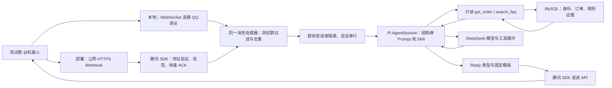

# QQ 开放平台接入调研

核对日期：2026-10-02。依据当前官方协议、腾讯 SDK 源码、后台操作与真实群联调。独立测试机器人已创建，凭据与群 OpenID 白名单仅写入被 Git 忽略的本机 `.env`。当前 WebSocket → 可信身份/只读 MySQL 工具 → 嵌入式 Pi SDK/DeepSeek → QQ 已跑通本人券单与规则查询、多轮追问、越权拒绝、未知节假日政策处理，以及 D1 模拟协商同意路径；公网 Webhook 与两用户真实隔离尚未实测。账号状态仅代表检查时的后台展示。

## 接入方案

在 dave-agent 的 Node.js 服务中使用腾讯 QQ SDK 负责通信，宿主按群和发送者路由到 Pi AgentSession SDK 的模型与工具循环。无需运行 OpenClaw，也无需独立启动 Pi CLI。**本地默认 WebSocket，部署默认 HTTP Webhook；两种模式共用消息处理器和发送 API。** 接收方式不决定 QQ 客户端是否支持流式显示；当前群聊一次发送完整回复，默认使用固定模板 Markdown，可配置纯文本。

首版已固定安装 `@tencent-connect/qqbot-nodejs@1.0.4`，固定回复已替换为 Pi 对话。[npm 发布信息](https://registry.npmjs.org/@tencent-connect%2Fqqbot-nodejs/1.0.4)与 GitHub main 不完全一致，落地以安装的发布包为准。本轮对照 GitHub commit 为 `ca55d9c395b582b7fcfad0ec27209c35dd04e0b3`；Webhook、发送和去重源码已与发布包比对，QQBot 全文件并不完全相同。参考腾讯的 [Webhook 示例](https://github.com/tencent-connect/qqbot-nodejs/blob/ca55d9c395b582b7fcfad0ec27209c35dd04e0b3/examples/webhook/index.ts)；按运行模式配置 `transport`，Webhook 再配置监听端口和路径。初版先验证纯文本，现在通过显式发送类型接入 Markdown。

### 当前启动与配置

| 项目 | 约定 |
| --- | --- |
| 本地启动 | `npm run qq`，默认 `websocket`，无需公网回调地址 |
| 数据库 | 先运行 `npm run db:up`；MySQL 仅发布本机 `127.0.0.1:13306`，配置 `DB_*` 与 `MYSQL_ROOT_PASSWORD`，详见[数据库说明](./database.md) |
| 部署启动 | `npm run qq:deploy`，设置 `NODE_ENV=production`，默认 `webhook` |
| 显式覆盖 | `QQ_TRANSPORT=websocket` 或 `webhook`，优先于环境默认；`.env.example` 中仅留注释 |
| 凭据 | `QQBOT_APP_ID`、`QQBOT_APP_SECRET`，仅运行时读取 |
| 测试群 | `QQ_ALLOWED_GROUPS`，逗号分隔群 OpenID；为空时仅记录被拦截群的 OpenID，不回复 |
| Webhook 监听 | `QQBOT_WEBHOOK_PORT=8080`、`QQBOT_WEBHOOK_PATH=/qq/callback` 为默认值，外层配置公网 HTTPS 反向代理 |
| 模型配置 | 默认 `deepseek/deepseek-flash`，读取运行时 `DEEPSEEK_API_KEY`；`MODEL_PROVIDER`、`MODEL_ID`、`MODEL_API_KEY` 可显式覆盖 |
| 回复内容 | `QQ_REPLY_FORMAT` 默认 `markdown`，可显式设为 `text`；宿主按本轮工具/任务结果选择固定模板，CLI 保持纯文本 |
| 可信身份绑定 | 未绑定身份保存本机忽略目录；管理员核对发信人后运行 `npm run qq:bind -- <12位identity代号> <对应演示客户ID>` |
| 工程检查 | `npm run validate` 检查类型、Pi、QQ 协议/会话及 `check:reply` 模板；`npm run check:business` 用真实 MySQL＋Pi/faux 检查只读业务边界 |
| 真实模型检查 | `npm run check:model` 使用配置的真实模型与数据库，单独记录业务样例结果，会产生模型调用 |

两种模式都只处理白名单测试群的 `@` 纯文本，当前接真实模型和本人模拟券单查询，只发送最终回复。后台事件接收方式需与运行模式一致；切换程序配置不会自动修改开放平台配置。WebSocket 需要进程主动访问 QQ 网关，Webhook 需要平台访问公网回调入口；后台设置服务器 IP 列表后，两者的 API 出口 IP 都必须匹配。未设置列表时，后台说明允许所有请求来源 IP。

## 开放平台需要准备什么

| 条件 | 准备方式 / 核实状态 |
| --- | --- |
| 机器人应用 | 已为 dave-agent 成功创建独立测试机器人 |
| AppID / AppSecret | 用户已重置 AppSecret 并填入本机 `.env`，QQ API 鉴权已成功；后台不保存可查看的密钥明文，密钥不进入 Prompt、日志或 Git |
| 群聊能力 | 机器人已添加到内部测试群并收到真实 `GROUP_AT_MESSAGE_CREATE`；公开服务开关保持关闭 |
| 测试成员和测试群 | 已完成目标测试群接入，从真实 @ 事件取得 OpenID 并加入本机白名单；此前旧版沙箱要求管理员为群主/管理员、群成员不超过 20 人，配置时以当前后台提示为准 |
| HTTPS 回调 | Webhook 入口可用，旧版表单要求 HTTPS；新机器人默认 WebSocket，未切换接收方式 |
| API 出口 IP | 新机器人服务器 IP 列表为空；后台明确说明未设置时允许所有请求来源 IP。已设置列表的机器人需匹配实际出口 IP，后台支持最多 50 个 IP |
| 域名 / 备案限制 | 查看到的表单未展示备案条件；具体校验仍待准备实际 HTTPS 地址后确认，尚未验证任何隧道或域名 |

Webhook 协议允许回调端口 `80/443/8080/8443`，要求 HTTPS。可以由公网入口终止 TLS，再转发到 SDK 的本地 HTTP 监听端口。WebSocket 由服务主动连接 QQ 网关，不配置公网回调地址。[事件订阅与通知](https://bot.q.qq.com/wiki/develop/api-v2/dev-prepare/interface-framework/event-emit.html)

后台路径：新版「我的机器人 → 机器人详情 → 开发设置 → 事件订阅与回调地址」；旧版「开发 → 沙箱配置 / 回调配置」。旧版回调表单的群事件标签中可见群 @ 事件，Webhook 勾选与提交仍待部署验收时进行。

旧版沙箱说明仍包含 AIGC 机器人进入社群及全量公开使用的限制，而新版个人认证页面给出公开群聊能力。两处说明存在差异，公开发布 AIGC 服务的适用范围仍待确认；首版只做内部测试群。本轮已通过添加到群入口完成测试群接入，并验证实际群消息投递。

## 接收与回复协议

| 字段 / 事件 | 用途 |
| --- | --- |
| `GROUP_AT_MESSAGE_CREATE` | 用户在 QQ 群 @ 机器人；与频道 `AT_MESSAGE_CREATE` 区分 |
| 外层 `payload.id` | 推送事件 ID，可用于入站关联与去重 |
| `payload.d.id` | 原始用户消息 ID，发送被动回复时使用的 `msg_id` |
| `payload.d.group_openid` | 群路由标识，不是界面显示的 QQ 群号 |
| `payload.d.author.member_openid` | 发送者标识，不是昵称或可自行填写的 QQ 号 |

每个进程只服务一个 AppID，因此会话键采用 `group_openid + member_openid`，机器人身份由进程隔离。不同用户隔离，同一用户消息串行；业务异步回调续接尚未实现。订单身份则由可信 AppID＋发送者标识查询 `qq_identities`，每次工具执行都检查绑定及归属，不使用用户正文、昵称或 CLI 默认客户身份。官方文档说明群 @ 的 `content` 已去掉机器人 mention 前缀；过滤依据可信事件类型，不能把文本中的昵称当作身份。[群 @ 事件](https://bot.q.qq.com/wiki/develop/api-v2/autogen/event/group_at_message_create.html)

未绑定用户可以问通用规则，不能查订单。宿主将可信事件身份记录在被 Git 忽略的 `.runtime/qq-identities/`，绑定日志只输出匿名代号，不公开真实发送者标识。本机管理员先核对发信人，再选择其对应的演示客户并运行 `qq:bind`；脚本通过容器管理员权限写入映射，不能覆盖已有绑定。不能将所有成员自动绑定为客户一，也不能让用户通过对话自行指定客户 ID。绑定完成后原会话下一次查询即生效。

群 OpenID 与 AppID 相关：更换机器人后，即使目标 QQ 群不变，也需通过新机器人的入站事件重新取得 OpenID。[唯一身份机制](https://bot.q.qq.com/wiki/develop/api-v2/dev-prepare/api-call-guide.html)

群回复调用 `POST https://api.bot.qq.com/v2/groups/{group_openid}/messages`，Markdown 使用 `msg_type: 2` 和 `markdown.content`，纯文本使用 `msg_type: 0` 和 `content`。经 SDK 的 `bot.send` 显式选择类型，保留入站 `msg.replyTarget` 和原消息 `msg_id`，不自行拼接群号；同一消息的多次回复需要区分 `msg_seq`。

**被动回复窗口是 5 分钟，每条消息最多回复 5 次。** 相同 `msg_id + msg_seq` 不能重复发送，群消息不支持流式参数。因此只发送完整回复；必要的“已受理”提示也计入次数。商家结果超过窗口时先保存，等同一用户再次 @ 查询；主动通知能力未核实前不作为首版前提。[发送群聊消息](https://bot.q.qq.com/wiki/develop/api-v2/autogen/api/v2_groups_group_openid_messages.post.html)

### 固定模板 Markdown

官方 2026-04-23 更新已将单聊、群聊自定义 Markdown 开放给所有机器人，无需单独申请模板；频道仍需内邀。当前安装包的旧权限说明与官网有差异，以 [官方 Markdown 文档](https://bot.q.qq.com/wiki/develop/api-v2/server-inter/message/type/markdown.html) 为准。这里的模板是应用内排版函数，无需平台 `custom_template_id`。

宿主将本轮成功工具结果或任务回执映射为 `Reply`，再按 `answer`、`order`、`merchant_confirmation`、`merchant_status`、`refund_confirmation`、`refund_status`、`notice` 七种类型选择固定策略模板。订单、金额、确认文字和状态只使用实际业务结果；模型正文经过转义，不能自行插入标题、链接或改变模板。退款工具失败且无有效操作证据时固定提示无法确认结果，不转发模型猜测。首版使用标题、粗体和列表，不依赖表格或代码块；CLI 使用同一策略的纯文本输出。

`QQ_REPLY_FORMAT=markdown` 为默认值，显式设为 `text` 可切回纯文本。发送错误只记录失败，不自动切换格式或重发；网络超时或响应读取失败时，原消息可能已经送达。模型正文最多 1000 个 Unicode 码点，渲染后应用输出上限为 4000 码点，不能把它写成 QQ 官方长度限制。

2026-10-02 验收：`validate` 通过五种模板、内容注入、长度限制与真实 SDK HTTP 发送失败不重发检查。真实 QQ API 返回 200，客户端已验证 `answer`、`order`、`merchant_confirmation`、`merchant_status`、`notice` 五类显示；空原因确认触发固定服务提示，不调用模型、不创建任务。协商确认采用独立普通文本行，已验证复制后精确发送；隐形字符在模板、确认入口和存储边界均拒绝。

### 固定业务按钮

`QQ_REPLY_BUTTONS` 默认 `false`，本机测试配置已设为 `true`。启用后，群聊 Markdown 的协商确认回复增加“确认模拟协商”，等待中的任务增加“查询进度”，有效退款方案增加“确认模拟退款”；终态不带按钮。按钮由固定策略生成，使用 `type=2` 指令按钮、`style=1` 蓝色线框，并限制为本次入站消息的实际发送者。点击只填入指令（`enter=false`、`reply=false`），用户核对后发送，继续经过原来的宿主确认、订单归属和幂等检查；普通文本、非群回复不带按钮，发送失败不自动重发。警告使用红色圆点与粗体，不依赖正文颜色。

2026-10-02 按钮验收：`npm run validate` 通过，最终样式调整后 `check:reply` 再次通过；真实 QQ API 返回 200，Mac QQ 显示蓝色线框及蓝色按钮文字。已完成“点击确认按钮 → 填入完整指令 → 用户发送 → pending 回执 → 点击查询按钮并发送 → approved 79.80 元”的模拟协商闭环，重复确认仍返回原任务；数据库核验退款金额和记录数为零、券未核销，临时测试夹具已清理。当前 Mac QQ 将 `style=3/4` 显示为灰色，且未展示请求中的 `modal` 二次确认弹窗，因此最终采用 `style=1`，用户发送指令才构成确认，不能把弹窗作为授权保证。手机端、真实双用户按钮权限尚未验收；本轮没有重跑历史 88/88 真实模型回归。

## 腾讯 SDK 与宿主的职责

腾讯 SDK 已实现地址验证 `op:13`、普通事件 Ed25519 验签、事件分发和 HTTP ACK。当前 Webhook 实现将事件处理放到后台，立即返回 HTTP 200 与 `{"op":12,"d":0}`；普通事件缺失或错误签名会返回 401。地址验证走独立路径，不能把它当成用户消息交给 Pi。[Webhook 源码](https://github.com/tencent-connect/qqbot-nodejs/blob/ca55d9c395b582b7fcfad0ec27209c35dd04e0b3/src/protocol/transport/webhook.ts)

ACK 只说明收到事件，不证明模型成功、退款成功或事件已持久保存。当前宿主负责测试群白名单、Pi 会话队列、模型超时与发送失败记录，Webhook 请求体限制为 64 KiB。最多 20 个内存会话，每会话最多 3 条在途消息（含正在处理）；模型限时 60 秒，空闲 30 分钟清理，20 轮后换新上下文。自动压缩关闭，模型输出最多 2048 token；输出长度按上述模板限制，并在发送前重新检查原消息仍处于 4 分 30 秒回复余量内。SDK 去重中间件使用进程内状态，重启后丢失，不能替代业务幂等或持久事件队列。

发布包的 `msg_seq` 由时间和随机数生成，并非每个原消息的持久递增计数；重新调用发送会生成新序号，不能把 SDK 发送当成业务幂等保障。SDK 的群级并发中间件也不能替代我们的“群＋发送者”会话队列；初期不用 SDK 自带历史缓冲，由 Pi 统一管理对话。[发送实现](https://github.com/tencent-connect/qqbot-nodejs/blob/ca55d9c395b582b7fcfad0ec27209c35dd04e0b3/src/protocol/api/routes.ts)、[并发中间件](https://github.com/tencent-connect/qqbot-nodejs/blob/ca55d9c395b582b7fcfad0ec27209c35dd04e0b3/src/middleware/concurrency-guard.ts)

普通回调的签名使用时间戳和原始请求体字节，不能先解析再重新序列化后验签。首版直接使用 SDK，不再写一份密码学实现。[安全和授权](https://bot.q.qq.com/wiki/develop/api-v2/dev-prepare/interface-framework/sign.html)

API 当前通过 `AppID + AppSecret` 获取 AccessToken：`POST https://api.bot.qq.com/app/getAppAccessToken`，请求字段为 `appId/clientSecret`；调用 API 使用 `Authorization: QQBot <AccessToken>`。有效期按返回的 `expires_in` 处理，通常不超过 7200 秒，接近到期 60 秒内可获取新 token。优先复用 SDK 的缓存和刷新；不要沿用已弃用的静态 Token 方案。[接口调用与鉴权](https://bot.q.qq.com/wiki/develop/api-v2/dev-prepare/interface-framework/api-use.html)

SDK `1.0.4` 的默认 API / Token 域名仍是 `api.sgroup.qq.com` / `bots.qq.com`，与当前文档有差异。实例的 `baseUrl` 和 `tokenBaseUrl` 均已设为 `https://api.bot.qq.com`，真实获取 token、网关连接和群消息发送已成功。旧地址是否继续兼容，本轮没有实际调用证据；无需为这个差异 fork SDK。[配置透传对照](https://github.com/tencent-connect/qqbot-nodejs/blob/ca55d9c395b582b7fcfad0ec27209c35dd04e0b3/src/QQBot.ts)，该段已同时核对 npm 发布源码和编译产物。

## 最小验收顺序

1. 准备独立机器人、AppSecret 与内部测试群，管理员担任群主/管理员。若后台配置服务器 IP 列表，核对实际 API 出口 IP；不公开凭据。本地 WebSocket 联调不需要公网地址。
2. 在本机填写数据库密码，运行 `npm run db:up` 与 `npm run check:business`；确认真实 MySQL、中文证据、只读权限和归属检查。
3. 填写 QQ 凭据，保留已有 `DEEPSEEK_API_KEY`，确认后台使用 WebSocket，运行 `npm run qq`；先留空群白名单，在测试群 @ 后从日志取得新机器人的群 OpenID，填入白名单并重启。
4. 用退款问题验证先追问订单号。管理员核对日志匿名代号对应的发信人，再运行 `qq:bind` 绑定其演示客户；同一会话补订单号，核对 `get_order` / `search_faq` 结果和群内可见金额、状态、证据。尝试他人订单应拒绝，缺失政策应明确未知，不能声称本轮已退款。
5. 运行 `npm run validate` 和 `npm run check:model`，分别记录工程与真实模型结果。双用户隔离需另行真实联调，离线队列检查不能替代；群内可见回复与实际工具/发送结果共同构成端到端证据。
6. 部署时用 `npm run qq:deploy`，配置公网 HTTPS 回调并切换后台接收方式，通过地址验证和真实群投递。验签与慢处理 ACK 的离线结果不能替代真实网络联调；重复事件处理也要在联调中验证。
7. 后续进入异步业务时，用模拟后台任务验证结果回到原会话；单独检查回复窗口过期及 Pi 回调续接的实际上下文。

2026-10-02 基座验收：QQ API 鉴权成功，WebSocket gateway READY；从真实 @ 事件取得 OpenID 并加入本机白名单。普通回答和 echo 工具调用均在群内可见，工具成功记录与发送 API 200 共同证明 QQ → Pi/DeepSeek → QQ 链路。

2026-10-02 业务验收：退款咨询先追问订单号；本机管理员基于可信事件绑定客户一后，原会话补充 `COUPON-1001` 获得数据库实付 79.80 元、未核销状态、有效期和 KB 规则引用，仅说明申请资格。服务记录实际 `get_order` 与 `search_faq` 成功，发送 API 返回 200，群内答复可见。同一身份查询他人 `COUPON-1002` 时，实际 `get_order` 返回错误且群内得到拒绝。该次只读验收尚未接入 D1/D2，当时没有退款执行能力；后续 D2 验收见下文。

同日未知政策验收：真实群内查询 `COUPON-1008` 的节假日可用性，实际工具为 `get_order` 和 `search_faq`，无工具错误，发送 API 返回 200。群内可见私享套餐实付 99.80 元、未核销事实与 `KB-SHOP-DEMO-1` 引用；答复明确法定节假日/特殊活动/私享套餐限制未录入，无法判断，并建议用户自行向商家核实，没有承诺未知政策或编造操作入口。

本轮 `npm run validate`、真实 MySQL＋Pi/faux 的 `check:merchant` 通过；`check:merchant-model` 使用真实 DeepSeek，通过 3 轮模型回复与 1 轮宿主确认。新 Prompt 的 `check:model` 通过 9 场景、10 轮、88/88 项检查，run `419ed809-e366-4a1a-98b6-9c0a4e47448d` 已进入工作台，这是只读回归，不是 D1 协商指标。另在真实 QQ 群用临时合成订单跑通“准备协商 → 复制确认文字 → 精确发送 → pending → 查询 approved 79.80 元”，回复始终明确未退款；清理临时订单前 SQL 核对同意金额为 7980 分、退款金额与退款记录数均为零、仍有一张未核销券；测试夹具已按精确标识清理，公开演示单 2001–2003 未被验收消费。真实群拒绝/超时、双用户隔离和公网 HTTPS Webhook 尚未验收，D1 持久评测及主动续接留后续。截图、模型完整回答和可信身份文件仅保存于忽略的 `.runtime`，公开文档不保存真实账号、群、匿名身份代号或凭据字段。

### D2 确认入口

群事件在平台移除机器人 @ 后可能仍带一个前导空格（本次真实消息为 U+0020）。入口只移除前导水平空白及开头匹配本 AppID 的 mention；保留正文内部 mention/表情、换行和尾部字符，不能使用通用清洗把畸形文本变成合法确认。退款确认要求完整单行 `确认退款 操作编号`，由宿主处理，不调用模型。

退款方案只有在 QQ API 成功接收固定摘要、宿主成功登记后才开放确认；用户点击按钮仅填字，发送后仍校验原身份、原群会话、审批、金额和有效期。方案失效或金额变动后重新获取会轮换编号，旧指令不再有效；模拟退款成功后重复指令返回同一记录。

2026-10-02 D2 真实 QQ 验收：在白名单测试群使用随机标识的三张合成订单，完成“准备协商 → 按钮填入并发送确认 → pending → 查询 approved 并生成退款方案 → 按钮填入并发送退款确认 → succeeded”。方案卡和结果卡均获 QQ API 200，Mac QQ 显示正确订单、79.80 元、操作编号、模拟警告及确认按钮；宿主确认轮未调用模型。重复同一确认仍返回同一操作/退款编号，数据库仅一笔 7980 分退款，订单与券同步为 refunded。实际停止并重启机器人后，新会话通过 get_order/get_refund 读取同一持久结果。

拒绝与超时订单分别完成真实群协商确认和结果查询，客户端展示 rejected / timed_out 固定卡，没有生成退款方案；SQL 核对两单退款记录均为零、已退金额为零、券仍 unused。临时订单按随机 marker 清理，原只读 100x 基线与公开 2001–2003 演示单未被消耗。此前通用清洗问题已由真实消息格式复现并修复，离线检查保留对应回归。

最终 `validate`、`check:business`、`check:merchant`、`check:refund` 通过。真实模型独立售后套件 `6349a275-946c-44bc-aac2-a8b9987f55d4` 为 3 场景 / 12 轮 / 67 项检查全通过；只读回归 `8c921f5f-eb37-44c0-86e9-bedc23eb6727` 为 9 场景 / 10 轮 / 88 项检查全通过。模型脚本替代 QQ 发信，以上真实客户端验收另行记录，两者不混算。评测工作台可见最终运行及失败历史；手机显示、真实双用户按钮权限和公网 Webhook 仍待后续验收；D3 主动续接见下文。

### D3 商家结果续接

2026-10-02 真实 WebSocket 测试群验收：三张临时合成订单分别精确确认协商，收到 pending 后不再发查询消息；Mac QQ 随后自动显示同意 79.80 元、拒绝、超时的固定结果卡。三次发送均获 QQ API 200，服务日志为 `merchant_event tools=get_merchant_request reply_sent=true`；数据库三条通知均为 sent，三单仍 paid、已退金额 0、退款方案/记录均为 0。通过协商确认按钮填字并发送的路径也已实测。

初轮超时通知在已领取、正在处理时收到 SIGTERM，仍发送完成；重启后三条已发送通知未重发。复查后已收紧关闭顺序：先停 worker 定时器，同时关闭 Agent 取消未发送的模型处理，最后等待收尾；已开始的 HTTP 发送可能仍完成。慢通知也不再阻塞商家轮询，避免其他正常任务被拖到超时。关闭及慢通知由新增工程回归验证，不能把初轮等待发送的现象当成最终停机策略或强杀后保证送达。pending 重启恢复、claimed 崩溃后不重发、并发领取、窗口过期及身份撤销由独立数据库/离线 Agent 检查覆盖。截图与脱敏数据库证据保留在被忽略的 `.runtime`，临时订单按 nonce 清理，公开 100x 与 2001–2003 基线未消费。

实现共用 QQ 的群＋用户队列，通过普通 `session.prompt` 保持客服上下文；事件只允许 `get_merchant_request`，不进入精确确认入口、不准备退款。原 taskId 的固定卡由宿主重新读取的任务生成，原确认 messageId 的本地 4 分 30 秒窗口在入队、出队和发送前检查。最多一次主动尝试，窗口失效/不在白名单记 deferred、发信失败记 unknown，保留业务结果供查询；CLI/旧任务不补通知路由。未使用无限期主动消息能力，也未接真实商家网络回调。

`validate`、`check:refund`、`check:merchant-notifications` 通过；D3 真实模型独立 run `7b788a77-865c-44ec-a6f7-d849a8b12540` 为 3/3 场景、9/9 处理轮、60/60 检查，不与以上平台验收混算。Kimi 前端通过现有 API 读取此运行，以“事件”展示第 3 轮，保持动态分母及缺失 usage 口径。

修正轮询与关闭顺序后，重启最终版本，再用新临时订单实测精确确认 → pending → 自动 approved 固定卡；QQ API 200、客户端可见、通知 sent，退款方案/记录与已退金额仍为零。最终 `validate`、`check:merchant` 与 `check:merchant-notifications` 再次通过，评测工作台显示 3/3 场景、9/9 处理轮及 18/18 usage；临时订单已清理。

### D2/D3 联合闭环

2026-10-02 在真实 WebSocket 测试群使用临时合成订单完成同一会话联合验收：精确确认协商后自动收到 approved 通知，用户不带订单请求退款，获得订单与金额均固定的 79.80 元方案。发送普通“同意”未执行退款，数据库退款记录与已退金额仍为零；点击固定按钮填字、由用户发送完整退款确认后才执行。方案与结果卡均获 QQ API 200，并在客户端显示。

重复发送同一确认返回同一退款 UUID，数据库仅一笔 7980 分退款，订单与券均为 `refunded`。实际停止并重启机器人后，新会话按订单号通过 `get_order` / `get_refund` 读取同一结果，QQ API 200 且客户端可见同一记录。临时测试夹具已清理，未消耗 100x/200x 基线；真实 QQ 身份、随机订单标识、截图与完整消息不进入公开文档。

本轮复用现有运行时，业务调整仅涉及 Prompt/Skill 与评测脚本，没有新增生产 TypeScript 逻辑、API 或表。独立联合模型套件 `merchant-notification-v2` 最终 run `2ba8c394-395e-421d-83eb-c48dcc2aa6ff` 为 3/3 场景、15/15 处理轮（12 用户 + 3 事件）、100/100 检查，31 次模型请求均报告 usage、24 次工具调用、0 工具错误；模型脚本本地替代发送，与本节平台验收分别记录。只读回归与检查器变化见 [评测说明](./evaluation.md)。下一步仍为双用户、手机端与公网 Webhook 验收。

最终 Prompt/Skill 已加载到机器人，并在真实 QQ 重新查询 `COUPON-1008` 的节假日政策：`get_order` / `search_faq` 无工具错误，QQ API 200，客户端明确规则缺失、无法确认，并建议自行向商家核实。独立只读回归 `19cffcc5-c734-47b2-8098-5c4a0cd89869` 为 9/9 场景、10/10 轮、88/88 检查；本轮检查器校准另有 11 项离线断言通过，历史失败保留。
