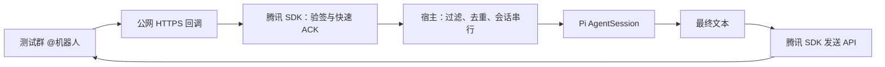

# QQ 开放平台接入调研

核对日期：2026-10-02。依据当前官方协议与腾讯 SDK 源码；本文是实现依据，尚未完成机器人配置或真实群联调。账号后台仍等待手机 QQ 扫码登录，因此群权限、测试群和域名限制尚未核实。

## 接入方案

在 dave-agent 的 Node.js 服务中同时使用腾讯 QQ SDK 和 Pi AgentSession SDK：QQ SDK 负责通信，宿主负责消息路由，Pi 负责模型与工具循环。无需运行 OpenClaw，也无需独立启动 Pi CLI。

首版复用 `@tencent-connect/qqbot-nodejs@1.0.4`，先固定回复，再替换为 Pi 对话。[npm 发布信息](https://registry.npmjs.org/@tencent-connect%2Fqqbot-nodejs/1.0.4)与 GitHub main 不完全一致，落地以安装的发布包为准。本轮对照 GitHub commit 为 `ca55d9c395b582b7fcfad0ec27209c35dd04e0b3`；Webhook、发送和去重源码已与发布包比对，QQBot 全文件并不完全相同。该依赖本轮尚未安装。参考腾讯的 [Webhook 示例](https://github.com/tencent-connect/qqbot-nodejs/blob/ca55d9c395b582b7fcfad0ec27209c35dd04e0b3/examples/webhook/index.ts)；创建实例时配置 `transport: "webhook"`、监听端口和路径，并关闭 Markdown，先验证纯文本。

## 开放平台需要准备什么

| 条件 | 准备方式 / 核实状态 |
| --- | --- |
| 机器人应用 | 在 [QQ 开放平台](https://q.qq.com/) 登录后查看已有机器人及注册状态；本轮未创建 |
| AppID / AppSecret | 创建机器人后获得；实现时从本地环境读取，密钥不进入 Prompt、日志或 Git |
| 群聊能力 | 后台确认具备群聊接入能力及 `GROUP_AT_MESSAGE_CREATE` 事件权限 |
| 测试成员和测试群 | 后台确认当前账号的测试配置入口、限制和机器人添加方式；不预设已可加入任意群 |
| HTTPS 回调 | 一个公网可达且证书有效的地址，例如 `https://<自己的域名>/qq/callback` |
| 域名 / 备案 / IP 限制 | 以当前账号后台要求为准，公开协议页不足以确认，暂不选择隧道或购买服务器 |

协议允许回调端口 `80/443/8080/8443`，要求 HTTPS。可以由公网入口终止 TLS，再转发到 SDK 的本地 HTTP 监听端口；首版只选一种部署方式。[事件订阅与通知](https://bot.q.qq.com/wiki/develop/api-v2/dev-prepare/interface-framework/event-emit.html)

公开资料有版本差异，不应仅凭旧教程推断个人账号当前的群聊权限。能登录平台不等于已经具备群聊权限，最终要按本账号后台核实；也不需要因为网站展示 OpenClaw 入口就把应用改成 OpenClaw Runtime。

## 接收与回复协议

| 字段 / 事件 | 用途 |
| --- | --- |
| `GROUP_AT_MESSAGE_CREATE` | 用户在 QQ 群 @ 机器人；与频道 `AT_MESSAGE_CREATE` 区分 |
| 外层 `payload.id` | 推送事件 ID，可用于入站关联与去重 |
| `payload.d.id` | 原始用户消息 ID，发送被动回复时使用的 `msg_id` |
| `payload.d.group_openid` | 群路由标识，不是界面显示的 QQ 群号 |
| `payload.d.author.member_openid` | 发送者标识，不是昵称或可自行填写的 QQ 号 |

会话键采用 `AppID + group_openid + member_openid`。不同用户隔离；同一会话的用户消息和业务回调共用串行入口。客户身份由宿主映射，未映射用户只能问通用规则。当前官方文档说明群 @ 的 `content` 已去掉机器人 mention 前缀；过滤应依据可信事件类型，不能把文本中的昵称当作身份。[群 @ 事件](https://bot.q.qq.com/wiki/develop/api-v2/autogen/event/group_at_message_create.html)

群回复调用 `POST https://api.bot.qq.com/v2/groups/{group_openid}/messages`，纯文本使用 `msg_type: 0`，携带原消息 `msg_id`；同一消息的多次回复需要区分 `msg_seq`。首版经 SDK 的 `sendText(msg.replyTarget, text)` 发送，保留入站 SDK 给出的回复目标，不自行拼接群号。

**被动回复窗口是 5 分钟，每条消息最多回复 5 次。** 相同 `msg_id + msg_seq` 不能重复发送，群消息不支持流式参数。因此只发送最终文本；必要的“已受理”提示也计入次数。商家结果超过窗口时先保存，等同一用户再次 @ 查询；主动通知能力未核实前不作为首版前提。[发送群聊消息](https://bot.q.qq.com/wiki/develop/api-v2/autogen/api/v2_groups_group_openid_messages.post.html)

## 腾讯 SDK 与宿主的职责

腾讯 SDK 已实现地址验证 `op:13`、普通事件 Ed25519 验签、事件分发和 HTTP ACK。当前 Webhook 实现将事件处理放到后台，立即返回 HTTP 200 与 `{"op":12,"d":0}`；普通事件缺失或错误签名会返回 401。地址验证走独立路径，不能把它当成用户消息交给 Pi。[Webhook 源码](https://github.com/tencent-connect/qqbot-nodejs/blob/ca55d9c395b582b7fcfad0ec27209c35dd04e0b3/src/protocol/transport/webhook.ts)

ACK 只说明收到事件，不证明模型成功、退款成功或事件已持久保存。宿主仍负责测试群白名单、事件去重、队列上限、超时、会话清理、发送失败记录，以及业务授权与幂等。SDK 示例中的去重中间件需要显式注册，使用进程内状态；短时内存去重不能替代重启后的业务幂等。

发布包的 `msg_seq` 由时间和随机数生成，并非每个原消息的持久递增计数；重新调用发送会生成新序号，不能把 SDK 发送当成业务幂等保障。SDK 的群级并发中间件也不能替代我们的“群＋发送者”会话队列；初期不用 SDK 自带历史缓冲，由 Pi 统一管理对话。[发送实现](https://github.com/tencent-connect/qqbot-nodejs/blob/ca55d9c395b582b7fcfad0ec27209c35dd04e0b3/src/protocol/api/routes.ts)、[并发中间件](https://github.com/tencent-connect/qqbot-nodejs/blob/ca55d9c395b582b7fcfad0ec27209c35dd04e0b3/src/middleware/concurrency-guard.ts)

普通回调的签名使用时间戳和原始请求体字节，不能先解析再重新序列化后验签。首版直接使用 SDK，不再写一份密码学实现。[安全和授权](https://bot.q.qq.com/wiki/develop/api-v2/dev-prepare/interface-framework/sign.html)

API 当前通过 `AppID + AppSecret` 获取 AccessToken：`POST https://api.bot.qq.com/app/getAppAccessToken`，请求字段为 `appId/clientSecret`；调用 API 使用 `Authorization: QQBot <AccessToken>`。有效期按返回的 `expires_in` 处理，通常不超过 7200 秒，接近到期 60 秒内可获取新 token。优先复用 SDK 的缓存和刷新；不要沿用已弃用的静态 Token 方案。[接口调用与鉴权](https://bot.q.qq.com/wiki/develop/api-v2/dev-prepare/interface-framework/api-use.html)

SDK `1.0.4` 的默认 API / Token 域名仍是 `api.sgroup.qq.com` / `bots.qq.com`，与当前文档有差异。实例的 `baseUrl` 和 `tokenBaseUrl` 都可以配置，接入时按当前文档设为 `https://api.bot.qq.com`，再通过真实获取 token 与发送消息验证。旧地址是否继续兼容，本轮没有实际调用证据；无需为这个差异 fork SDK。[配置透传对照](https://github.com/tencent-connect/qqbot-nodejs/blob/ca55d9c395b582b7fcfad0ec27209c35dd04e0b3/src/QQBot.ts)，该段已同时核对 npm 发布源码和编译产物。

## 最小验收顺序

1. 登录后核实机器人、群事件权限、测试群和 HTTPS 地址要求，记录可用条件，不公开凭据。
2. 启动 SDK 的固定回复服务，在后台配置回调并通过地址验证；测试群 @ 获得纯文本回复。
3. 一次离线检查覆盖正确/错误签名、重复事件、慢处理仍快速 ACK；真实群检查接收与发送。
4. 固定回复替换为 Pi，确认两名成员不串历史、同一成员消息串行、只发送最终文本。
5. 用模拟后台任务验证结果回到原会话；单独检查回复窗口过期及 Pi 回调续接的实际上下文。

本轮只完成公开协议研究并打开扫码登录页。尚未获取密钥、配置回调、发送群消息或实现 QQ 适配代码；账号后台核实与真实联调仍待完成。
