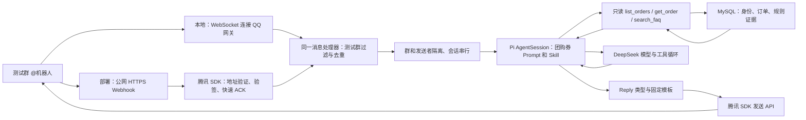

# QQ 开放平台接入调研

协议核对日期：2026-10-02；真实群联调更新：2026-10-03。依据当前官方协议、腾讯 SDK 源码、后台操作与真实群联调。独立测试机器人已创建，凭据与群 OpenID 白名单仅写入被 Git 忽略的本机 `.env`。当前 WebSocket → 可信身份/只读 MySQL 工具 → 嵌入式 Pi SDK/DeepSeek → QQ 已跑通本人券单与规则查询、多轮追问、越权拒绝、未知节假日政策处理，以及 D1 模拟协商同意路径；同群双用户业务边界已实测，公网 Webhook 与完整手机端验收仍未完成。账号状态仅代表检查时的后台展示。

## 接入方案

在 dave-agent 的 Node.js 服务中使用腾讯 QQ SDK 负责通信，宿主按群和发送者路由到 Pi AgentSession SDK 的模型与工具循环。无需运行 OpenClaw，也无需独立启动 Pi CLI。**本地默认 WebSocket，部署默认 HTTP Webhook；两种模式共用消息处理器和发送 API。** 接收方式不决定 QQ 客户端是否支持流式显示；当前群聊一次发送完整回复，默认使用固定模板 Markdown，可配置纯文本。



首版已固定安装 `@tencent-connect/qqbot-nodejs@1.0.4`，固定回复已替换为 Pi 对话。[npm 发布信息](https://registry.npmjs.org/@tencent-connect%2Fqqbot-nodejs/1.0.4)与 GitHub main 不完全一致，落地以安装的发布包为准。本轮对照 GitHub commit 为 `ca55d9c395b582b7fcfad0ec27209c35dd04e0b3`；Webhook、发送和去重源码已与发布包比对，QQBot 全文件并不完全相同。参考腾讯的 [Webhook 示例](https://github.com/tencent-connect/qqbot-nodejs/blob/ca55d9c395b582b7fcfad0ec27209c35dd04e0b3/examples/webhook/index.ts)；按运行模式配置 `transport`，Webhook 再配置监听端口和路径。初版先验证纯文本，现在通过显式发送类型接入 Markdown。

### 当前启动与配置

| 项目 | 约定 |
| --- | --- |
| 本地启动 | `npm run qq`，默认 `websocket`，无需公网回调地址 |
| 数据库 | 先运行 `npm run db:up`；MySQL 仅发布本机 `127.0.0.1:13306`，配置 `DB_*` 与 `MYSQL_ROOT_PASSWORD`，详见[数据库说明](./database.md) |
| 部署启动 | `npm run qq:deploy`，设置 `NODE_ENV=production`，默认 `webhook` |
| 显式覆盖 | `QQ_TRANSPORT=websocket` 或 `webhook`，优先于环境默认；`.env.example` 中仅留注释 |
| 凭据 | `QQBOT_APP_ID`、`QQBOT_APP_SECRET`，仅运行时读取 |
| 测试群 | `QQ_ALLOWED_GROUPS`，逗号分隔群 OpenID；为空时仅记录被拦截群的 OpenID，不回复 |
| Webhook 监听 | `QQBOT_WEBHOOK_PORT=8080`、`QQBOT_WEBHOOK_PATH=/qq/callback` 为默认值，外层配置公网 HTTPS 反向代理 |
| 模型配置 | 默认 `deepseek/deepseek-flash`，读取运行时 `DEEPSEEK_API_KEY`；`MODEL_PROVIDER`、`MODEL_ID`、`MODEL_API_KEY` 可显式覆盖 |
| 回复内容 | `QQ_REPLY_FORMAT` 默认 `markdown`，可显式设为 `text`；宿主按本轮工具/任务结果选择固定模板，CLI 保持纯文本 |
| 可信身份绑定 | 未绑定身份保存本机忽略目录；管理员核对发信人后运行 `npm run qq:bind -- <12位identity代号> <对应演示客户ID>` |
| 工程检查 | `npm run validate` 检查类型、Pi、QQ 协议/会话及 `check:reply` 模板；`npm run check:business` 用真实 MySQL＋Pi/faux 检查只读业务边界 |
| 真实模型检查 | `npm run check:model` 使用配置的真实模型与数据库，单独记录业务样例结果，会产生模型调用 |

两种模式都只处理白名单测试群的 `@` 纯文本，当前接真实模型和本人模拟券单查询，只发送最终回复。后台事件接收方式需与运行模式一致；切换程序配置不会自动修改开放平台配置。WebSocket 需要进程主动访问 QQ 网关，Webhook 需要平台访问公网回调入口；后台设置服务器 IP 列表后，两者的 API 出口 IP 都必须匹配。未设置列表时，后台说明允许所有请求来源 IP。

## 开放平台需要准备什么

| 条件 | 准备方式 / 核实状态 |
| --- | --- |
| 机器人应用 | 已为 dave-agent 成功创建独立测试机器人 |
| AppID / AppSecret | 用户已重置 AppSecret 并填入本机 `.env`，QQ API 鉴权已成功；后台不保存可查看的密钥明文，密钥不进入 Prompt、日志或 Git |
| 群聊能力 | 机器人已添加到内部测试群并收到真实 `GROUP_AT_MESSAGE_CREATE`；公开服务开关保持关闭 |
| 测试成员和测试群 | 已完成目标测试群接入，从真实 @ 事件取得 OpenID 并加入本机白名单；此前旧版沙箱要求管理员为群主/管理员、群成员不超过 20 人，配置时以当前后台提示为准 |
| HTTPS 回调 | Webhook 入口可用，旧版表单要求 HTTPS；新机器人默认 WebSocket，未切换接收方式 |
| API 出口 IP | 新机器人服务器 IP 列表为空；后台明确说明未设置时允许所有请求来源 IP。已设置列表的机器人需匹配实际出口 IP，后台支持最多 50 个 IP |
| 域名 / 备案限制 | 查看到的表单未展示备案条件；具体校验仍待准备实际 HTTPS 地址后确认，尚未验证任何隧道或域名 |

Webhook 协议允许回调端口 `80/443/8080/8443`，要求 HTTPS。可以由公网入口终止 TLS，再转发到 SDK 的本地 HTTP 监听端口。WebSocket 由服务主动连接 QQ 网关，不配置公网回调地址。[事件订阅与通知](https://bot.q.qq.com/wiki/develop/api-v2/dev-prepare/interface-framework/event-emit.html)

后台路径：新版「我的机器人 → 机器人详情 → 开发设置 → 事件订阅与回调地址」；旧版「开发 → 沙箱配置 / 回调配置」。旧版回调表单的群事件标签中可见群 @ 事件，Webhook 勾选与提交仍待部署验收时进行。

旧版沙箱说明仍包含 AIGC 机器人进入社群及全量公开使用的限制，而新版个人认证页面给出公开群聊能力。两处说明存在差异，公开发布 AIGC 服务的适用范围仍待确认；首版只做内部测试群。本轮已通过添加到群入口完成测试群接入，并验证实际群消息投递。

## 接收与回复协议

| 字段 / 事件 | 用途 |
| --- | --- |
| `GROUP_AT_MESSAGE_CREATE` | 用户在 QQ 群 @ 机器人；与频道 `AT_MESSAGE_CREATE` 区分 |
| 外层 `payload.id` | 推送事件 ID，可用于入站关联与去重 |
| `payload.d.id` | 原始用户消息 ID，发送被动回复时使用的 `msg_id` |
| `payload.d.group_openid` | 群路由标识，不是界面显示的 QQ 群号 |
| `payload.d.author.member_openid` | 发送者标识，不是昵称或可自行填写的 QQ 号 |

每个进程只服务一个 AppID，因此会话键采用 `group_openid + member_openid`，机器人身份由进程隔离。不同用户隔离，同一用户消息串行；D3 商家结果已通过同一队列续接，窗口与恢复边界见[商家结果续接](#d3-商家结果续接)。订单身份则由可信 AppID＋发送者标识查询 `qq_identities`，每次工具执行都检查绑定及归属，不使用用户正文、昵称或 CLI 默认客户身份。官方文档说明群 @ 的 `content` 已去掉机器人 mention 前缀；过滤依据可信事件类型，不能把文本中的昵称当作身份。[群 @ 事件](https://bot.q.qq.com/wiki/develop/api-v2/autogen/event/group_at_message_create.html)

未绑定用户可以问通用规则，不能查订单。宿主将可信事件身份记录在被 Git 忽略的 `.runtime/qq-identities/`，绑定日志只输出匿名代号，不公开真实发送者标识。本机管理员先核对发信人，再选择其对应的演示客户并运行 `qq:bind`；脚本通过容器管理员权限写入映射，不能覆盖已有绑定。不能将所有成员自动绑定为客户一，也不能让用户通过对话自行指定客户 ID。绑定成功提交后，后续新开始的订单工具查询按新映射授权，无需重启会话。2026-10-09 已加入出队与发送前的绑定快照门禁，变化后重建会话；在途查询撤销、瞬时ABA与末次快照之后的撤销仍不保证，见[当前失效保护](#绑定变化后的历史失效与出站门禁2026-10-09)。

群 OpenID 与 AppID 相关：更换机器人后，即使目标 QQ 群不变，也需通过新机器人的入站事件重新取得 OpenID。[唯一身份机制](https://bot.q.qq.com/wiki/develop/api-v2/dev-prepare/api-call-guide.html)

群回复调用 `POST https://api.bot.qq.com/v2/groups/{group_openid}/messages`，Markdown 使用 `msg_type: 2` 和 `markdown.content`，纯文本使用 `msg_type: 0` 和 `content`。经 SDK 的 `bot.send` 显式选择类型，保留入站 `msg.replyTarget` 和原消息 `msg_id`，不自行拼接群号；同一消息的多次回复需要区分 `msg_seq`。

**被动回复窗口是 5 分钟，每条消息最多回复 5 次。** 相同 `msg_id + msg_seq` 不能重复发送，群消息不支持流式参数。因此只发送完整回复；必要的“已受理”提示也计入次数。商家结果超过窗口时先保存，等同一用户再次 @ 查询；主动通知能力未核实前不作为首版前提。[发送群聊消息](https://bot.q.qq.com/wiki/develop/api-v2/autogen/api/v2_groups_group_openid_messages.post.html)

### 固定模板 Markdown

官方 2026-04-23 更新已将单聊、群聊自定义 Markdown 开放给所有机器人，无需单独申请模板；频道仍需内邀。当前安装包的旧权限说明与官网有差异，以 [官方 Markdown 文档](https://bot.q.qq.com/wiki/develop/api-v2/server-inter/message/type/markdown.html) 为准。这里的模板是应用内排版函数，无需平台 `custom_template_id`。

宿主将本轮成功工具结果或任务回执映射为 `Reply`，再按 `answer`、`order`、`merchant_confirmation`、`merchant_status`、`refund_confirmation`、`refund_status`、`notice` 七种类型选择固定策略模板。结构化订单字段、金额、确认文字和状态来自业务结果；`answer` 和订单卡附文仍保留模型正文。其 Markdown 版本转义所覆盖的排版语法，不能据此声称正文事实或整段回答已获验证；纯文本版本保留原正文。退款工具失败且无有效操作证据时固定提示无法确认结果，不转发模型猜测。首版使用标题、粗体和列表，不依赖表格或代码块；CLI 使用同一策略的纯文本输出。

`QQ_REPLY_FORMAT=markdown` 为默认值，显式设为 `text` 可切回纯文本。发送错误只记录失败，不自动切换格式或重发；网络超时或响应读取失败时，原消息可能已经送达。`answer` / `notice` 正文最多 1000 个 Unicode 码点，订单卡附文最多 500；最终 Markdown 超过 4000 码点则拒绝发送，不截断完整模板或确认指令。4000 检查作用于 Markdown，即使选择纯文本也先经过该检查；它是应用限制，不能写成 QQ 官方长度限制。

2026-10-02 验收：`validate` 通过五种模板、内容注入、长度限制与真实 SDK HTTP 发送失败不重发检查。真实 QQ API 返回 200，客户端已验证 `answer`、`order`、`merchant_confirmation`、`merchant_status`、`notice` 五类显示；空原因确认触发固定服务提示，不调用模型、不创建任务。协商确认采用独立普通文本行，已验证复制后精确发送；隐形字符在模板、确认入口和存储边界均拒绝。

### 固定业务按钮

`QQ_REPLY_BUTTONS` 默认 `false`，2026-10-02 本机按钮验收配置设为 `true`。启用后，群聊 Markdown 的协商确认回复增加“确认模拟协商”，等待中的任务增加“查询进度”，有效退款方案增加“确认模拟退款”；终态不带按钮。按钮由固定策略生成，使用 `type=2` 指令按钮、`style=1` 蓝色线框，并限制为本次入站消息的实际发送者。点击只填入指令（`enter=false`、`reply=false`），用户核对后发送，继续经过原来的宿主确认、订单归属和幂等检查；普通文本、非群回复不带按钮，发送失败不自动重发。警告使用红色圆点与粗体，不依赖正文颜色。

2026-10-02 按钮验收：`npm run validate` 通过，最终样式调整后 `check:reply` 再次通过；真实 QQ API 返回 200，Mac QQ 显示蓝色线框及蓝色按钮文字。已完成“点击确认按钮 → 填入完整指令 → 用户发送 → pending 回执 → 点击查询按钮并发送 → approved 79.80 元”的模拟协商闭环，重复确认仍返回原任务；数据库核验退款金额和记录数为零、券未核销，临时测试夹具已清理。当前 Mac QQ 将 `style=3/4` 显示为灰色，且未展示请求中的 `modal` 二次确认弹窗，因此最终采用 `style=1`，用户发送指令才构成确认，不能把弹窗作为授权保证。当时手机端、真实双用户按钮权限尚未验收；后续跨用户按钮检查见下文，完整手机样式仍待验收。该轮没有重跑历史 88/88 真实模型回归。

### 业务卡渲染与平台接收边界审计（2026-10-08）

**业务约束与追问：** 模型说“已退款”不能改变合成订单/资金事实，排版或按钮也不能替代用户确认。面试可追问“工具仍是 prepared 时为什么不能显示成功？平台返回消息 ID 后为什么仍可能无法确认方案已登记？”本轮固定源码 `1b4d4321c884c758fa67fda5a1712ecd50d9d19f`，只审计默认 atomic 的出站卡片链；25 分钟内以源码、既有断言、文档差异及链接核验收尾，无新增业务检查或远程批次。

```text
QQAgent.enqueue
├ 普通 atomic 模型轮：本轮新增且当前启用的工具结果 → replyFromTools → Reply
│  优先退款结果、退款失败提示、商家、订单、普通答复；格式异常为 notice
└ 宿主确认回执 / 原任务通知：直接形成业务 Reply
→ renderReply：两路汇合，七种固定策略、字段校验、Markdown 转义、长度检查、原始按钮指令
→ qq.ts → sendQQReply：显式格式 / 按钮开关、可信发送者、原 replyTarget → QQ SDK
→ 非空消息 ID → QQAgent.deliver.afterDeliver → markRefundReplyPresented（适用方案）
```

**个人实现与取舍：** [`QQAgent`](../src/qq-agent.ts)、[`replyFromTools`](../src/reply-from-tools.ts)、[`renderReply`](../src/reply.ts) 和 [`sendQQReply`](../src/qq-reply.ts) 实现本轮证据映射、固定模板及发送/登记顺序；Pi 复用循环、工具结果和生命周期，腾讯 SDK 复用网络传输。直接发送模型 Markdown 或采信模型声明的 Reply/按钮更短，但会把卡片结构交给模型；固定策略增加字段/状态校验，仍不能验证 `answer` 与订单附文的语义。有效退款或商家专用卡不附模型正文；Controller 候选先取 `supportReply`，不据本条扩展其准入。渲染不新增模型请求，未单独测量 CPU、延迟或费用。

**可复现例子与证据：** 工具返回合法 prepared 方案，即使模型正文为“退款成功”，[`reply-check.ts`](../scripts/reply-check.ts) 仍断言 `refund_confirmation`，保留 79.80 元及原 `确认退款 UUID` 指令；渲染时按本机时间判过期的方案不带确认指令/按钮，合法 succeeded 卡不带重复动作；显示动作不替代存储边界的期限复核。该脚本另含伪标题/链接、emoji 码点、订单附文及完整协商指令断言，入口 `node scripts/reply-check.ts`。按钮指令保留未转义原文，Markdown 正文另行转义；[`qq-reply-check.ts`](../scripts/qq-reply-check.ts) 用实际安装 SDK 连 localhost，核对 `msg_type`、原 `msg_id`、指定用户权限参数，以及无 ID/API/网络失败各仅一次发送，入口 `node scripts/qq-reply-check.ts`。这只证明请求构造，真实权限拒绝与客户端显示使用下文的[历史双用户记录](#双用户隔离与异额退款)。

**接收、登记与边界：** 默认按钮关闭；开启也仅群聊 Markdown 且有可信发送者时附按钮，点击只填字，手动复制仍须通过宿主授权。请求中的 modal 不是授权保证，历史 Mac QQ 未展示它。SDK 非空 ID 支持“平台接收”的判断，不证明客户端可见；[`QQAgent.deliver`](../src/qq-agent.ts) 随后调用 [`markRefundReplyPresented`](../src/refund-entry.ts)，发送或登记异常均不自动重发，也不声称尚无副作用。两步非原子，登记可在平台接收后失败，确认与持久恢复仍依赖[退款边界](./after-sales.md#退款确认调用链审计2026-10-08)。[`refund-agent-check.ts`](../scripts/refund-agent-check.ts) 已有替代 Store/发送的顺序和失败断言；本轮只审阅，不执行或增加样本。文档差异、链接和独立源码审阅通过；0 新模型/数据库/真实 QQ/资金请求，当前平台权限、客户端、实库登记失败未补验，完整手机样式及 C1/O4/O5 仍未完成。下一步先按上述两问讲清证据层级，无相关变化不重复审计。

## 腾讯 SDK 与宿主的职责

腾讯 SDK 已实现地址验证 `op:13`、普通事件 Ed25519 验签、事件分发和 HTTP ACK。当前 Webhook 实现将事件处理放到后台，立即返回 HTTP 200 与 `{"op":12,"d":0}`；普通事件缺失或错误签名会返回 401。地址验证走独立路径，不能把它当成用户消息交给 Pi。[Webhook 源码](https://github.com/tencent-connect/qqbot-nodejs/blob/ca55d9c395b582b7fcfad0ec27209c35dd04e0b3/src/protocol/transport/webhook.ts)

ACK 只说明收到事件，不证明模型成功、退款成功或事件已持久保存。当前宿主负责测试群白名单、Pi 会话队列、模型超时与发送失败记录，Webhook 请求体限制为 64 KiB。最多 20 个内存会话，每会话最多 3 条在途消息（含正在处理）；Pi prompt 的60秒timer触发取消/失败处理，旧请求完成取消收尾没有硬时限（见[取消边界](#非协作取消与在途工具的恢复边界2026-10-09)）；空闲 30 分钟清理，20 轮后换新上下文。自动压缩关闭，模型输出最多 2048 token；输出长度按上述模板限制，并在发送前重新检查原消息仍处于 4 分 30 秒回复余量内。SDK 去重中间件使用进程内状态，重启后丢失，不能替代业务幂等或持久事件队列。

发布包的 `msg_seq` 由时间和随机数生成，并非每个原消息的持久递增计数；重新调用发送会生成新序号，不能把 SDK 发送当成业务幂等保障。SDK 的群级并发中间件也不能替代我们的“群＋发送者”会话队列；初期不用 SDK 自带历史缓冲，由 Pi 统一管理对话。[发送实现](https://github.com/tencent-connect/qqbot-nodejs/blob/ca55d9c395b582b7fcfad0ec27209c35dd04e0b3/src/protocol/api/routes.ts)、[并发中间件](https://github.com/tencent-connect/qqbot-nodejs/blob/ca55d9c395b582b7fcfad0ec27209c35dd04e0b3/src/middleware/concurrency-guard.ts)

普通回调的签名使用时间戳和原始请求体字节，不能先解析再重新序列化后验签。首版直接使用 SDK，不再写一份密码学实现。[安全和授权](https://bot.q.qq.com/wiki/develop/api-v2/dev-prepare/interface-framework/sign.html)

API 当前通过 `AppID + AppSecret` 获取 AccessToken：`POST https://api.bot.qq.com/app/getAppAccessToken`，请求字段为 `appId/clientSecret`；调用 API 使用 `Authorization: QQBot <AccessToken>`。有效期按返回的 `expires_in` 处理，通常不超过 7200 秒，接近到期 60 秒内可获取新 token。优先复用 SDK 的缓存和刷新；不要沿用已弃用的静态 Token 方案。[接口调用与鉴权](https://bot.q.qq.com/wiki/develop/api-v2/dev-prepare/interface-framework/api-use.html)

SDK `1.0.4` 的默认 API / Token 域名仍是 `api.sgroup.qq.com` / `bots.qq.com`，与当前文档有差异。实例的 `baseUrl` 和 `tokenBaseUrl` 均已设为 `https://api.bot.qq.com`，真实获取 token、网关连接和群消息发送已成功。旧地址是否继续兼容，本轮没有实际调用证据；无需为这个差异 fork SDK。[配置透传对照](https://github.com/tencent-connect/qqbot-nodejs/blob/ca55d9c395b582b7fcfad0ec27209c35dd04e0b3/src/QQBot.ts)，该段已同时核对 npm 发布源码和编译产物。

### 身份绑定与失效调用链审计（2026-10-08）

本节保留固定历史基线的缺口与审计结果；当前修复及证据见[2026-10-09门禁](#绑定变化后的历史失效与出站门禁2026-10-09)。

**本轮 P0 合同：** 业务约束是由管理员把可信 QQ 发送者关联到合成客户，用户话术、昵称、匿名代号和模型参数都不能授予订单权限。面试追问是“绑定后为何无需重启，以及解绑后拒绝新查询是否就清除了旧模型事实”。个人实现是管理员绑定流程、工具边界的重新授权和可选上下文失效；复用腾讯 SDK 入站身份、Pi 循环与既有 MySQL 约束。固定源码基线 `f9bff1b533ba9565422797864336e6b645fbc0e9`，沿用[稳定 atomic 配置](./after-sales.md#启动)。预算30分钟，只读源码/既有记录、独审及文档差异/链接核验后收尾；0新增模型、数据库或真实QQ请求，不重跑既有检查。

| 调用位置 | 真实行为与边界 |
| --- | --- |
| [qq.ts：main 的 Session 工厂](../src/qq.ts) → [QQAgent.enqueue](../src/qq-agent.ts) | identity 取进程 AppID 与可信事件 senderId；群白名单在工厂前执行。会话按群＋发送者隔离，但 `resolveCustomer` 只在创建 Session 时用于未绑定提示/记录，不是每轮权限门禁。已有 Session 继续复用，不能依赖日志提示阻止访问。 |
| [recordQQIdentity](../src/qq-identity.ts) | 对 AppID＋senderId 做 SHA-256，显示12位前缀；完整记录位于忽略目录，目录/新文件创建权限为0700/0600，`wx` 不覆盖已有文件。因此 groupOpenid/seenAt 是首次记录，不是最新活动或当前授权证明；匿名代号只是管理员定位索引，仍须核对发信人。 |
| [bind-qq.ts：main](../scripts/bind-qq.ts) → [qq_identities](../db/01-schema.sql) | 严格校验参数、唯一前缀匹配、当前 AppID 与记录中的白名单群；通过本机容器管理员事务仅插入现有客户且尚无绑定的映射。已有相同绑定可确认，已有其他客户则报错不覆盖；数据库的发送者唯一键与客户外键独立兜底。该脚本没有解绑/重绑功能，也不是模型工具。 |
| [createCouponSession 的 get_order](../src/agent.ts) → [CouponStore.getOrder](../src/coupon-store.ts) | 模型只提交 orderId，宿主闭包带 identity；每次查询联查当前映射及订单归属，并在同一个只读 REPEATABLE READ 快照中读取订单/券/支付/退款。成功绑定提交后的新快照会读取新映射；已经建立的快照不构成实时撤销屏障。不存在和不归属使用相同拒绝消息，结果不暴露客户或发送者标识。 |
| atomic 历史与 [Controller/mysql 恢复](./conversation-recovery.md#本片恢复与降级边界) | 默认 atomic Session 未传轮前绑定检查，普通消息复用 Pi 历史；管理员删除/重绑后，工具重新授权不能证明历史事实已从后续模型输入清除。只有显式 Controller/mysql 的 `options.context` 路径才读取 customerId/绑定行ID/修订号，并在变化时同时 `resetLeaf()` 与 `agent.reset()`。这不是默认 atomic 或 Controller/memory 的保证，当前分支重置也不是历史物理删除。 |

**取舍与可复现路线：** 同一发送者在获准群中的订单身份共享 AppID＋senderId 映射，群级会话/确认来源另行隔离；不把群成员资格当订单授权。管理员首次绑定复用一张映射表及约束，工具自行查库，避免把客户ID交给模型或另建登录系统。代价是本机人工核对与管理员权限；每次 `get_order` 都在数据库查询中复核授权，没有独立延迟/费用对照。沿[最小验收顺序](#最小验收顺序)的第4步复现“未绑定拒绝 → 管理员绑定 → 原会话新查询本人单 → 他人单拒绝”，工程入口为 `npm run check:business`（真实MySQL＋Pi/faux，须先准备本机数据库）；本轮未执行这些写入/检查，也未读取本机真实身份记录。

**证据与未准入项：** [2026-10-03双用户实测](#双用户隔离与异额退款)支持首次绑定无需重启及本人/他人订单边界；[O4恢复记录](./conversation-recovery.md#启用与复现)支持候选配置的绑定变化清理，均为历史证据。源码证明默认路径缺少相应失效门禁，不能据静态阅读声称已动态复现模型泄漏，也不能宣称默认已支持运行中的解绑/重绑清历史。该能力保持未实现/未准入；若要支持它，下一步先冻结一个“旧订单已入Pi历史 → 删除或更换绑定 → 下一轮实际 provider 输入不含旧事实”的独立工程合同。既有首次绑定闭环继续展示，C1/O4/O5、通知/退款事务及历史分数不变。

**本轮结果：** 固定基线源码与工作区对应文件无差异，独审及文档/链接核验通过；仅补材料与计划，不改生产代码或配置。无新增业务运行、效果分数或费用估算，不把源码审阅替代当前MySQL、真实模型、QQ或商业交易验收。

### 绑定变化后的历史失效与出站门禁（2026-10-09）

本片五项P0合同和停止条件见[v2方案记录](./optimization-plan.md#第二片qq-绑定变化后的历史失效与拒发)。此前实际Pi/faux在解绑与重绑后仍能把旧私有事实送入下一轮provider，原保护0/2；将新专项临时接回 `c98abd9` 的旧QQAgent时，旧历史拒漏断言仍退出1。该回放保存在本机忽略目录，不提交复制实现或改变固定评测题。

```text
可信QQ AppID＋senderId → 出队时 resolveBinding（行ID字符串＋customerId）
  → 变化：dispose旧Pi Session，清会话/选单状态 → 创建新Session
  → 未变化：保留原历史 → 宿主入口或Pi处理
  → 发送前重新读取绑定，与本轮起点比较
      → 变化/读取失败：deferred，拒发并清理旧会话
      → 已关闭/消息过期：deferred，拒发；关闭沿用原生命周期清理
      → 相同：原路发送一次；发送/登记异常仍unknown，不自动重发
```

[CouponStore.resolveBinding](../src/coupon-store.ts) 复用参数化查询和脱敏错误，以 `CAST(id AS CHAR)` 保留BIGINT精度；`resolveCustomer` 继续保留原接口。[QQAgent](../src/qq-agent.ts) 在通知任务解析、会话工厂和宿主写入入口前先读取绑定，并让普通模型回复、宿主回执、host/model两类通知和模型失败兜底共用送前门禁。[正式QQ入口](../src/qq.ts) 始终注入此读取，不提供关闭身份保护的配置。模型和用户文本均不能提供绑定快照。

删除后同客户重建也产生新行ID，不能仅比较客户名；dispose/recreate同时使原Pi历史与订单发现WeakMap失效。同绑定正控保留历史，避免用每轮清空会话冒充记忆安全。代价是成功出站的普通轮次新增轮前、送前两次绑定读取（新建会话的已有提示读取另计），以及变化时需要用户重新定位订单。后续[本机成本微基准](./optimization-plan.md#第三片绑定门禁的本机读取成本)采样100组双调用P50 0.560ms、P95 0.711ms，首次读取12.527ms；这是客户端本机调用耗时，QQ端到端增量与并发竞争未测量，不宣称免费或无损恢复。

| 检查 | 结果与层级 |
| --- | --- |
| `node scripts/qq-agent-check.ts` | 新27/27实际Pi/QQAgent/faux控制：私有工具结果、同绑定续轮、解绑、换客户、同客户新行ID、旧卡、初始/送前读失败、等待中撤销、host回执、两类通知、模型error兜底、关闭/过期及unknown不重试；另有启动等待负控校准 |
| `node --env-file-if-exists=.env scripts/qq-binding-db-check.ts` | 本机真实MySQL、随机专属app/sender：8/8场景组，7个Session、14次本地faux provider调用；绑定读取、真实订单toolResult、解绑/重绑后输入清理、同客户新ID、在途拒发与恢复通过，夹具精确清理。共享身份和订单只读 |
| 最终完整检查 | 最终运行文件版本的 `npm run validate` 结果记录在[本片收尾](./optimization-plan.md#第二片qq-绑定变化后的历史失效与拒发)，不使用之前版本的绿跑代替 |

首个DB检查的断言曾把system/tool描述中的 `COUPON-1001` 示例误算为旧私有事实，退出1且清理完成；修正为只读取真实 `toolResult` 内容，并保留同绑定正控。独审另补启动等待上限、提前结束诊断、释放与精确清理，防测试回归悬挂后残留夹具。以上校准与本片重跑不计新增业务能力分数，不修改历史标签或结果。

这些证据支持默认QQ门禁的工程与实库行为，0新增远程模型/真实QQ/商业交易调用。未绑定公开咨询适用于默认atomic和Controller/memory；Controller/mysql仍沿用其候选恢复合同。本片不改O4/C1准入，也不回填历史QQ成绩。快照之间直接UPDATE A→B→A、强行复用原ID、轮前快照之后的provider输入窗口、末次快照到QQ发送间的撤销、撤回已提交provider的旧内容均未证明；数据库授权与QQ发送仍不原子。

### 非协作取消与在途工具的恢复边界（2026-10-09）

五项P0合同见[第四片](./optimization-plan.md#第四片非协作取消时的队列恢复合同)。实际Pi/faux基线复现：50ms测试timer触发失败通知及AbortSignal，100ms观察窗内原handle仍未完成，同用户retry没有进入新provider或Session；释放旧callback后才重建并恢复，迟到echo调用未执行。该结果修正此前“失败tail不会阻塞后续轮”的笼统表述，是工程负控，不是远程请求或QQ验收。

```text
prompt超时 → cancelSupportTurn＋Pi abort → 一次受控恢复回复
  → 等Pi idle及完整prompt（含宿主尾段，无硬等待上限）→ dispose → 同用户下一轮新Session
其他用户的独立队列可继续处理；close同样等待旧Session与队列收尾
```

固定SDK1.0.0的`AgentSession.abort()`发出信号后等待idle；`dispose()`清监听器、扩展上下文及资源，没有终止外部Promise或强制idle。Pi默认parallel工具路径在prepare与execute前检查signal，未启动的迟到工具被拒；已启动execute仍等待完成。当前atomic工具不消耗signal，已经开始的`prepare_refund`可保存待确认方案，取消不能撤销已开始的事务，也不构成退款执行授权。

本片另修复QQ只等Pi idle的遗漏：Controller的完整prompt在native模型结束后仍会await上下文发布，现[QQAgent](../src/qq-agent.ts)保留该Promise并在失败dispose前等其settle，避免宿主尾段未结束就释放同用户队列。Controller的`cancelSupportTurn`和`support_action`在继续操作与本地发布前校验当前turn/signal；已发出的focus/context写仍需完成。context引用写若在取消后完成，会尝试CAS补blocked；focus接口没有此补写，CAS补写失败也不能视为原子撤销。正式QQ当前注入context，不注入focus。跳过finally等待后直接重建，会让旧任务/写入与新会话并存，Map的会话与排队上限也不再覆盖退役任务；本片补齐完整prompt尾段等待，保留生命周期串行，没有为更短表面耗时删除等待或改Pi核心；它只涵盖包装prompt所等待的宿主工作，不保证任意脱离该Promise的后台任务收尾。

新增专项区分原实现可通过的非协作provider/已开始工具2个边界控制，以及捕获Pi idle后宿主尾段提前释放的1个修复控制；对应实库与最终完整检查结果见[第四片收尾](./optimization-plan.md#第四片非协作取消时的队列恢复合同)。它不证明DB回滚、供应商停计费或QQ客户端显示；要支持有界退役，须另立合同区分provider等待与工具/持久写阶段，并跟踪退役任务、资源上限和收尾。取消后的底层请求尝试、已经发送的HTTP及外部副作用仍不能被本片强行撤回。

### 会话排队与超时恢复调用链审计（2026-10-08）

本节原专项使用响应取消信号的provider；非协作及已启动工具的补充合同见[2026-10-09取消边界](#非协作取消与在途工具的恢复边界2026-10-09)。

**本轮 P0 合同：** 业务约束是同一用户的确认/查询按到达顺序执行，不串入其他会话，也不把超时或未知发送当作成功。面试追问是“一个用户卡住时，其他人能否继续；超时后旧请求会不会发出迟到回复；60秒到底覆盖哪些等待”。个人实现为入口校验、按群＋用户的Promise队列、取消/替换会话与发送门槛；复用腾讯SDK通信/中间件、Pi工具循环/取消接口及已有业务重新授权。本轮只审计这一链、修正文档状态与时间范围，沿用[稳定atomic演示配置](./after-sales.md#启动)。预算30分钟，既有离线检查仅一次（命令超时90秒），0远程模型/真实QQ/数据库请求；核对源码、检查及证据范围后收尾，不扩建队列或重新跑候选实验。

| 请求经过哪里 | 实际行为与讲解边界 |
| --- | --- |
| [qq.ts：main / sanitizeQQContent](../src/qq.ts) → [QQAgent.handle / enqueue](../src/qq-agent.ts) | 正式入口依次注册群白名单、SDK内存去重、mentionGate和有限前缀清理，再调用handle。宿主只接受群@事件，校验发送者、群、消息及replyTarget一致；文本中的身份不是授权。validQQMessage要求消息年龄在-30秒至严格小于270秒之间，在入队、出队和会话创建后复查。 |
| QQAgent.enqueue：conversation.tail | 以JSON编码的群＋发送者为键串接Promise；同一会话最多3条在途（含正在执行），第4条只回忙碌提示、不进入模型/确认hook。不同键各有队列；第21个新会话被拒，已有会话仍可接待。出队过期的消息直接放弃，队列不是持久事件收件箱。 |
| enqueue：创建会话 → beforePrompt → session.prompt | 创建会话后才执行宿主前置处理；返回固定回执时不调用模型，回执以triggerTurn=false写入原会话。普通消息进入Pi，60秒timer仅与prompt竞速；排队、会话创建、beforePrompt、发送及等待abort完成均不在该timer内，不能称作整条请求60秒保证。 |
| enqueue：catch / finally → deliver | 模型超时/错误先发出abort，再尝试一次受控失败回复；原基线finally仅等Pi idle；2026-10-09还补等完整prompt宿主尾段再dispose，新轮才创建会话。catch消化异常不能使未settle的tail立即完成，非协作取消仍会阻塞同一用户后续轮。发送或登记异常不盲目重发；正常模型路径发送前复查时效及关闭状态。close先标记关闭、取消已建立会话，再等待队列收尾，不能证明任意外部等待有界。 |
| [agent.ts：createSession](../src/agent.ts) 与业务Store | Pi完整历史只在内存中；20个已处理轮后，下一轮dispose并重建，空闲且无在途的会话达到30分钟后在扫描/下次入队时清理。轮换不迁移对话摘要，下一轮必须重新定位/取证；业务任务与退款的持久化及幂等另由Store保证，不能把会话串行说成跨进程事务保护。 |

取舍是用现有Promise与Pi生命周期承载小规模测试群，避免引入消息代理或自写Harness；代价是队列/历史在进程退出后丢失，超时不覆盖所有await，内存限额与轮换可能要求用户重述。SDK去重不等于处理成功或资金幂等，跨进程恢复与已执行退款仍须按[售后持久化边界](./after-sales.md#确认与持久化边界)说明。D3已实现续接，本页旧“尚未实现”描述已修正；不据此认领真实商家网络回调。

**验收入口与范围：** 仓库根目录执行`node scripts/qq-agent-check.ts`，使用实际Pi/QQAgent、faux脚本模型及本地发送记录，session工厂为通信echo工具，不读取业务数据库。它检查A阻塞时另一个用户/群能完成、同会话第4条忙碌、前三条按序、100毫秒测试超时在失败回复前取消且不发送迟到文本、失败后新会话恢复、宿主回执串行及初始化期间过期/关闭不执行。身份归属、资金事务、真实网络耗时和QQ客户端显示不在该检查的证明范围；20会话上限、20轮轮换与30分钟清理本轮仅源码核验，不冒称动态验收。历史平台结果仍见[D2/D3联合闭环](#d2d3-联合闭环)，本轮不重验。

**本轮结果：** 上述离线检查仅执行一次、退出0（外层命令耗时1.049秒）；文档差异与新增链接已核对。源码基线`51b71f3`，Node v26.10.0、Pi coding-agent 1.0.0、QQ SDK 1.0.4；0远程模型/真实QQ/数据库请求，无检查失败。仅补本文与计划，未发现需修改生产代码的有证据缺陷；默认配置与C1/O4/O5准入状态保持不变，不将本地echo/faux通过结果升级为售后业务或平台验收。

## 最小验收顺序

1. 准备独立机器人、AppSecret 与内部测试群，管理员担任群主/管理员。若后台配置服务器 IP 列表，核对实际 API 出口 IP；不公开凭据。本地 WebSocket 联调不需要公网地址。
2. 在本机填写数据库密码，运行 `npm run db:up` 与 `npm run check:business`；确认真实 MySQL、中文证据、只读权限和归属检查。
3. 填写 QQ 凭据，保留已有 `DEEPSEEK_API_KEY`，确认后台使用 WebSocket，运行 `npm run qq`；先留空群白名单，在测试群 @ 后从日志取得新机器人的群 OpenID，填入白名单并重启。
4. 管理员核对日志匿名代号对应的发信人，运行 `qq:bind` 绑定其演示客户；在无订单焦点的新会话发送简单退款诉求，核对宿主列出本人最近订单，再选择订单续问。核对重新读取的 `get_order` / `search_faq` 结果和群内可见金额、状态、证据；列表只用于定位，不代表退款许可。尝试他人订单应拒绝，缺失政策应明确未知，不能声称本轮已退款。
5. 运行 `npm run validate` 和 `npm run check:model`，分别记录工程与真实模型结果。双用户隔离另行真实联调，离线队列检查不能替代；2026-10-03 已完成本文记录的双用户业务边界检查；群内可见回复与实际工具/发送结果共同构成端到端证据。
6. 部署时用 `npm run qq:deploy`，配置公网 HTTPS 回调并切换后台接收方式，通过地址验证和真实群投递。验签与慢处理 ACK 的离线结果不能替代真实网络联调；重复事件处理也要在联调中验证。
7. 后续进入异步业务时，用模拟后台任务验证结果回到原会话；单独检查回复窗口过期及 Pi 回调续接的实际上下文。

2026-10-02 基座验收：QQ API 鉴权成功，WebSocket gateway READY；从真实 @ 事件取得 OpenID 并加入本机白名单。普通回答和 echo 工具调用均在群内可见，工具成功记录与发送 API 200 共同证明 QQ → Pi/DeepSeek → QQ 链路。

2026-10-02 业务验收：退款咨询先追问订单号；本机管理员基于可信事件绑定客户一后，原会话补充 `COUPON-1001` 获得数据库实付 79.80 元、未核销状态、有效期和 KB 规则引用，仅说明申请资格。服务记录实际 `get_order` 与 `search_faq` 成功，发送 API 返回 200，群内答复可见。同一身份查询他人 `COUPON-1002` 时，实际 `get_order` 返回错误且群内得到拒绝。该次只读验收尚未接入 D1/D2，当时没有退款执行能力；后续 D2 验收见下文。

同日未知政策验收：真实群内查询 `COUPON-1008` 的节假日可用性，实际工具为 `get_order` 和 `search_faq`，无工具错误，发送 API 返回 200。群内可见私享套餐实付 99.80 元、未核销事实与 `KB-SHOP-DEMO-1` 引用；答复明确法定节假日/特殊活动/私享套餐限制未录入，无法判断，并建议用户自行向商家核实，没有承诺未知政策或编造操作入口。

本轮 `npm run validate`、真实 MySQL＋Pi/faux 的 `check:merchant` 通过；`check:merchant-model` 使用真实 DeepSeek，通过 3 轮模型回复与 1 轮宿主确认。新 Prompt 的 `check:model` 通过 9 场景、10 轮、88/88 项检查，run `419ed809-e366-4a1a-98b6-9c0a4e47448d` 已进入工作台，这是只读回归，不是 D1 协商指标。另在真实 QQ 群用临时合成订单跑通“准备协商 → 复制确认文字 → 精确发送 → pending → 查询 approved 79.80 元”，回复始终明确未退款；清理临时订单前 SQL 核对同意金额为 7980 分、退款金额与退款记录数均为零、仍有一张未核销券；测试夹具已按精确标识清理，公开演示单 2001–2003 未被验收消费。该轮结束时真实群拒绝/超时、双用户隔离和公网 HTTPS Webhook 尚未验收，后续进展见下文。截图、模型完整回答和可信身份文件仅保存于忽略的 `.runtime`，公开文档不保存真实账号、群、匿名身份代号或凭据字段。

### D2 确认入口

群事件在平台移除机器人 @ 后可能仍带一个前导空格。QQ 入口移除前导水平空白及开头匹配本 AppID 的 mention；协商与退款确认解析器再仅去除首尾 ASCII 空格和制表符，兼容手机输入附带的空白。正文内部字符保持原样，换行、附加文本及零宽等隐形字符仍不构成合法确认，不使用通用清洗拼出指令。退款确认要求完整单行 `确认退款 操作编号`，由宿主处理，不调用模型。2026-10-03 真实手机输入复现尾部空格导致拒绝后补充此兼容，最小回归与完整 `validate` 已通过。

退款方案只有在 QQ API 成功接收固定摘要、宿主成功登记后才开放确认；用户点击按钮仅填字，发送后仍校验原身份、原群会话、审批、金额和有效期。方案失效或金额变动后重新获取会轮换编号，旧指令不再有效；模拟退款成功后重复指令返回同一记录。

2026-10-02 D2 真实 QQ 验收：在白名单测试群使用随机标识的三张合成订单，完成“准备协商 → 按钮填入并发送确认 → pending → 查询 approved 并生成退款方案 → 按钮填入并发送退款确认 → succeeded”。方案卡和结果卡均获 QQ API 200，Mac QQ 显示正确订单、79.80 元、操作编号、模拟警告及确认按钮；宿主确认轮未调用模型。重复同一确认仍返回同一操作/退款编号，数据库仅一笔 7980 分退款，订单与券同步为 refunded。实际停止并重启机器人后，新会话通过 get_order/get_refund 读取同一持久结果。

拒绝与超时订单分别完成真实群协商确认和结果查询，客户端展示 rejected / timed_out 固定卡，没有生成退款方案；SQL 核对两单退款记录均为零、已退金额为零、券仍 unused。临时订单按随机 marker 清理，原只读 100x 基线与公开 2001–2003 演示单未被消耗。此前通用清洗问题已由真实消息格式复现并修复，离线检查保留对应回归。

最终 `validate`、`check:business`、`check:merchant`、`check:refund` 通过。真实模型独立售后套件 `6349a275-946c-44bc-aac2-a8b9987f55d4` 为 3 场景 / 12 轮 / 67 项检查全通过；只读回归 `8c921f5f-eb37-44c0-86e9-bedc23eb6727` 为 9 场景 / 10 轮 / 88 项检查全通过。模型脚本替代 QQ 发信，以上真实客户端验收另行记录，两者不混算。评测工作台可见最终运行及失败历史；该轮结束时手机显示、真实双用户按钮权限和公网 Webhook 仍待后续验收；D3 主动续接见下文。

### D3 商家结果续接

2026-10-02 真实 WebSocket 测试群验收：三张临时合成订单分别精确确认协商，收到 pending 后不再发查询消息；Mac QQ 随后自动显示同意 79.80 元、拒绝、超时的固定结果卡。三次发送均获 QQ API 200，服务日志为 `merchant_event tools=get_merchant_request reply_sent=true`；数据库三条通知均为 sent，三单仍 paid、已退金额 0、退款方案/记录均为 0。通过协商确认按钮填字并发送的路径也已实测。

初轮超时通知在已领取、正在处理时收到 SIGTERM，仍发送完成；重启后三条已发送通知未重发。复查后已收紧关闭顺序：先停 worker 定时器，同时关闭 Agent 取消未发送的模型处理，最后等待收尾；已开始的 HTTP 发送可能仍完成。慢通知也不再阻塞商家轮询，避免其他正常任务被拖到超时。关闭及慢通知由新增工程回归验证，不能把初轮等待发送的现象当成最终停机策略或强杀后保证送达。pending 重启恢复、claimed 崩溃后不重发、并发领取、窗口过期及身份撤销由独立数据库/离线 Agent 检查覆盖。截图与脱敏数据库证据保留在被忽略的 `.runtime`，临时订单按 nonce 清理，公开 100x 与 2001–2003 基线未消费。

实现共用 QQ 的群＋用户队列，通过普通 `session.prompt` 保持客服上下文；事件只允许 `get_merchant_request`，不进入精确确认入口、不准备退款。原 taskId 的固定卡由宿主重新读取的任务生成，原确认 messageId 的本地 4 分 30 秒窗口在入队、出队和发送前检查。最多一次主动尝试，窗口失效/不在白名单记 deferred、发信失败记 unknown，保留业务结果供查询；CLI/旧任务不补通知路由。未使用无限期主动消息能力，也未接真实商家网络回调。

`validate`、`check:refund`、`check:merchant-notifications` 通过；D3 真实模型独立 run `7b788a77-865c-44ec-a6f7-d849a8b12540` 为 3/3 场景、9/9 处理轮、60/60 检查，不与以上平台验收混算。Kimi 前端通过现有 API 读取此运行，以“事件”展示第 3 轮，保持动态分母及缺失 usage 口径。

修正轮询与关闭顺序后，重启最终版本，再用新临时订单实测精确确认 → pending → 自动 approved 固定卡；QQ API 200、客户端可见、通知 sent，退款方案/记录与已退金额仍为零。最终 `validate`、`check:merchant` 与 `check:merchant-notifications` 再次通过，评测工作台显示 3/3 场景、9/9 处理轮及 18/18 usage；临时订单已清理。

### D2/D3 联合闭环

2026-10-02 在真实 WebSocket 测试群使用临时合成订单完成同一会话联合验收：精确确认协商后自动收到 approved 通知，用户不带订单请求退款，获得订单与金额均固定的 79.80 元方案。发送普通“同意”未执行退款，数据库退款记录与已退金额仍为零；点击固定按钮填字、由用户发送完整退款确认后才执行。方案与结果卡均获 QQ API 200，并在客户端显示。

重复发送同一确认返回同一退款 UUID，数据库仅一笔 7980 分退款，订单与券均为 `refunded`。实际停止并重启机器人后，新会话按订单号通过 `get_order` / `get_refund` 读取同一结果，QQ API 200 且客户端可见同一记录。临时测试夹具已清理，未消耗 100x/200x 基线；真实 QQ 身份、随机订单标识、截图与完整消息不进入公开文档。

2026-10-02 联合验收复用现有运行时，该轮业务调整仅涉及 Prompt/Skill 与评测脚本，没有新增生产 TypeScript 逻辑、API 或表。独立联合模型套件 `merchant-notification-v2` 最终 run `2ba8c394-395e-421d-83eb-c48dcc2aa6ff` 为 3/3 场景、15/15 处理轮（12 用户 + 3 事件）、100/100 检查，31 次模型请求均报告 usage、24 次工具调用、0 工具错误；模型脚本本地替代发送，与本节平台验收分别记录。只读回归与检查器变化见 [评测说明](./evaluation.md)。该轮后续双用户验收见下文；完整手机端与公网 Webhook 仍待验收。

最终 Prompt/Skill 已加载到机器人，并在真实 QQ 重新查询 `COUPON-1008` 的节假日政策：`get_order` / `search_faq` 无工具错误，QQ API 200，客户端明确规则缺失、无法确认，并建议自行向商家核实。独立只读回归 `19cffcc5-c734-47b2-8098-5c4a0cd89869` 为 9/9 场景、10/10 轮、88/88 检查；本轮检查器校准另有 11 项离线断言通过，历史失败保留。


### 双用户隔离与异额退款

2026-10-03 同一真实 QQ 测试群中，A/B 分别绑定两个演示客户。B 未绑定查询被拒，管理员绑定后无需重启即可查本人 `COUPON-1002`，查他人 `COUPON-1001` 被拒；绑定提示不再硬编码客户一。两人临时订单分别收到 79.80/59.90 元通知与方案，数据库通知均为 `sent`，原发送者、群与来源匹配，通知没有自动退款。B 点击 A 的协商/退款按钮均得到 QQ“无权限操作”；双方手动复制对方退款指令均被宿主拒绝，退款事实未变。

A/B 各自合法及重复确认均返回各自同一退款 UUID，数据库分别仅一笔 7980/5990 分退款。实际重启后 B 查询到同一退款；A 本轮在重启后首次确认，未计作 A 退款后的重启查询。B 在输入末尾带空格后重复发送，客户端得到同一 59.90 元结果、QQ API 200，数据库仍仅一笔；未记录入站原始空白字节，不据此判断平台是否保留空格。两张临时订单的订单、协商、退款操作和退款记录已清理并经 SQL 核对；公开 2001–2003 仍 paid、已退金额为零。

工程检查 `node --env-file-if-exists=.env scripts/qq-isolation-check.ts` 另行覆盖阻塞并发、私有上下文标记、并发方案及新 Agent 查询，使用脚本模型与本地替代发送，不计作真实模型成绩。该检查暴露的空范围锁死锁及单事务隔离级别修复见 [事务边界](./after-sales.md#确认与持久化边界)；旧退款数据库检查、`check:merchant` 与完整 `validate` 通过。上述模型套件分数仍属于 2026-10-02 版本。手机仅由 A 协助收发，完整样式/`modal` 与公网 Webhook 未验收；真实身份、昵称、随机标识及截图不进入公开文档。
