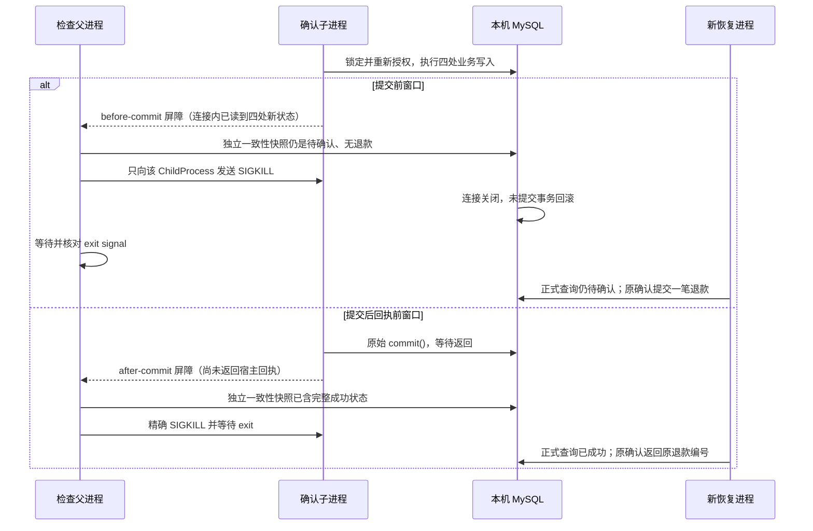
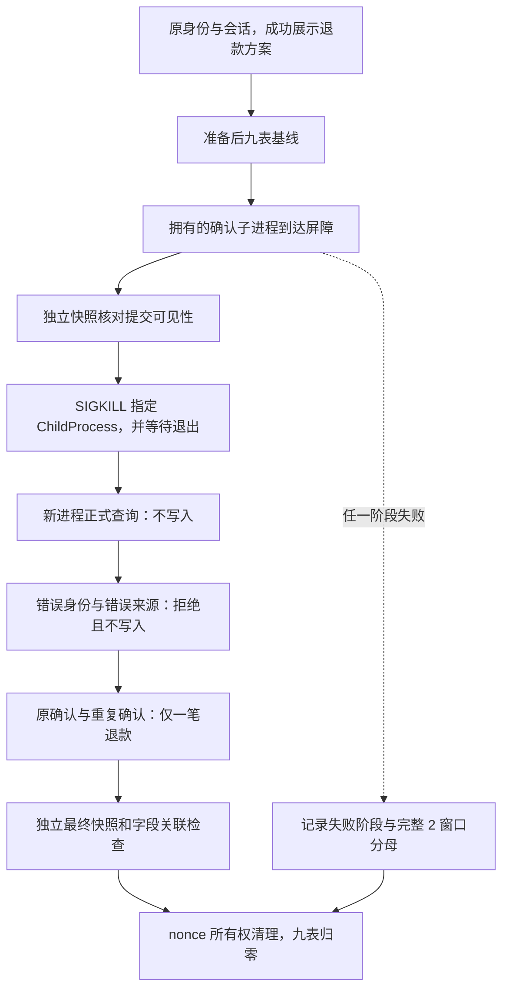

# M3：退款事务中断的两个窗口

本轮补的是故障验证，不新增退款写入能力。已有 `RefundStore.confirm` 在一个 MySQL 事务中写入退款记录、订单退款金额、券状态和退款操作结果；新增检查让独立进程真实停在 `COMMIT` 前、`COMMIT` 返回后但业务回执尚未返回的位置，再终止该进程并从另一个进程恢复查询与确认。

**当前状态（2026-10-10）：两个真实 MySQL 窗口均通过，2/2，未执行 0，清理通过。** 提交前中止后仍为待确认且没有退款；提交后回执前中止后仍保留同一成功结果。新进程重新授权与重复确认均通过，两个订单对应的九表夹具均已清除。脱敏结构化证据和受测源码哈希见[结果归档](../data/refund-crash-window-results-20261010.json)。

## 本轮合同与停止条件

| 项目 | 约束 |
| --- | --- |
| 真实业务问题 | 客户已经发出退款确认，但进程退出、客户端没有收到结果。再次查询或重复确认必须面对实际持久状态，不能凭“没收到回执”断言没有退款。 |
| 面试追问 | 提交前中止与提交后丢回执分别发生什么？如何证明没有部分更新？新进程如何恢复？旧操作编号能否重复扣款？错误客户、错误会话能否借恢复绕过授权？ |
| 个人实现与复用 | 个人代码提供业务事务、可信身份及来源校验、确认入口、数据库约束和检查协调；复用 MySQL/InnoDB 的事务与连接断开回滚、mysql2 驱动和已有 nonce 所有权夹具。本检查直接调用正式存储与宿主确认入口，不运行 Pi 循环，不声称实现了 Agent 通用 checkpoint。 |
| 预算 | 固定两个独立临时订单、两个故障窗口，各执行一次。真实模型请求 0、QQ 请求 0；只允许本机 `localhost`/`127.0.0.1:13306` 的 `dave_agent` 库。 |
| 验收 | 逐表状态与关联一致；明确观察到所拥有子进程的 `SIGKILL` 退出；新的进程查询不写、错误授权不写、原确认及重复确认最多形成一笔退款；清理后九张夹具相关表均无该订单数据。 |
| 收尾 | 保留 2 个窗口的完整分母和失败阶段；异常不伪装为通过。无需追加模型轮次，不引入生产故障开关、通用恢复框架、支付网关或通知补发平台。实库前置条件不满足就记录未执行。 |

## 两个窗口究竟切在哪里



屏障位于新检查脚本创建的**测试子进程内部**：该进程只包装自己 `refundPool.getConnection()` 返回连接的 `commit()`。提交前窗口停在调用原始 `commit()` 之前；提交后窗口必须先 `await nativeCommit()`，再发送屏障。屏障还会在该连接中读取四张已写表，验证业务写入确实已经发生。父进程收到屏障后，另用只读账号取一致性快照，才主动终止自己创建的子进程。

这没有修改 `src/refunds.ts`，也没有给生产入口添加环境变量、HTTP 路由或订单 ID 特判。屏障不会通过固定等待时间猜测事务进度。

| 观察点 | 提交前窗口 | 提交后回执前窗口 |
| --- | --- | --- |
| 屏障时，写连接内部 | 四处更新均已执行，尚未 commit | 原始 commit 已返回，四处更新已提交 |
| 屏障时，另一个只读连接 | 与准备完成后的基线逐字段相同 | 已退款、券已退、操作成功、恰好一条退款 |
| 子进程退出后 | 与基线相同，仍待确认 | 与屏障时持久状态完全相同 |
| 新进程只查询 | 返回原操作编号、待确认；所有表不变 | 返回原操作及退款编号、成功；所有表不变 |
| 原确认重放两次 | 第一次完成退款；第二次返回同一结果 | 两次都返回原结果，全部表与中止前相同 |

提交前的恢复确认会重新走授权、当前审批、未核销、有效期、金额等正式检查；检查只在条件仍满足时预期成功。提交后的成功结果也先重新查身份与来源，再允许返回原操作；幂等结果不是凭操作编号开放查询。

## 九表不变量与重新授权

读取快照使用独立只读账号，在同一个 `REPEATABLE READ`、`WITH CONSISTENT SNAPSHOT, READ ONLY` 事务中顺序读取，避免把不同时间的九次查询拼成“原子快照”。

| 表 | 检查内容 |
| --- | --- |
| `orders` | 原订单、实付 7980 分；成功时状态为 refunded、已退恰好 7980 分；其余字段不变。 |
| `order_items` | 一条项目、仍属于该订单，完整内容不变。 |
| `coupons` | 一张券、仍指向该项目；只能从 unused 变为 refunded，其余字段不变。 |
| `payments` | 唯一成功付款仍为 7980 分，完整内容不变；随机付款 marker 用于识别夹具所有权。 |
| `merchant_requests` | 同一批准任务、同一订单/客户/会话、批准金额 7980 分，完整内容不变。 |
| `refund_operations` | 同一操作编号、客户、入口身份、会话来源、任务和金额；只允许成功状态、确认时间、退款编号变化。 |
| `refunds` | 提交前是 0 条；成功后恰好 1 条，退款编号与操作引用一致、金额与实付一致、完成时间与确认时间一致。 |
| `merchant_notifications` | 始终 0 条；本检查没有存储通知路由，也没有启动通知派发。 |
| `merchant_demo_scenarios` | 同一订单对应的合成场景，完整内容不变。 |

恢复子进程还会执行：

1. 用当前可信身份调用 `CouponStore.getOrder` 与 `RefundStore.get`，核对订单状态、操作编号、退款编号，并比较查询前后的完整快照。
2. 用 `TEST_USER2` 查询该订单，要求拒绝；用错误客户或错误会话来源查询退款，要求没有可读取操作；向正式 `confirmRefundReply` 重放同一个确认命令，要求返回拒绝通知且所有表不变。
3. 用原身份和原会话确认，得到实际成功回执；再次确认必须得到同一回执，时间与退款表不能改变。

这里验证的是**新进程重新执行身份与来源授权**。没有更改共享 `qq_identities` 绑定，因此不能据此声称验证了“原客户绑定在中止期间被撤销/转移”的全部路径；已有授权专项检查与本检查应分别保留。



## 代码阅读路线

- [检查脚本](../scripts/refund-crash-window-check.ts)：`commitBarrier`、`databaseChild`、`Children.run`、`checkRefundCrashWindowsDatabase`、`checkRefundCrashWindows`。屏障、进程所有权、真实状态与纯协调测试均在这一个新脚本中。
- [退款事务](../src/refunds.ts)：`transaction` 的真实提交位置；`withOperation` 先授权再判断已成功；`confirm` 的四处写入；`get` 的持久状态授权查询。
- [宿主确认入口](../src/refund-entry.ts)：`confirmRefundReply` 只接受字面确认命令；失败回复把结果表述为未知，提示回原会话查询；`markRefundReplyPresented` 在固定方案成功交付后登记可确认状态。
- [订单读取](../src/coupon-store.ts)：`getOrder` 读取当前绑定与订单归属并返回业务状态。
- [随机夹具](../scripts/merchant-test-fixture.ts)：`createMerchantFixture` 创建新的合成订单；`cleanup` 先按随机付款 marker 固定所属订单集合，再按依赖顺序删除。不得按 `COUPON-2xxx` 范围清库。
- [已有正常恢复检查](../scripts/atomic-refund-recovery-db-check.ts)：已有检查是正常完成后由新进程查询；本轮保留该入口，补充两个真正被终止的事务窗口。

准备阶段直接调用真实商家存储生成并批准一个合成任务，再渲染固定退款方案到本地成功交付数组，调用正式 `markRefundReplyPresented`。这用于建立受测事务的合法前置状态；不证明模型规划、QQ 传输、商家外部接口或客户客户端确实展示。

## 复现命令与失败清理

从仓库根目录运行无数据库检查：

```bash
node scripts/refund-crash-window-check.ts --check
npm run typecheck
```

`--check` 不读取数据库配置，不创建连接，也不运行模型。它真实创建本地子进程，但业务写入用纯数据断言替代，覆盖：

- 原始 commit 与两种屏障的顺序。
- 屏障属于当前随机 nonce、窗口和当前拥有的 PID；伪造父进程 PID 或错误 nonce 会拒绝。拒绝时也只清理本次创建的子进程。
- 正常返回、提前退出、超时、主动 shutdown 都有退出等待；一个子进程中止不会杀死另一个仍等待的子进程。
- 新子进程不能在 coordinator 已停止后继续启动。
- 半更新、重复退款、金额错误、来源错误以及无关表变化能够被断言捕获。

实库检查由主会话串行执行，运行前确认无待处理商家任务、待发送终态通知或活动评测；环境应已按项目文档初始化。不要为本检查运行数据库重置、共享身份修改或全局任务扫描。

```bash
node --env-file-if-exists=.env scripts/refund-crash-window-check.ts --db
```

脚本打印 `run_started`、`fixture_allocated`、`prepared` 以及最终 JSON 报告。报告包含随机 nonce、明确的 2 窗口分母、每个窗口状态与当前阶段、拥有的订单/付款 marker、准备/中止/恢复 PID、实际退出信号、关键快照散列、恢复与重复确认依据、清理结果。打印过程不包含连接配置、密码或完整 SQL。需保存原始输出时使用本地 `.runtime/` 路径；不要将未经审核的本地日志入库。

每个子进程默认最多 30 秒；发送 `SIGKILL` 后最多等 5 秒观察退出；父进程快照的每条查询最多 5 秒；连接超时复用 `readDatabaseConfig` 的 5 秒；夹具创建/清理复用现有 Docker 命令的 15 秒超时。测试中的 800 毫秒超时只用于无 DB 的故意挂起子进程，不用来判断业务进度。

父进程的 `SIGINT`/`SIGTERM` 会停止后续子进程调度、只终止其拥有的子进程、等待退出，再尝试夹具清理。普通失败也会执行相同清理并记录错误；清理失败不得记为本轮成功。若最终仍无法确认拥有的子进程全部退出，清理标为 `skipped_unconfirmed_children`，保留夹具信息，避免与可能存活的写进程竞争删除。父进程自身遭到 `SIGKILL`、机器掉电或数据库不可用时无法保证清理：保留已输出的 nonce、订单和付款 marker，先核实确实属于该次夹具，再在独立维护窗口处理；不能用订单号区间推断所有权。这里不承诺自动恢复被强杀的检查父进程。

如果存在本轮子进程退出未确认、权限失败、表结构不匹配或清理失败，最终进程退出码为非零；即便另一窗口成功，仍保留失败与未执行项。脚本不会更改失败用例或自动重跑追分。

## 当前结果与证据层级

| 验证项 | 2026-10-10 结果 | 可以说明什么 |
| --- | --- | --- |
| `node scripts/refund-crash-window-check.ts --check` | 通过，退出码 0 | 屏障顺序、拥有子进程的退出与清理协调、错误 marker、超时/提前退出、存活隔离及数据不变量断言可工作。 |
| `npm run typecheck` | 通过，退出码 0 | 当前工作树在该次检查时通过 TypeScript 类型检查。 |
| 提交前真实 MySQL 中止与恢复 | **通过**，1/1 | COMMIT 前独立快照不可见新写入，SIGKILL 后事务回滚；新进程原确认及重复确认只形成一笔退款。 |
| 提交后回执前真实 MySQL 中止与恢复 | **通过**，1/1 | COMMIT 成功、回执未返回时 SIGKILL；新进程查询及重复确认保持同一成功结果。 |
| 两窗口实库清理 | **通过**，2/2 个临时订单 | 按随机付款 marker 核对所有权后清理，两个订单对应的九张相关表均无残留；结果归档保留逐表计数。 |
| 整体 `npm run validate` | 主会话在 M4 最终运行文件版本执行，退出 0 | 本实库报告覆盖的退款/夹具源码哈希与最终文件一致；完整检查不替代两个实库窗口。 |
| 模型 / QQ / 支付渠道 | 调用预算 0，未执行 | 本实验完全不证明这些外部环节。 |

本轮没有通用 Agent step checkpoint、工作队列重放或商家通知 exactly-once。它只对已存在的单笔合成退款事务提出可复现的中断验证。退款业务状态使用真实代码和本机存储；金额与商家结果为合成数据，没有真实商业资金结算。

## 练习：把结果讲成可核验的面试答案

1. 先不运行 DB，沿 `confirm → transaction → commit` 标出四处写入，说明哪一个屏障会使另一个连接仍看见待确认。
2. 从实际 JSON 报告找出中止进程 PID、退出信号、恢复进程 PID、操作编号及退款编号，证明“新进程”与“重复确认返回同一笔”分别依据什么。
3. 假设 `refunds` 已存在而 `coupons` 仍为 unused，说明哪个断言会失败，以及为什么这不能作为已通过的恢复证据。
4. 解释为什么超时回复只能说“结果需要查询”，为什么不能自动生成新操作编号再次退款。
5. 对比错误会话重放与原客户绑定撤销：本检查覆盖了前者，后者应查哪一组独立授权专项证据，不能如何概括。

可用的当前表述：“我在本机 MySQL 上分别终止了提交前和提交后回执前的确认进程。两个窗口均通过，新进程会重新授权查询，重复确认仍只有一笔合成退款；我没有验证真实支付渠道或 QQ 送达。”两窗口完整报告与受测源码哈希已归档，参见 [03.30 退款章](yuque-drafts/minimax/03.30-refund.md)。
