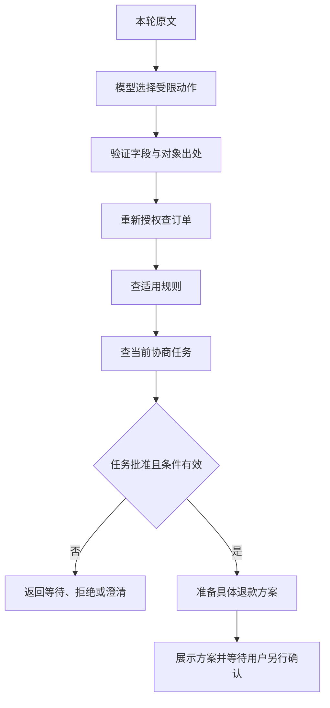

# 01.00｜Agent 宿主总览：从一句诉求到可靠执行

用户说：“团购券用不了，帮我退一下。”一个语言模型能理解“退”是什么意思，却不能仅凭这句话决定退哪一单、退多少钱、是否已经获准。客服系统要把语言理解接到订单、规则、协商和退款上，还要在失败时留下可以继续查询的结果。

这就是 Agent 宿主的工作。宿主是围绕模型运行的业务程序：准备上下文、提供工具、控制执行、保存状态、处理异常。英文 Harness 在这里指这套工程。理解它，先抓住一句话：**模型提出要做什么，业务代码决定是否能做以及实际做成了什么。**

## 先认识三个业务对象

订单记录买了什么、实付多少、券是否使用；协商任务记录向商家提出了什么问题、正在等待还是已有结果；退款方案记录待确认的订单、金额和操作编号。这三个对象分别回答“买了什么”“商家怎么说”“这次准备执行什么”。

商家同意只是退款的一个前提。系统还要展示具体方案，用户针对该方案确认，执行时再次核对状态。聊天中出现“可以退款”几个字，不能把这三层合并。

项目用合成订单、商家结果和资金演示单张未核销券的整笔退款，身份、确认、金额和幂等由代码与数据库执行。网页入口只提供咨询；完整写入流程在配置了相应业务服务的入口中使用。


图 1：Pi 连接模型与工具循环；业务宿主检查身份、状态与确认，把请求接到业务执行和账本上。

## 从一句话走到结果

可以把一次完整售后读成七步：找到本人订单，查询适用规则，准备联系商家的请求，等待用户确认后建立协商任务，读取商家结果，展示退款方案，再接受精确确认并执行退款。

| 顺序 | 谁负责 | 本步要完成什么 |
| --- | --- | --- |
| 1 | 可信入口与会话 | 接收诉求，确定发信人身份 |
| 2 | 模型与受限工具 | 理解需求、选择工具，再检查订单归属 |
| 3 | 业务读取 | 获取当前订单和适用规则 |
| 4 | 业务宿主与用户 | 准备协商请求或退款方案，等待对应的具体确认 |
| 5 | 执行服务与数据库 | 重新检查权限与状态，保存唯一业务结果 |
| 6 | 回复与查询 | 说明本次结果；回复丢失时查询已保存的记录 |

没有订单号时，系统先列出当前身份最近三笔本人订单。列表帮助选中对象；选中之后，仍要重新查询当前订单和规则。等待 A 单协商时，用户可以咨询 B 单；A 的通知不能悄悄把当前咨询对象改回 A。

## Pi 与项目各自负责什么

Pi 是复用的 Agent SDK，它负责调用模型、执行模型选择的工具、把工具结果交回模型，并管理会话生命周期。项目提供业务工具、可信身份、确认流程和业务存储。这样可以把实现精力放在客服难点上，而不用重写模型与工具循环。

下面是 `src/agent.ts` 中 `createSession` 的实际会话创建片段：

```typescript
  const { session } = await createAgentSession({
    cwd: projectDir,
    agentDir: `${projectDir}.runtime/pi`,
    modelRuntime, model, thinkingLevel: "off",
    tools: tools.map((tool) => tool.name), customTools: tools,
    resourceLoader,
    sessionManager: SessionManager.inMemory(projectDir),
    settingsManager: SettingsManager.inMemory({
      // Full HTTP payloads have a local budget; semantic compaction is not implemented.
      compaction: { enabled: false }, retry: { enabled: true, maxRetries: 2 },
      cacheWarming: "off",
    }),
  });
```

从上到下看，`modelRuntime` 和 `model` 提供模型运行配置；`tools` 是允许调用的名字，`customTools` 是对应实现；`resourceLoader` 提供固定流程资源；`SessionManager.inMemory` 保存本次进程中的聊天上下文。自动压缩关闭，表示这套配置没有自动摘要旧聊天。请求重试属于模型连接容错，不会使退款获得绕过确认的资格。

这段只节选会话创建。当前函数随后还包装该 Session 的 `streamFunction`，将正式入口的模型 HTTP 预算与取消信号接到实际请求，再返回 Session；并不是创建后立即返回。该接线复用 Pi 的原循环，不修改 SDK 核心。预算按一条入口消息或事件共享，具体计数与未知费用见 [07.10](./07.10-evaluation-cost.md)。

## 用一个工具看清信任边界

模型要查订单时，只能提交订单号。下面是同一文件中 `createCouponSession` 为 `get_order` 设置的参数和执行体；这是工具定义中的节选：

```typescript
      parameters: Type.Object({ orderId: Type.String({ pattern: "^COUPON-\\d{4}$" }) }, { additionalProperties: false }),
      execute: async (_id, { orderId }) => ({ content: [{ type: "text", text: JSON.stringify(await store.getOrder(identity, orderId)) }], details: {} }),
    }),
```

`orderId` 来自模型选择，`identity` 则来自外层宿主，模型没有客户 ID 参数。`additionalProperties: false` 拒绝额外字段。真正读取发生在 `store.getOrder`：它把可信发信人与订单归属放在数据库查询里核对。

这里有两个不同的问题。一个是“用户说的是哪一单”，模型可以协助理解；另一个是“该用户能否访问它”，必须由业务代码裁决。即使模型知道别人的订单号，也不能因此得到查询权限。返回结果还包含当前状态和金额，模型不能拿旧聊天充当最新业务事实。

## 为什么还设计业务 Controller

直接提供多个业务工具的路线叫 `atomic`。模型可以灵活安排顺序，例如先查订单，再查规则，再准备请求。实现接入简单，但模型可能漏查规则、用错范围或把旧结果当作刚查到的信息。

Controller 是业务编排层：模型先提出一种受限动作，宿主安排该动作必须完成的读取，并根据本轮结果形成业务回复。它把能够确定的步骤放进代码，代价是要维护动作、澄清、引用和失败恢复的更多逻辑。模型仍可能选错动作，所以这条路线作为候选独立研究，没有自动替换默认流程。

两种路线都必须通过相同的身份、金额、确认与幂等保护。选择的依据应是具体失败和收益，而非“更多宿主代码一定更可靠”。例如针对漏取证，可以比较漏查次数与新增延迟；针对切单，可以观察是否需要更多澄清，不能只看回答听起来顺畅。

## 从用户原句到一个业务动作

以“请为 COUPON-2001 准备退款方案”为例，模型需要表达的是办理意图和对象，而不是金额、批准或执行结果。Controller 路线可接收下面的动作；这是说明协议的输入例子，不是一次已经执行的退款：

```json
{
  "action": {
    "protocol": "v2.2",
    "kind": "refund_prepare",
    "orderRef": { "kind": "explicit", "orderId": "COUPON-2001" }
  }
}
```

`kind` 告诉宿主要走哪条业务链，`orderRef` 说明对象来自本轮明确订单。当前消息没写订单号、只是承接已确认的唯一焦点时，应使用 `focus`；不能把聊天里见过的号码伪装成当前原文明示。用户同时说“查一下 A，再替 B 申请退款”，而办理对象与顺序尚不清楚时，模型选择 `clarify`，请用户先明确这一轮处理哪件事。

动作在 TypeBox schema 中是一个带分支的对象。以下两行分别来自 `src/support-action.ts` 与 `src/support-context-action.ts`；它们是对应分支节选，不是完整定义：

```typescript
Type.Object({ kind: Type.Literal("refund_prepare"), orderRef }, { additionalProperties: false })
Type.Object({ kind: Type.Literal("explicit"), orderId: Type.String({ pattern: "^COUPON-\\d{4}$" }) }, { additionalProperties: false })
```

固定动作名、限定订单格式、拒绝额外字段，可以阻止模型附加 `amountCents` 或 `approved` 来改变协议。schema 只解决形状是否合法，还没有证明订单来自当前请求或属于当前客户。

接下来是出处检查。`src/support-controller.ts` 的轮次验证包含这一段：

```typescript
      const ids = [...new Set(trusted.userText.match(/COUPON-\d{4}(?!\d)/g) ?? [])];
```

```typescript
      if (action.orderRef?.kind === "explicit" && !ids.includes(action.orderRef.orderId)) {
        throw new SupportProtocolError("订单引用不在当前用户消息中；历史唯一订单应使用 focus，不能编造显式选单。");
      }
```

`trusted.userText` 来自宿主接收到的本轮原文。这个检查拒绝“字段完全合法，却把旧单说成本轮新选择”。通过后，服务仍按可信身份重新查询订单；文字出处与访问权限是两道不同的检查。

## 固定依赖由谁安排

准备退款有固定前提。Controller 先取得当前本人订单和适用规则，再读取这个会话的协商任务；只有任务批准和其他业务条件满足，才能请求退款服务准备方案。模型不用另写四次工具调用来维持这个顺序。



这张图的“准备方案”没有连接到自动执行退款。最终确认始终来自用户新的完整消息，并由另一条宿主入口检查。即使动作名包含 `refund`，模型也没有获得提交退款的能力。

下面是 `SupportController.execute` 取证后的实际执行节选：

```typescript
    const task = await getTask();
    if (!task) return result(notice("当前会话尚无这笔订单的协商任务。请提供原因并明确要求联系商家，收到确认文字后本人确认。"), "blocked");
    if (task.status !== "approved") return result({ kind: "merchant_status", task }, "blocked");
    const operation = await call("prepare_refund", { orderId }, async () => {
      const value = await this.services.refunds!.prepare(context.identity, context.sourceKey, orderId!);
      if (!isRefundOperation(value) || value.orderId !== orderId || value.taskId !== task.taskId
        || value.amountCents !== order!.amounts.paidCents || value.amountCents !== task.approvedAmountCents) throw new Error();
      return value;
    });
```

没有任务就停止，并解释需先联系商家；任务仍等待、拒绝或超时就返回该状态；批准后才调用准备服务。服务返回后还核对订单、任务、实付金额和批准金额，防止“函数返回了一个对象”被直接当成正确结果。服务内部另有自己的当前条件校验，宿主比较返回对象不能替代数据库边界。

## 一步成功，到底成功了什么

步骤成功要对应可检查的后置条件。工具调用没有抛异常，只能说明这次函数正常返回；用户目标还可能没有完成。

| 步骤 | 应检查的结果 | 不能据此声称 |
| --- | --- | --- |
| 选择业务动作 | 字段合法，当前原文与对象引用匹配 | 订单一定属于当前客户 |
| 查订单 | 当前身份有权读取，返回对象是目标订单 | 已经获准退款 |
| 查规则 | 范围与所问内容匹配，有可用来源 | 当前订单满足每项前提 |
| 查协商任务 | 返回这个会话与订单的真实任务状态 | approved 就是已退款 |
| 准备方案 | 操作、任务、订单、金额匹配 | 用户已经看见或确认 |
| 展示登记 | 指定方案发送被接受并登记 | 用户一定已读 |
| 确认执行 | 当前授权、期限和状态有效，事务形成唯一结果 | 真实支付机构已经到账 |
| 解释结果 | 最终文字准确描述事实、限制和下一步 | 工具正确就保证文字正确 |

Controller 的 `ready` 表示当前动作形成了可用结果；`clarification` 表示还缺信息；`blocked` 表示当前业务前提阻止继续；`non_business` 表示当前请求不属于支持的办理动作。`ready` 不是整段售后全部完成的统一标签，准备方案成功与退款成功应查看各自的对象状态。

## 为什么一次模型纠错不能变成重复业务

模型可能在一次请求里重复给同一个动作，也可能看到失败后换一个动作继续试。宿主需要限制这种“继续试”发生的位置。

`SupportController.createTurn` 对已经接纳的动作采用以下逻辑：

```typescript
        if (accepted) {
          if (!isDeepStrictEqual(action, accepted)) throw new SupportProtocolError("本轮已有业务动作，不能追加冲突动作；请在下一轮明确需求。");
          return pending!;
        }
```

相同动作返回已经保存的 Promise；冲突动作拒绝。保存的 Promise 包括失败结果：服务可能已经写入后才返回错误，此时不能因模型再次调用就重做。它限制的是同一宿主轮次中的执行，跨进程与重复确认仍靠业务数据库的唯一操作和事务幂等。

格式或当前消息引用错误发生在业务执行前，可以让模型按错误信息做有限修正。当前 Controller 默认允许一次修复，参数只接受零至二；超过预算会取消本轮。另有一种特殊修复只用于已完成的、无副作用的政策范围拒绝：宿主要求同一明确订单重新提出完整问题，或转为澄清，不能趁修复换单或申请退款。

| 异常 | 本轮处理 | 为什么不能统一重试 |
| --- | --- | --- |
| 非法字段或错误引用 | 执行前有限修复，预算耗尽停止 | 还没开始业务，才有安全修正空间 |
| 业务条件拒绝 | 展示原因或当前状态 | 重复请求不会使条件成立 |
| 服务错误或写入结果不明 | 保留未知，后续查询持久结果 | 可能已经产生业务效果 |
| 模型最终解释失败 | 使用已有受控业务回执或失败说明 | 不能为了补一句文字再准备一次方案 |
| 请求连接故障 | 按运行配置处理模型请求重试 | 不代表用户重新授权业务 |

这里的动作修复、Pi 的模型请求重试、用户重发和数据库幂等属于不同层。`retry.maxRetries` 不能被解释成整轮只有固定数量的 HTTP 请求；一次回答可能多次调用模型，每次调用又可能遇到网络重试。

## 为什么现在没有通用 Planner

当前售后依赖主要由业务状态决定，订单与规则必须先查，批准与确认不能被模型规划跳过。用固定业务动作执行这些依赖，便于说明每一步输入、结果和失败后置条件；代价是新增业务要明确扩展动作与合同。

通用 Planner 会把目标拆成子任务，并根据执行结果重新安排步骤。当前代码没有通用任务 DAG、多 Agent 调度或按复杂度自动选模型。模型选择业务动作不等于实现了这些系统，固定售后状态机也不是一套通用规划器。

如果未来出现步骤不固定、多个独立资料源需要比较、能够安全重新安排顺序的真实请求，再评估规划是否减少遗漏或用户等待。先与现有固定动作对照，检查成功率、错误副作用、调用次数、延迟和维护成本；不要因为面试题提到 Planner 就把高风险确认交给它。

## 工具结果怎样变成用户能看懂的回复

工具返回订单、任务或方案数据，面向用户的 Reply 则表达业务含义。例如 pending 表示任务仍在等待，approved 表示商家同意，退款操作 succeeded 才表示本项目的退款记录已完成。宿主可以用结构化回复呈现这些状态，避免把模型一句“好了”当成执行回执。

结构化回复还要经过发送。展示登记说明发送被接受，不能证明用户已经阅读；发送不明时也不能把方案重新准备或把资金操作再做一遍。把查询、状态变化和对外投递拆开，出现故障后才能判断应该继续查结果、等待确认，还是重建对话。

## 失败后，哪个部件负责继续

| 情况 | 系统处理 | 接受的代价 |
| --- | --- | --- |
| 同一用户连续发消息 | 同一会话串行；最多接纳三条尚未完成消息，含处理中一条 | 用户可能需要排队 |
| 模型失败或超时 | 提供受控回复，发出取消信号，等待旧工作收尾后重建会话 | 取消不等于远端已停止，收尾无固定上限 |
| 商家结果超过期限 | 得到数据库锁后再次检查截止时间 | 不能仅用开始等待前的时间 |
| 通知发送结果不明 | 记录未知，保留查询，不自动重发 | 可能少一次主动提醒 |
| 用户重复确认退款 | 事务与持久唯一结果返回原处理结果 | 要维护业务状态，单靠消息去重不够 |

任务完成、平台接受发送、用户读到消息和退款到账，是不同事件。例如协商已经批准而通知失败，批准不会消失；用户可以再查进度。反过来，平台接受一条“已处理”消息，也不能证明数据库真的执行了退款。


图 2：业务状态和通知投递走两条线。投递结果未知时，应核对持久账本，不能自动认定业务失败。

## 把一个场景讲完整

小林不记得订单号，先说“帮我退款”。系统按可信身份列出最近订单，小林选中 A。系统读取 A 当前状态与适用规则，生成联系商家所需的确认文字。小林完整确认后，宿主建立任务；期间咨询 B 时，两条线各自保留对象。

A 获得批准后，系统通知结果。小林请求退款方案，方案成功展示后再确认。执行服务核对当前身份、A 的状态、金额、批准和期限，并用事务保存结果。如果小林重复发送同一确认，得到既有结果；如果进程重启，则用明确订单号重新授权查询持久记录。

沿这个故事应能指出三条边界：选单只定位；批准还不是退款；确认只针对已展示的具体方案。它们让模型的语言能力与可检查的业务执行形成一个闭环。

## 练习与面试追问

试着用两分钟回答：“如果模型判断错了，系统如何保证不退错钱？”答案应分别提到受限工具、当前归属、展示确认、金额计算和事务幂等，不能只说系统提示写得严格。

再在故事中加入一次身份解绑和一次发送未知：前者需要让旧会话失效并在发送前复核，后者需要保留查询。说清每次失败损失的是哪种体验、哪种业务事实仍然存在。

最后做四个协议练习：把动作中的订单改成本轮没出现的旧单；重复发送同一动作；第一次准备服务结果不明后改成另一个动作；准备成功但最终文字生成失败。逐个指出检查点、服务最多执行几次、用户应看到什么。答案应分别包含出处校验、同轮 Promise 复用、冲突拒绝和保留业务回执，不能只回答“让模型再想一遍”。

## 参考资料与实现边界

实现入口：[会话与工具](../../../src/agent.ts)、[QQ 队列与恢复](../../../src/qq-agent.ts)、[订单授权](../../../src/coupon-store.ts)、[动作 schema](../../../src/support-action.ts)、[引用协议](../../../src/support-context-action.ts)、[Controller 依赖与后置条件](../../../src/support-controller.ts)、[轮次与有限修复](../../../src/support-session.ts)。正文节选对应这些源码，省略的周边变量不应被误当成可独立运行的脚本。

练习可对照已有 [Controller 检查](../../../scripts/support-controller-check.ts) 与 [Session 协议检查](../../../scripts/support-session-check.ts)。阅读或复制本课不产生新的业务验收；涉及真实模型、数据库和发送的复现按项目 [计划](../../../plan.md) 与 [售后说明](../../../docs/after-sales.md) 选择专用合成环境。

项目复用 Pi 的循环与生命周期，业务宿主为项目实现。有限场景检查不能说明所有自然语言都正确；当前没有真实商业资金交易。Controller 与持久引用恢复的完整综合验收仍待完成。
