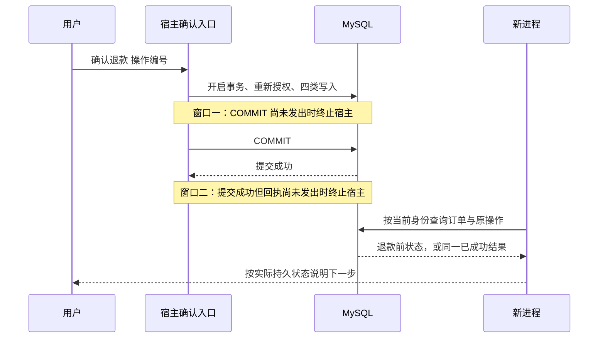

# 03.30｜退款执行：展示确认与事务幂等

## 商家同意之后，还差哪一步

小林收到“商家同意退款 79.80 元”的消息，接着问：“那就退吧。”系统不能仅凭商家结果或一句历史同意立即执行。它要先生成当前可执行的方案，把订单、金额和操作编号展示给小林，再接收针对这一方案的明确确认。

**批准、方案、展示、确认、执行是五件事。** 批准给出商家允许的范围；方案把具体对象与金额固定下来；展示让用户看到这次操作；确认表达用户同意；执行才改变资金记录与订单状态。任何一步省略，都可能出现“用户没看到却被执行”“看的是旧金额却退了新金额”或重复退款。


图 1：可信身份、明确确认和事务幂等是三道不同的保护。知道订单信息，不代表已经获得执行许可。

## 退款操作是什么

项目把一份待确认方案存为 `refund_operations` 中的操作。它关联订单、商家任务、客户、入口身份、来源会话、金额、有效期与状态。`operationId` 是这份具体方案的编号，不是订单号，也不是让任何持有者都能退款的通行证。

| 状态 | 含义 | 下一步 |
| --- | --- | --- |
| `prepared` | 方案已写入，尚未登记成功展示 | 发送固定方案摘要 |
| `awaiting_confirmation` | 方案成功发送且展示登记完成 | 等用户精确确认 |
| `succeeded` | 本次操作已完成 | 返回持久结果，重复确认不再写款 |

金额使用整数分，并从当前订单实付读取。工具可以请求准备哪一单的方案，不能传入任意退款金额。当前写入范围是单张未核销券的整笔合成退款，部分核销、多券或需要优惠分摊的订单不会因为模型回答“可以”就获得写入能力。

## 准备方案：锁住当前事实，再固定操作

先区分两层检查。工具入口保证订单、适用规则与当前协商都实际读取过；`RefundStore.prepare` 再以事务内的权威数据决定能否保存方案。第一层防止漏取证，第二层保护身份、资格、金额和业务状态，不能互相代替。

下面是 `src/agent.ts` 中 `prepare_refund` 当前执行体：

```typescript
        execute: async (_id, { orderId }, signal, _update, ctx) => {
          const turn = currentTurn, revision = turn.revision;
          const task = await requiredTool(ctx, "get_merchant_request", { orderId }, signal);
          assertCurrent(turn, revision, signal);
          if (task?.orderId !== orderId || task.status !== "approved") throw new Error("本轮未取得当前订单的商家批准，不能生成退款方案。");
          const value = await refunds.prepare(identity, afterSales.sourceKey, orderId);
          assertCurrent(turn, revision, signal);
          return { content: [{ type: "text", text: JSON.stringify(value) }], details: {} };
        },
```

`requiredTool` 通过 Pi 原生调用已注册的协商查询工具；协商查询内部先重读本人订单、按订单每个商品的范围查询退款规则，再读取当前会话任务。它记录真实父子执行事件；这些依赖由宿主安排，不是模型自行规划出来的额外步骤。失败、空规则、范围不匹配、取消或未取得当前批准，都不能继续进入这里的准备服务。

`turn` 与 `revision` 用来确认等待前后仍处于同一有效轮次。它们不是数据库锁，更不是批准凭据。即使前置全部成功，下面的业务服务仍要重新授权；模型仍可能选错工具，因此这段代码也不能证明任意退款诉求都被正确理解。

`prepare` 先锁定本人订单，读取该订单已有操作，再核对券、支付、退款与商家批准。批准必须属于同一客户和来源会话，批准额覆盖整单实付，原申请额也要与当前实付一致。有效方案可以重复返回，已经成功的操作返回原结果。

如果旧方案过期，重新准备会更换操作编号并清空展示时间。这样，旧确认文本永久失去对新方案的指向，用户不能拿昨天复制的编号确认今天另一份方案。这里选择重新生成编号，避免给“旧编号现在指向什么”留下歧义。

准备时检查一次不够。用户可能过几分钟才确认，期间券可能过期、被核销或状态发生变化。因此执行时再次核验，不从聊天历史恢复旧批准或旧资格。

## 展示不是模型说“我已告知”

程序把结构化方案渲染为固定摘要，调用发送接口成功后，再调用展示登记。这个顺序让 `presented_at` 表示宿主完成了交付步骤；模型自行写一句“用户已看到”没有修改该字段的权限。

**源码节选：`src/refunds.ts` · `RefundStore.markPresented`。省略了本段前后的其他实现。**

```typescript
  async markPresented(identity: QQIdentity, sourceKey: string, operationId: string): Promise<RefundOperation> {
    return this.withOperation(identity, sourceKey, operationId, async (connection, order, row) => {
      const { coupon } = await this.eligible(connection, sourceKey, order, row);
      const now = await this.decisionTime(connection, coupon, row);
      await connection.execute(`UPDATE refund_operations SET status = 'awaiting_confirmation', presented_at = COALESCE(presented_at, ?)
        WHERE operation_id = ?`, [now, operationId]);
      return operation((await this.current(connection, identity, sourceKey, order))!);
    });
  }
```

输入是可信身份、来源和具体操作编号。登记前仍复核资格与时间；成功后状态进入 `awaiting_confirmation`。`COALESCE` 保留第一次展示时间，重复展示不会任意刷新它。

平台接受发送不等于人已阅读。若发送结果不明确，或发送成功但展示登记失败，不能猜测用户已获得可确认方案，应提示查询并重新获取。为安全而拒绝一次确认，比把一个无法确认展示的方案直接执行更可解释。


图 2：任务先持久保存，通知可能丢失，商家批准也不会自动执行退款。后续操作仍需对应的用户确认。

## 精确确认：只从真实入口接受

用户需要发送“确认退款 操作编号”。输入中的编号明确指向一份方案；身份和来源仍来自可信入口。模型可以告诉用户怎么确认，但确认入口不作为模型工具开放。

**源码节选：`src/refund-entry.ts` · `confirmRefundReply`。省略了本段前后的其他实现。**

```typescript
  text = text.replace(/^[ \t]+|[ \t]+$/g, "");
  if (!text.startsWith("确认退款")) return undefined;
  const match = /^确认退款 ([a-f0-9]{8}-[a-f0-9]{4}-[a-f0-9]{4}-[a-f0-9]{4}-[a-f0-9]{12})$/.exec(text);
  if (!match || match[0] !== text) return { kind: "notice", text: "请核对退款方案，并完整发送单行“确认退款 操作编号”，或点击方案中的确认按钮后发送。这里只处理模拟退款。" };
  try {
    return { kind: "refund_status", operation: await store.confirm(identity, sourceKey, match[1]!) };
```

正则要求完整单行格式，用户只发“同意”或引用一段混合文字不会成为这条直接确认。代码调用 `store.confirm`，而不是把“已确认”标志再交给模型决定。发生异常时，回执说无法确认结果并引导查询，不轻率声称“一定没退款”。

这正是资金操作里常见的未知结果：数据库可能已经提交，而服务端在返回前断开。异常说明调用没拿到可靠结果，不能自动推出交易没有发生。后续应查持久操作状态。

## 事务幂等：重复确认只执行一次

所有退款修改先锁同一订单，再锁该订单的操作。两个确认并发到来时，后一个需要等前一个事务结束。公共入口在重新授权后看到 `succeeded`，就返回原结果，不再执行写款。

**源码节选：`src/refunds.ts` · `RefundStore.withOperation`。省略了本段前后的其他实现。**

```typescript
        const order = await this.lockOrder(connection, identity, lookup[0]!.order_id as string);
        const row = await this.current(connection, identity, sourceKey, order);
        if (!row || row.operation_id !== operationId) throw new BusinessError(unavailable);
        if (row.status === "succeeded") return operation(row);
        if (!row.valid) throw new BusinessError("退款方案已过期，请重新获取方案并确认新的操作编号。");
        return action(connection, order, row);
      });
    });
  }
```

这段展示了执行之前的共同门禁。操作编号先用于定位订单，真正取锁后还要核对当前操作编号，防止过期编号在查询与锁定之间被替换。身份、客户和来源约束在 `lockOrder`、`current` 中完成；持有编号本身没有授权效果。

通过门禁后，`confirm` 要求状态为 `awaiting_confirmation` 且存在展示时间，再执行资格与取锁后时间复核。随后在同一事务内写四类记录：新增退款结果、把订单改为已退款并记累计退款额、把券改为已退款、把操作改为成功并关联退款编号。

四类记录必须一起提交。如果中途失败而只改了订单没改券，会出现“订单已退但券还能用”；只写退款记录没改操作，又可能让重试误认为从未成功。事务让这些变化共同成立或共同回滚，幂等状态则让后续重复确认读到同一个已完成事实。

可以在 `RefundStore.confirm` 中看到最后三项更新紧跟退款结果写入之后，使用同一个 `connection`：

```typescript
      await connection.execute("UPDATE orders SET status = 'refunded', refunded_cents = ? WHERE id = ?", [row.amount_cents, order.id]);
      await connection.execute("UPDATE coupons SET status = 'refunded' WHERE id = ?", [coupon.id]);
      await connection.execute(`UPDATE refund_operations SET status = 'succeeded', confirmed_at = ?, refund_id = ?
        WHERE operation_id = ?`, [now, refundId, operationId]);
```

这里没有接收模型传入的新金额，而是使用已重新核对的方案金额 `row.amount_cents`。`refundId` 把操作记录与这一笔退款关联；它不是每次重试都生成另一笔退款的理由，因为前面的 `succeeded` 分支会先返回已有结果。这些 SQL 位于同一事务回调内，尚未提交时不会被当作完整成功回执发送。

## 三个常见失败场景

**确认太早。** 方案刚写成 `prepared`，发送尚未成功，用户已复制编号发来确认。系统拒绝，要求先获取并看到方案，不能跳过展示。

**确认太晚。** 用户在有效期后发送旧编号。未成功操作不能执行，重新请求方案会产生新编号。即使开始处理时尚未过期，取锁等待后也会复核数据库时间，避免等待窗口穿过期限。

**成功后重复。** 第一次已经提交，但用户没有收到回执，再发送同一确认。当前身份与来源仍有效时，返回已有成功结果，不新增退款。重启后也能按明确订单号查询持久结果；聊天历史丢失不意味着资金操作丢失。

恢复时先找持久结果。通知没显示、模型超时或进程重启，都不能自动解释为退款没有执行。

## 查询恢复的是结果，不是旧授权

按订单查询时，Store 重新检查当前入口身份、订单客户和原来源会话，再返回操作状态。查询不会重新退款，也不会自动把过期方案改为可确认。用户看到“已成功”是在读取持久结果；用户看到“等待确认”仍需面对当次资格和有效期检查。恢复流程要把“找到过去的操作”和“允许今天继续执行”分开，这样重启恢复才不会变成绕过授权的后门。

## 为什么不只用缓存或提示词

提示词能提醒模型先确认，却不能强制数据库写入满足条件。内存去重能减少重复调用，却挡不住重启和多进程。只用退款编号唯一键还不够：它限制重复插入，但无法独自证明订单、券、批准与金额仍然满足规则。

本项目组合了宿主入口、展示登记、订单锁、状态条件和事务写入。代价是更多数据库读写，以及展示不明确时更保守的交互。收益是每次拒绝和恢复都有明确原因，可以追溯到一个业务条件，而不是寄希望于模型从长对话里记住所有约束。

练习：将“退款完成但发送回执失败”与“发送方案失败”分别画成时间线。前者应查询已完成结果，后者仍不能确认执行。再假设确认处理等待了行锁，指出哪一次时间读取决定未完成方案是否过期。

## 进程突然退出：先区分两个窗口

“重启后还能查到退款”和“执行到一半突然退出仍然正确”需要不同的检查。前者可以先正常完成退款、退出程序，再启动新进程查询；后者必须把退出时刻放在事务附近。仅在两次调用之间重启，无法证明第一笔事务中途发生过故障。

先认识 `COMMIT`：它是数据库提交事务的动作。在本项目中，退款结果、订单、券和操作状态在一个事务中修改；`COMMIT` 之后，这组修改才成为其他正常读取者能看见的已提交事实。服务端随后还要把结果返回给用户，提交与回执之间存在间隔。

| 退出窗口 | 退出前执行到哪里 | 新进程首先应查到什么 | 用户如何继续 |
| --- | --- | --- | --- |
| 提交前 | 四类业务写入已经执行，但尚未把 `COMMIT` 发给数据库 | 连接断开、事务回滚完成后，订单和券仍是退款前状态，没有新退款，原方案仍等待确认 | 先查询；当前授权、批准及有效期仍满足时，可重新发送同一精确确认 |
| 提交后、回执前 | 数据库已成功返回 `COMMIT`，但宿主还没有返回成功回执 | 同一退款编号、订单与券已退款、操作为 `succeeded` | 查询成功结果；再次确认也只能返回同一笔结果 |

两个窗口都可能让用户觉得“机器人没有回复”，但数据库结论相反。恢复入口必须读持久状态，不能用客户端是否显示成功倒推交易是否发生。提交前重新确认也不是无条件续跑：这段时间若账号改绑、券过期或资格变化，就应该拒绝，不能把故障前的许可缓存下来继续使用。



图 3：两个终止点是两次独立检查，不是在一次退款里同时发生。新进程不继承旧进程的内存判断。

## 怎样证明检查真的停在事务边界

固定睡眠后杀进程不可靠：机器快时可能已经回复，机器慢时可能还没执行写入。应由子进程在确切边界通知父进程，父进程收到信号后再终止它。这里的屏障是检查程序内部的同步点，不是生产系统新增的管理员接口。

正式实现的事务顺序位于 `src/refunds.ts`，关键部分如下。生产代码不需要为了实验增加“跳过提交”或“强制成功”的开关。

```typescript
await connection.beginTransaction();
const result = await action(connection);
await connection.commit();
return result;
```

`action` 完成并不代表事务提交；`commit` 返回也不代表用户收到了回执。检查程序可以只在子进程里包装它自己创建的真实数据库连接：提交前模式进入 `commit` 包装后先通知父进程并等待，不调用真实 `commit`；提交后模式先等待真实 `commit` 成功，再通知并等待，不把结果返回给宿主。其他方法原样调用真实连接，业务 SQL 和正式确认函数保持不变。

父进程还需独立核验数据库：提交前，正常读取仍只能看到旧状态；提交后，独立连接应已看到完整成功状态。然后父进程终止对应子进程，确认退出信号和 PID，再使用另一进程查询与重复确认。这样，屏障消息、真实数据库快照、进程退出和新进程结果互相校验，不只相信检查脚本自己打印了“已提交”。

## 故障验收应检查什么

| 检查项 | 提交前终止 | 提交后、回执前终止 |
| --- | --- | --- |
| 同一事务四类状态 | 回滚完成后全部保留退款前状态，无半笔退款 | 四类状态共同成功，并关联同一退款编号 |
| 新进程查询 | 读到原待确认操作，查询本身无写入 | 读到原 `succeeded`，查询本身无写入 |
| 本人精确重复确认 | 当前条件仍满足时仅产生一笔退款；再次确认不追加 | 始终回读同一笔退款，不追加记录或变更金额 |
| 他人或错误来源 | 拒绝查询或确认受限结果，业务快照不变 | 即使已成功，仍先重新授权，不能因幂等分支泄露结果 |
| 清理 | 只删除本轮随机标记的夹具，并核对没有残留 | 同样按精确夹具清理，不重置共享演示订单 |

这项检查验证的是本机真实 MySQL 与宿主进程退出，不是数据库服务器断电、磁盘损坏、真实支付回调或 QQ 客户端验收。窗口二有意选择数据库已经确认提交的位置；网络恰好在 `COMMIT` 发送与应答之间断开，仍属于另一种不确定结果窗口，不能凭本次计划声称已经覆盖。

练习：用户连续两次看到“无法确认结果”，第一次发生在提交前，第二次发生在提交后。分别列出应该查询的订单、券、退款和操作记录，写出下一句客服回复，再解释为什么两个场景都不能只根据错误日志重放一组 SQL。

## 参考资料与实现边界

- 最近一次专项记录：2026-10-10 在真实 MySQL 上执行两个受控终止窗口，2/2 通过、未执行 0。检查包含新进程查询、重新授权、错误身份与来源拒绝、本人重复确认和九表夹具清理。它独立于先正常退出再恢复的旧检查，没有新增真实支付或 QQ 验收。
- 复现命令为 `node --env-file-if-exists=.env scripts/refund-crash-window-check.ts --db`，只在专用合成环境运行；完整环境约束、版本与哈希见 [事务中断验收记录](../../refund-crash-window-validation.md) 及 [脱敏结果](../../../data/refund-crash-window-results-20261010.json)。
- 实现位置：`src/refunds.ts`、`src/refund-entry.ts`、`src/qq-agent.ts`。节选省略了完整 SQL、输入验证与事务资源释放；正文已说明它们在机制中的职责。
- 工具前置位于 `src/agent.ts`，本地检查为 `scripts/atomic-tool-prerequisite-check.ts`。它验证实际 Pi 嵌套执行、失败停止与取消，不增加数据库或真实模型验收；上面的事务中断结果有自己的固定版本与范围，不能追溯成新增前置的验收。
- 复现资料：`docs/after-sales.md`；相关检查入口为 `scripts/refund-agent-check.ts`、`scripts/atomic-refund-recovery-db-check.ts`，具体环境与历史结果在项目记录中。
- 当前退款是数据库中的合成资金状态变化，没有调用真实支付渠道。事务提交成功不能称为真实款项已到账；本章记录了本机 MySQL 的两个受控中止窗口验收，没有新增真实商家、支付渠道或 QQ 客户端验收。
