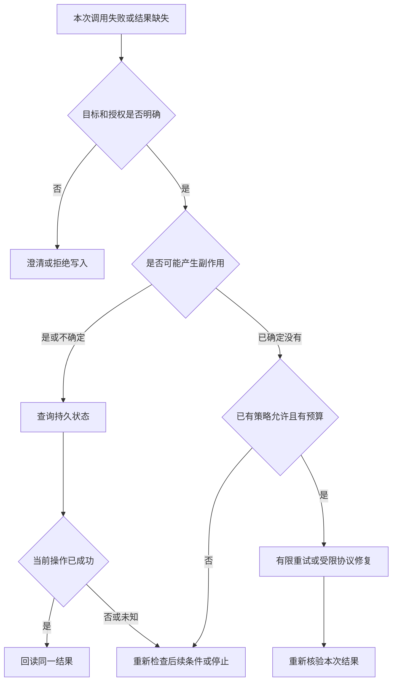

# 03.50｜会话排队：超时取消与下一轮接待

## 同一个人按顺序处理，不让整群一起等

小林刚发出退款确认，紧接着问“进度怎样”。如果进度查询先开始，就可能读到确认前的旧状态。与此同时，小周也在群里询问自己的券，不应因为小林的模型请求很慢而一起被挡住。

项目按“群＋发送者”划分会话队列：同一对话的已接纳请求排队，不同用户使用不同队列。这里解决的是调度顺序；谁能读订单、是否可以退款，仍由业务存储验证。**队列不会赋予权限，也不代替数据库幂等。**

同一用户的已接纳工作串行进行，后台任务和其他用户仍有自己的执行路径。

## Session、队列、退款记录有何不同

`Session` 承载模型对话历史与一次次工具循环，项目复用 Pi 管理这些生命周期。队列则决定某个 Session 下一次何时开始工作。退款结果保存在数据库里，决定钱和券的业务状态。

| 对象 | 当前保存位置 | 重启后的含义 |
| --- | --- | --- |
| 会话队列 | 进程内存 | 未处理工作不会自动恢复 |
| QQ 模型历史 | 当前进程的 Session | 不自动完整恢复旧聊天 |
| 协商、退款操作 | 数据库 | 重新授权后仍可明确查询 |

程序重启导致用户需要重述订单，不等于已经提交的退款消失。相反，销毁旧模型历史也不是撤回业务操作的方式。把这三类状态拆开，才能正确回答“取消后还能退款吗”“重启后为什么查得到结果”。

本节的队列和内存历史指 QQ 接待入口。网页公开聊天另有 SQLite 持久记录和授权回访，不能把 QQ 的内存边界扩写成“所有入口都没有持久历史”。

## 用 Promise 链保持顺序

一个队列不一定需要新框架。项目给每个会话保存一个 `tail`，表示目前已接纳工作的尾部 Promise。新工作通过 `tail.then(...)` 接在后面，上一项完成后才进入本项；不同键拥有不同尾部，因此彼此不会共用同一条等待链。

**源码节选：`src/qq-agent.ts` · `QQAgent.enqueue`。省略了本段前后的其他实现。**

```typescript
    if (entry.pending >= 3) {
      if (resolve) return "busy";
      await this.deliver(msg, "你的消息仍在处理中，请等待回复后再发送。");
      return "busy";
    }
    entry.pending++;
    const conversation = entry;
    let outcome: ContinuationOutcome = "deferred";
    const queuedAt = Date.now();
    let queueMs = 0;
    const task = entry.tail.then(() => withModelTask({
      requestId: msg.messageId, entrypoint: "qq", trigger: resolve ? "event" : "user", limits: this.taskLimits,
      onComplete: summary => this.log(`[model-task] ${JSON.stringify({ ...summary, queueMs, delivery: outcome })}`),
    }, async modelTask => {
      queueMs = Date.now() - queuedAt;
```

输入已经通过 QQ 事件检查。`pending` 包含正在处理和已经排队的工作，达到三条时，新普通消息直接收到忙碌提示；通知事件则返回 `busy` 让调度器稍后再试。被接纳后先加计数，再挂在前一项尾部上。

出队后才建立 `withModelTask`，一条用户消息或宿主事件共用一份模型请求预算与脱敏完成记录。`queueMs` 单独保存排队耗时，`delivery` 保存交付结果；这不把多轮退款业务合并成一个模型任务，也不把排队时间算进 prompt 的六十秒计时器。

这意味着“已接纳请求有序”，不能说“所有可见回复都严格先进先出”：第四条忙碌提示可能先于第一条慢请求的正式回复出现。把超额消息也无限加入队列，会让等待越来越长，并可能超过平台可回复窗口，因此项目明确限制积压。

会话容量和空闲清理同样有界：当前最多保留二十个会话，长时间空闲后会回收，轮数过多时重新创建 Session。这些是小规模接入的简化选择，并非跨进程队列或持久会话系统。

## 等待中变化的条件，出队后要重看

一条消息进队时有效，等到出队时可能已经太旧或服务已关闭，所以执行前再次检查。正式接入还读取账号绑定：若旧 Session 属于另一客户，就销毁旧历史，再为当前绑定创建会话。

发送前同样重新核对绑定，防止排队或模型等待期间发生改绑后仍发送旧客户内容。历史清理与发送门禁配合，分别解决“旧上下文进入新客户对话”和“旧回复向变化后的身份发出”。业务工具自身仍会重新授权，不能因为队列刚检查过就取消工具边界。

创建 Session 后，宿主先尝试处理完整确认、固定咨询与选单等入口。已有固定回执时直接交付，并以不触发新生成轮的消息记入历史。普通问题才调用 Pi 的 `prompt`。因此不是每条客服消息都需要远程模型推理。


图 1：业务状态和通知投递走两条线。投递结果未知时，应核对持久账本，不能自动认定业务失败。

## 超时到底限制了哪一段

当前默认六十秒计时器围绕 `session.prompt`，它和实际调用在 `Promise.race` 中竞争。

**源码节选：`src/qq-agent.ts` · `QQAgent.enqueue 的模型等待`。省略了本段前后的其他实现。**

```typescript
        prompting = session.prompt(prompt, { expandPromptTemplates: false });
        await Promise.race([
          prompting,
          new Promise<never>((_resolve, reject) => {
            timer = setTimeout(() => { modelTask.cancel(); reject(new Error("模型处理超时")); }, this.timeoutMs);
          }),
        ]);
```

若模型先结束，继续整理工具结果并发送；若计时器先触发，先调用 `modelTask.cancel()` 停止本轮新的受控模型 HTTP，再进入失败收尾。排队、会话创建、宿主 hook、发送和等待取消都不属于这个计时区间。因此用户看到的总等待可能超过六十秒，不应把参数解释为整个请求的硬截止。

`Promise.race` 只决定哪个结果先返回，不会自动停止另一个 Promise。计时器获胜时，旧模型请求或工具仍可能运行。如果马上允许下一轮使用同一 Session，两轮可能改写同一历史、读取旧上下文或互相覆盖输出。

## 先发取消，再等旧轮真正结束

失败分支先调用 `cancelSupportTurn` 和 Session 的 `abort()` 发出停止信号，再尝试一次受控回执。取消信号不能等 QQ 发送完成后才发，否则网络发送一旦卡住，旧模型还会继续工作。

最后的收尾等待两件事：Pi 的取消结束，以及完整 `prompt` Promise 结束。后者很重要，因为宿主包装的结果整理可能在 Pi 已空闲后仍未完成；只等“模型不再生成”不等于整个调用已经收尾。

**源码节选：`src/qq-agent.ts` · `QQAgent.enqueue 的失败收尾`。省略了本段前后的其他实现。**

```typescript
        if (failed && conversation.session) {
          try {
            if (!aborting) {
              cancelSupportTurn(conversation.session);
              aborting = conversation.session.abort();
            }
            await aborting;
          } finally {
            // Controller publication can outlive Pi idle; finish the full prompt before replacing it.
            await prompting?.catch(() => {});
            conversation.session.dispose();
            conversation.session = undefined;
            conversation.turns = 0;
          }
        }
      }
    })).finally(() => {
      conversation.pending--;
      conversation.touched = Date.now();
    });
```

等旧轮结束后才销毁 Session、清空轮数，最后减少 `pending`。下一条已接纳消息仍挂在同一条尾链后面，因此不会抢在旧轮收尾前开始。尾链还会吸收任务异常并输出受控诊断，避免前一次失败让所有后续 `.then` 永远跳过。

这段等待没有硬上限。若某个供应商不配合取消，或工具已经进入不能立即中断的操作，收尾可能继续等待。提前返回超时提示只是改善用户感知，不表示底层请求已经消失，也不能保证供应商马上停止计费。


图 2：上下文索引帮助找到订单，当前事实仍要重新查询。旧引用不等于持续有效的批准。旧轮结束后继续查询业务结果时，也必须重新授权。

## 已开始的工具怎么办

模型调用准备退款方案的工具后，方案可能已经持久保存，而后续模型生成发生超时；取消不能删除已经保存的方案。实际退款执行走宿主确认入口；若事务已提交但结果回执发送失败，应按订单查询持久结果。若工具正在等待数据库，不应简单把“abort 已调用”当作数据库已回滚；取消如何传播、底层连接是否支持中断，需要具体实现和验证。

本项目的安全策略是保留已发生的持久事实，后续重新读取。失败消息避免断言“一定未执行”，也不自动重复已尝试发送的内容。用户可以根据订单查结果，而不需要让模型从残缺历史中猜上一次究竟做了什么。

这与进程终止也要分开：2026-10-10 的 M3 已在真实 MySQL 上验证提交前、提交后回执前两个受控 `SIGKILL` 窗口，2/2 通过，新进程查询、重新授权及重复确认维持单笔合成退款，见 [M3 结果](../../refund-crash-window-validation.md)。它证明的是那两个事务窗口；不能反推普通 `abort()` 一定中断数据库，也不能证明 QQ 送达或模型推理会自动恢复。

另一个容易混淆的情况是普通发送失败。发送返回不明确，并不总会触发模型失败和 Session 销毁；它是交付状态问题，应与模型循环异常分开分析。否则会错误地把每次网络波动都解释成整段业务回滚。

## 用四个问题检查实现

正常顺序：同一人连发两条已接纳请求，第二条是否只在第一条完整收尾后开始？用户隔离：小林阻塞时，小周能否使用自己的队列？取消顺序：是否在等待发送前就发出 abort，销毁前又确实等到完整 prompt 结束？业务恢复：准备方案后模型超时，或宿主退款提交后回执发送失败，按订单查询是否返回各自的持久状态？

这些问题应分别使用适合的检查：可控模型替身验证排队与取消时序，数据库场景验证持久结果，真实平台验证消息显示。不能用一个本地取消测试推导所有网络都有硬截止，也不能从一次正常回复推导取消安全。

## 取舍与练习

内存 Promise 队列改动少、顺序清楚，适合当前有限接待范围；代价是重启丢失排队工作，没有跨进程协调。等待旧轮结束更保守，却避免为了尽快接待下一条而造成两个活跃轮次。数据库授权和幂等继续存在，是因为它们保护的对象超出了单个内存队列。

练习：在纸上画出“入队 → 创建 Session → 宿主 hook → prompt → 发送 → 收尾”，只给实际计时器覆盖的部分着色。再加入一次超时，标出取消、受控回执、完整 prompt 结束、销毁与下一轮开始的位置。若最后两个位置交换，就找到了会话重叠的风险。

## 失败之后，先决定恢复方式

面试官问“工具失败了怎么办”，不能只回答“重试三次”。先看失败发生在读还是写、是否已经产生副作用、还有没有足够预算，以及当前授权能否重新建立。相同的网络异常，放在规则查询和退款提交后，需要不同的动作。

`retry` 是对同一操作再次尝试；协议修复是改正无效的动作参数；澄清是请用户明确目标；持久查询是读取之前可能已经完成的结果；停止是本轮不再发起后续工作。重新规划通常还包含改变执行步骤或依赖，本项目没有通用规划器，不能把下面所有分支都称作自主重规划。

| 观察到的失败或状态 | 当前合理动作 | 为什么这样处理 | 当前实现位置与范围 |
| --- | --- | --- | --- |
| 用户没有明确订单，或多个历史对象竞争 | 澄清、让用户选单，然后重新取证 | 猜出一个订单不等于获得选择与授权 | 订单发现与 Controller 引用处理；前者有默认入口，后者按候选合同使用 |
| 确认格式不完整、身份不符、券已核销或方案过期 | 拒绝当前写入；解释重述或重新取方案的条件 | 重试不能把业务不允许改成允许 | 宿主确认解析、`RefundStore` 当前资格与期限检查 |
| 模型请求失败 | 由已有模型层按其规则有限重试；最终失败则取消并收尾 | 模型请求恢复和业务写入恢复是两条链 | Pi Session 配置 `maxRetries: 2`；这不是整轮所有 HTTP 请求的共同上限 |
| Controller 动作尚未开始，schema 或当前消息引用错误 | 在限定预算内修复动作，或澄清 | 此时尚未启动该业务动作，可以改正表达 | 显式 Controller 候选；不能反推默认原子工具已执行相同协议 |
| Controller 已完成一个无副作用的特定范围拒绝 | 只允许宿主认可的受限修复或澄清 | 可修复的错误必须确定完成且没有未知写入 | 候选的 `SupportPolicyScopeRepairError`，不允许换单或借修复扩成写入 |
| 动作可能已写入，但调用异常或结果缺失 | 结束当前尝试，按本人订单与操作查询 | 异常不证明没有提交；重新生成动作可能重复产生效果 | 退款持久查询；Controller 保留已接纳动作及其失败 Promise |
| 商家 worker 某次扫描数据库失败 | 下一次轮询重新扫描当前待处理状态 | 扫描恢复依据数据库当前状态，不复制旧结果直接覆盖 | `startMockMerchant`；终态仍由条件更新保护 |
| 通知尚未领取但队列忙 | 返回 `busy`，下次在原窗口内再调度 | 没有消耗唯一发送尝试，且仍须重新检查资格 | 通知 dispatcher 与同用户队列 |
| 通知已领取后进程退出，或发送结果未知 | 不自动重发；保留 `claimed`／`unknown`，引导查询 | 可能已送达，重发会制造重复提醒 | 持久通知状态机；接受漏提醒的代价 |
| 来源变化、规则冲突或覆盖不全 | 拒绝承诺本轮规则答案；必要时重新发起只读咨询 | 不拼接不同版本的依据，也不由模型补齐未知条件 | 完整到账命令的来源复核与拒答分支 |
| 请求预算到达、取消信号发出 | 停止新的受控模型 HTTP，保留已发生事实，等待受控收尾 | 剩余模型请求不能挤过预算；停止也不撤销既有副作用 | 正式 CLI／QQ／网页已接入 `withModelTask`；默认每条入口消息或事件最多 12 次实际模型 HTTP，后续重试也不能绕过 |

有的拒绝是系统正确完成了边界检查。例如他人订单被拒绝，工具从用户角度“没有查到”，但安全检查通过。记录时应同时保留业务结果和技术状态，不能把所有拒绝算成系统故障，也不能把模型给出了一段解释算成业务目标完成。

## 一次步骤的四层成功

“这个 step 成功了吗”至少要说清评判的是哪一层。同一次处理可以技术执行成功、业务未获批准，而结果通知仍然成功送达。

| 层次 | 要检查的事实 | 本项目的例子 | 不能据此推出 |
| --- | --- | --- | --- |
| 输入与协议 | schema、对象引用、身份入口和动作范围有效 | 工具参数合法，确认原文精确匹配 | 用户已获退款资格，或回答已正确 |
| 调用与执行 | 本次工具或宿主调用有可靠返回，写入满足事务合同 | `request` 已保存 `pending`；`prepare_refund` 已保存方案 | 商家同意，或资金操作已执行 |
| 业务结果 | 当前权威状态满足目标，并通过必要结果检查 | `confirm` 后订单、券、退款与操作一致；拒绝场景没有错误写入 | 自然语言没有遗漏，或真实款项到账 |
| 交付与解释 | 固定回执与状态一致，发送结果可区分，最终回答完整 | 平台接受方案后登记展示；回答说明仍待用户确认 | 用户已读，或失败回程代表平台未收到 |

默认原子工具把部分步骤选择交给模型；宿主与 Store 强制关键写入边界，并不因此保证每句自然语言都回答充分。回答、实际调用、持久状态与费用需要联合验收。一次工具没有报错，只证明不了这四层都通过。



图 3：这是一张恢复决策图，不是模型可以自行执行的任意工作流。“没有副作用”和“允许重试”必须有具体合同依据。

## 为什么候选 Controller 不重复未知写入

Controller 在一轮内记住已接纳动作与正在执行的 Promise。相同动作再次出现，返回原 Promise；冲突动作被拒绝。它连失败的 Promise 也保留，因此模型重试不能凭一次异常重新进入同一个不确定写入。

`src/support-controller.ts` 的 `createTurn` 中有以下节选：

```typescript
if (accepted) {
  if (!isDeepStrictEqual(action, accepted)) throw new SupportProtocolError("本轮已有业务动作，不能追加冲突动作；请在下一轮明确需求。");
  return pending!;
}
try { validate(action); } catch (error) { return Promise.reject(error); }
accepted = structuredClone(action);
```

这里的 `accepted` 是本轮已接纳动作，`pending` 指向那一次执行，不是新的数据库操作。后续代码只有遇到指定的、已经完成且无副作用的范围拒绝时才释放这把本轮动作限制，让模型做有界修复。服务故障和取消不能随意释放它。

这仍不能代替数据库幂等：进程退出后，内存 Promise 消失；另一个进程也有自己的内存。因此退款 Store 继续以订单锁、操作编号、当前授权与持久状态保护写入。两个层次分别约束同一轮模型的重复意图，以及跨轮、跨进程的业务重复。

## 多用户队列不等于多租户与多实例

当前接入的一个进程服务固定 AppID，按群和发送者拆分队列。这个设计回答“同一人的已接纳工作是否串行”和“另一个人能否继续”，并没有提供企业租户隔离平台。

| 能力 | 当前做到了什么 | 还不能声称什么 |
| --- | --- | --- |
| 用户隔离 | 工具重新按入口身份查客户归属，会话按群＋发送者分开 | 一个企业管理员可以配置完整成员角色和数据策略 |
| 容量限制 | 会话数及每会话待处理数有上限，数据库连接池也有界 | 有实测吞吐、全局公平调度或分租户费用配额 |
| 业务幂等 | 数据库保护同订单退款与通知唯一领取 | 两个实例不会同时处理同一入站消息或同时生成回复 |
| 进程恢复 | 新进程可以重新授权查业务持久结果 | 进程内排队消息、模型历史和正在运行的步骤会自动续跑 |

如果将来确实需要多实例，第一步应先定义可信入站事件的持久键、领取与未知结果合同，再决定怎样按会话分配工作。单纯共享聊天记录，不能保证两个实例不会同时改同一会话；增加分布式锁也不能自动解决模型、数据库与消息平台之间的所有提交窗口。本轮没有扩建这些平台能力。

## 测量延迟与承诺 SLO 是两件事

SLO 是在指定时间范围和业务对象上承诺达到的服务目标，例如“某类有效请求有多少比例在约定时间内完成”。它需要明确分母、成功定义、起止点和观察周期。一个超时参数、一次本机测试或一个 P95 数字，本身都不是完整 SLO。

| 指标 | 起止点应如何定义 | 当前解释边界 |
| --- | --- | --- |
| 排队等待 | 接纳请求到开始处理 | QQ 的正式任务摘要单列 `queueMs`；旧 `duration_ms` 从出队后开始，不包含这段 |
| 模型阶段 | 真正发起请求到相应响应结束 | 一个用户轮可能多次请求；包括 retry 的实际 HTTP 另计 |
| 工具阶段 | 工具开始到结束 | 成功返回、明确拒绝和未完成应分开 |
| 用户可用回执 | 接纳请求到平台接受最终回执 | 不等于客户端显示或用户已读 |
| 取消收尾 | 发出取消到旧完整工作结束 | 当前没有硬上限，不能用 60 秒 timer 代替 |
| 完整业务完成 | 用户目标开始到满足业务状态与回答条件 | 等待用户确认、等待商家和技术处理耗时需分别呈现 |

正式 CLI、QQ、网页入口现已接入模型请求记录与 HTTP 上限，相关纯专项已通过。摘要保存 requestId 的哈希、入口、当前阶段、首次失败阶段与固定原因、任务时长，以及各模型 HTTP 的完成状态、耗时和用量；QQ 另外保存排队耗时及交付结果。网页嵌套使用 CLI 回复驱动时复用外层预算，不另开一份账本。源码见 `src/model-request-budget.ts`，复现与完整参数见 [正式请求预算说明](../../model-request-budget.md)。最终完整 `validate` 状态以项目计划为准。

阶段记录使用 `authorization/session/host/model/render/send/receipt` 固定枚举。宿主处理失败、模型失败、发送结果未知与展示登记失败分别记录；清理时发出的取消不能覆盖原故障。没有更早失败的主动取消仍记为取消，HTTP 上限触发单独记为预算停止。可运行 `node scripts/model-task-entry-check.ts` 检查网页宿主／会话／回执故障、CLI／网页零模型宿主路径、嵌套预算和晚请求拒绝；QQ 的发送与回执归因由 `scripts/qq-agent-check.ts` 检查。

这些记录尚不是完整的逐阶段时间轴。常驻摘要没有为每个工具、宿主处理和发送单独保存起止 span，也没有跨进程分布式追踪；网页 scope 结束不代表客户端已显示最终答复。上表仍包含需要另行采集的指标定义，不能全部说成已有测量结果。原文、完整订单和真实账号不应为了排障直接进入公共日志。

有观测之后，先看小样本里哪类失败和耗时最多，再决定是否值得设置对用户有意义的目标。身份、金额或确认错误不能为了达成延迟目标被跳过。当前未承诺企业生产可用率，也没有用本机替身调用推算真实供应商容量。

练习：给“收到确认但数据库结果未知”“模型 JSON 不合法”“通知队列忙”“规则已经变更”各选一种恢复方式。再为同一退款例子分别写出协议、执行、业务和交付四层结果，最后标出哪些时间需要等待真实运行记录才能评价。

## 参考资料与实现边界

- 实现位置：`src/qq-agent.ts`、`src/qq.ts`、`src/support-session.ts`。本课代码节选省略了完整授权、工具结果组装和发送逻辑。
- 本地时序检查入口为 `scripts/qq-agent-check.ts`；生命周期与恢复说明保存在 `docs/qq-integration.md`。
- 本轮动作固定与受限修复见 `src/support-controller.ts`、`src/support-session.ts`；两者属于显式 Controller 候选，默认原子工具路线不能据此认领相同协议。持久通知调度见 `src/merchant-notifications.ts`、`src/after-sales.ts`。
- 当前默认 QQ 队列和模型聊天在内存；网页公开历史另存 SQLite。六十秒是 prompt 等待阈值，收尾无硬上限。取消不回滚已提交退款，也不证明远程供应商停止计费。
