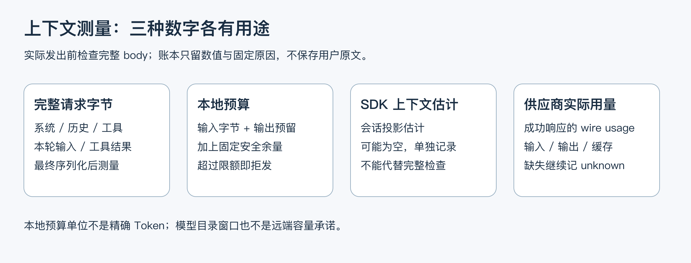
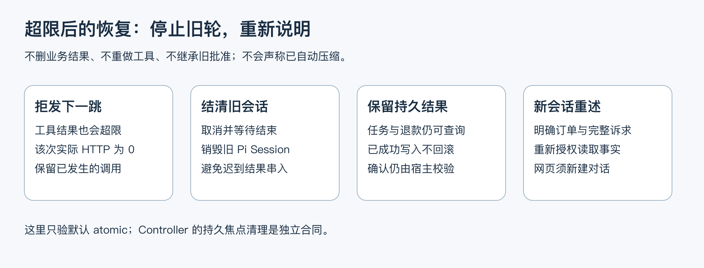

# 04.30｜长对话与上下文预算：测量、拒发和重新说明

用户说“只看这个订单”，不代表模型只收到这一句话。系统流程、工具定义、历史消息、刚返回的订单和规则也在请求里。一次工具调用可能返回很长的内容，使原本能发送的会话在下一跳超过限额。

本课回答四个面试追问：窗口多大，实际用了多少，何时采取措施，以及停止后怎样安全继续。dave-agent 本轮选择完整请求预算与新会话重述。自动语义摘要仍未实现；不能把停止和清空会话称为压缩质量已经得到验证。最终代码、参数、校准和批次结果见仓库 `docs/context-budget-contract.md`。



图 1：本地预算、SDK 估计和供应商实际用量分别回答不同问题，不能互相替代。

## 1. 先把三种数字讲清楚

| 数字 | 什么时候得到 | 用途与边界 |
| --- | --- | --- |
| 模型目录的 `contextWindow` | 选择模型时 | 本地声明的窗口上限；不是远端服务实时承诺 |
| Pi `getContextUsage()` | 会话已有消息时 | SDK 的会话投影估计，可能为空；不等于下一次完整 HTTP 请求的精确用量 |
| 最终请求字节与输出预留 | 序列化完成、真正发送前 | 本地准入依据，包含系统、历史、工具、用户输入及工具结果 |
| 响应中的 wire usage | 已发送请求返回后 | 记录供应商报告的输入、输出、缓存用量；流中断或 usage 缺失时保持未知 |

“模型支持 128K”不能直接回答“我们的系统实际用了多少”。演示时应展示本次配置、完整请求的测量记录和已返回的用量。模型目录随版本变化，不能靠背一个永久窗口数字替代运行快照。

## 2. 为什么先用保守预算，而不立即做摘要

客服历史中既有可以概括的闲聊，也有不能模糊的订单、金额、批准、方案编号和用户确认。通用摘要容易把“可以申请”压成“允许退款”，或者把旧状态当成当前事实。仅把上下文缩短，不会自动保留这些业务约束。

当前短会话项目先在真实发送边界加一个可解释的限制，超限后要求明确重述。代价是可能提前拒绝本来能放入供应商窗口的请求，用户需要重新说明；收益是没有新增摘要模型费用和一套尚未验证的摘要授权语义。

这是有边界的工程选择。若后续真实使用反复因长对话失败，再固定新的对照题，比较摘要保真、任务完成率、额外延迟和费用。不能因为面试问到 compression，就把未经验证的摘要加入退款主线。

## 3. 预算怎样计算

本轮策略名为 `utf8-byte-plus-output-v1`：

```text
输入预算单位 = 最终 JSON body 的 UTF-8 字节数
所需单位 = 输入预算单位 + body 中声明的输出 Token 预留 + 1024 余量
有效限额 = min(本次应用限额, 模型目录窗口)
允许发送：所需单位 <= 有效限额
```

正式默认限额为 **65,536**，`MODEL_CONTEXT_BUDGET_UNITS` 严格接受 4096..262144 的整数。付费前校准发现，原定 32,768 会截断正常退款历史；回放的最大所需单位为 33,889。默认值因此在运行真实批次前调整。四题验收使用独立的 **30,000**，用于检查拒发边界，不能把该参数下的结果推广为默认配置成绩。

这里的总和叫“本地预算单位”，不是实际消耗 Tokens。把每个输入字节按一单位计入是一种保守、易复现的策略；JSON 结构也在其中。它不提供精确 tokenizer 保证。实际默认值与本批校准值必须看配置及结果，不能混用。

输出预留读取最终 body 中唯一的 `max_tokens` 或 `max_completion_tokens`，要求合法正整数且不超过当前会话批准的输出上限。模型主调用通常最多 2048，网页可更低，咨询解析也有自己的上限。Pi 可能进一步缩小请求输出值，所以不能假定每次预留都等于 2048。字段缺失、冲突或未知格式应拒绝，不能偷偷按一个方便的默认数继续发送。

例如一个完整 body 为 18,000 字节，实际输出预留为 1,024，余量为 1,024，则所需单位为 20,048。应用限额为 24,576 且目录窗口更大时允许发送；工具结果增加 8,000 字节后，下一跳就超过应用限额。这个算例是教学数字，不是项目实测 Tokens。

## 4. 为什么检查必须落在 transport 前

只限制用户输入长度，拦不住系统提示、工具 schema 或检索结果增长。只在 `session.prompt()` 前看历史，又看不到随后工具返回的内容。实际守卫必须检查 Pi 和项目 hook 最终生成的请求，每次真正发出 HTTP 前都执行。

检查顺序应是：验证最终 body 与预算 → 记录允许发送的请求 → 调用底层 transport。拒发不新增实际 HTTP attempt；它记录固定原因与数值诊断。否则会出现“没有发出请求，但账本显示用过一次模型”的错误。

本项目的 `src/model-request-budget.ts` 同时负责正式消息的实际 HTTP 上限。一次消息可能经历多次模型推理、工具调用与重试，每次 HTTP 都计数；上下文拒发不能重置这份预算。超限信号需要先写入 task 状态，因为供应商 SDK 可能把原异常变成模型错误消息。宿主从固定状态识别原因，避免将其误报成普通网络重试。

日志只保留字节、预算、输出预留、模型元数据和固定失败原因。为了调试上下文，不应把用户长原文、工具完整结果、密钥或请求 header 放入正式账本。

## 5. 停止后怎样继续



图 2：新会话只重建语言上下文。已持久化的业务结果仍在数据库中，下一次查询重新授权读取。

| 入口 | 处理方式 | 用户下一步 |
| --- | --- | --- |
| QQ | 沿用失败路径，取消并等待旧工作结清，再销毁 Session | 下一条重新写明订单号和完整问题 |
| CLI | 等待旧调用结束，释放旧 Session，再由工厂创建新对象 | 不自动重试长输入；重新说明订单和诉求 |
| 网页 | 当前会话失效，原有历史和未知回执保留 | 新建对话；重开旧记录仍可能注入相同长历史 |

CLI 不能只清空 `session.messages`。订单选择状态绑定到 Session 对象；继续复用同一个对象，可能把旧焦点带入“那张订单”。换对象并重新授权读取，才能建立清楚的重述边界。

已经成功执行的工具不会因为最后一句解释失败而自动重做。商家任务和退款结果仍可按订单查询；用户确认、批准与幂等由原宿主和工具检查。不能把旧聊天中的“同意”迁移成新操作许可。

本轮恢复验收限定默认 atomic。Controller 候选可能从 MySQL 重新加载持久焦点，清掉 Pi 历史不代表清掉它。该候选若要实现自动清除，需要独立的版本、CAS、等待旧写入结束及实库合同，不能借用本课成绩。

## 6. 如何证明这一层确实生效

先用本机替代 HTTP 验证边界：系统、schema、用户输入和工具结果分别单独造成超限，实际 transport 都不能被调用；等于限额可发，超过一单位拒发；非法输出预留拒发；usage 缺失不补零；旧轮迟到工作不能继续发出请求。

再用预声明的新题做一次限额真实批次：短查询放行，长用户原文首跳拒发，长规则结果回填后下一跳拒发，新 Session 明确重述后恢复。长规则是声明过的长度故障注入，不能包装成真实线上事故。若模型没有选到预定规则工具，就如实记录该场未触达目标，不强制改题或重跑。

完整计划分母、请求预算、冻结源码、实际参数、结果、失败和费用保存到专项结果文档。零 HTTP 的拒发题有实际工程意义，但不能称为一次成功远程模型调用。CLI / QQ / 网页的替代传输检查、真实模型、真实 MySQL 和真实 QQ 也分别说明。

## 7. 本次结果怎样准确讲述

本批四个预声明路径全部符合合同：短查询2次HTTP、长用户输入0次、工具结果膨胀2次后拒发、新Session重述2次，共6次实际请求。两条已生成答复经Codex独立审阅通过；两条拒发题没有伪造模型回答。合计22,001 Tokens，目录估算USD 0.001341372，用量和费用无未知。

这些结果对应验收限额30000、只读合成Store与生产Pi请求构造。正式默认是65536；默认值来自前置离线校准，不能把测试阈值的效果推广给默认值。三入口恢复的工程检查另列，真实模型批次不是QQ/数据库或完整网页验收。详细版本、输入、测量与局限集中在仓库 `docs/context-budget-contract.md` 和 `data/context-budget-results-20261010.json`，后续改代码时不复制旧分数。

## 练习与面试回答

拿一条“查订单 → 查规则 → 回答”的轨迹，标出三次请求各自包含什么。随后假设第二个工具返回长文：哪个位置拒发，之前已经发生的工具能否重做，用户重开原历史为什么仍可能失败？最后从 `src/cli.ts`、`src/qq-agent.ts` 和 `src/web-chat.ts` 找出恢复入口。

可以这样回答：“我们测量最终请求，而不是只数聊天字数。当前使用明确命名的保守本地预算，保留输出余量，每次 HTTP 前检查。超限就结清旧轮并让用户在新会话明确重述，持久业务结果重新授权查询。自动摘要还没有准入；若要做，必须验证订单、金额、批准、确认和时间条件不会被摘要改变。”

这能解释当前实现和代价，但不能证明自动压缩质量、超大窗口性能、多机全局费用硬限制或商业生产稳定性。
