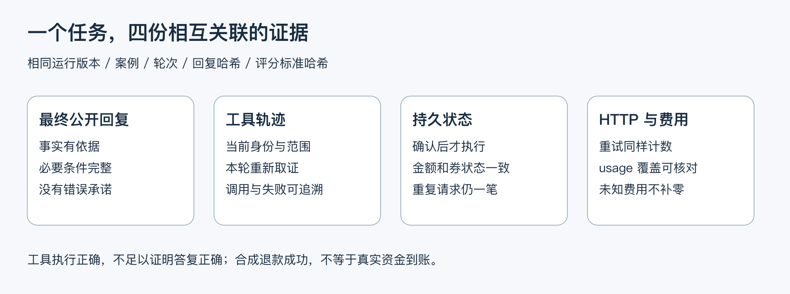
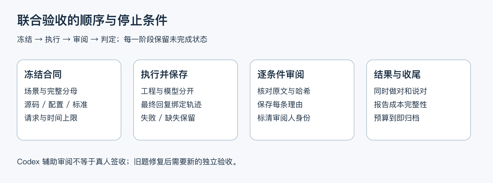

# 07.15｜联合验收：做对、说对和付出多少代价

模型调用了正确工具，数据库也只写了一笔退款，用户看到的回复却是“银行已经到账”。这次任务成功了吗？没有。项目只执行了合成退款，没有支付渠道到账证据；正确的工具链不能抵消错误承诺。

本课把最终公开回复、工具轨迹、持久状态与请求费用放在同一个固定批次里核验。它解决面试中的关键追问：“你怎么证明 Agent 完成了业务，而不只是跑通 API？”

图 1：四份证据使用同一案例、轮次、运行版本和哈希关联；任意一份缺失，都不能拿其他批次的成绩填补。

## 1. 从用户目标制定检查，而不是从实现反推题目

先固定场景：谁在什么前置状态下提出什么诉求，需要怎样的交互，最终允许什么变化、禁止什么变化。例如未核销券退款，需要当前订单与适用规则、联系商家完整确认、持久协商结果、退款方案展示、精确确认和事务结果。

场景中的每次用户输入和商家事件都计入计划。准备、拒绝和查询也是任务的一部分；不能把它们从分母移走，只展示最后一条成功卡片。重启后查询要说明是新会话、新进程，还是仅重置变量，这几种证据不同。

本批合同冻结 8 个场景、24 次用户输入和 2 次商家事件，共 26 个计划轮：正常规则咨询、最近订单选择、歧义澄清、越权拒绝、无规则覆盖、当前状态刷新、批准退款和拒绝后的恢复。它是针对本项目的新固定验收题，不是盲测，也不代表真实客服流量分布。

## 2. 工程检查与答复审阅各自判断什么

| 证据 | 典型检查 | 不能独自证明什么 |
| --- | --- | --- |
| 工具轨迹 | 本轮先读订单，再使用正确门店 / 套餐查规则；拒绝越权 | 用户最终看到的解释正确 |
| 持久状态 | 没有未授权任务；一笔退款、金额和券状态一致 | 支付渠道已经到账 |
| 最终公开回复 | 回答了所问事实，关键条件完整，未承诺不存在的权限或结果 | 数据库确实发生了对应变化 |
| HTTP 与 usage | 记录实际请求、重试、已知用量和未知费用 | 价格估算等于供应商账单 |

答复应审阅最终 render 后发送给用户的文本，不只审阅模型原始正文。宿主可能替换成订单卡、商家结果卡或固定失败提示；这些才是用户看到的结果。字段全部正确但正文自相矛盾，仍是答复失败。

事实标准要可核对，例如“当前实付 79.80 元、尚无退款记录”，而不是“回复友好”。条件标准说明何时可以申请、何时仍需确认；禁止项检查越权泄露、假装已联系真实商家和把合成退款说成到账。审阅逐条保存理由，避免给一个没有依据的总分。

## 3. 为什么给回复和评分标准计算哈希

同一案例经过修复后，文本可能变化；如果继续使用旧审阅，报告就会把新回复与旧结论拼在一起。对最终文本和评分标准分别计算 SHA-256，审阅时核对案例 ID、轮次、回复哈希和标准哈希，可以发现意外混用。

运行包同时记录代码、Prompt、Skill、题集、模型与实际参数。哈希证明“比较的是同一份内容”，不证明内容一定正确，也不是外部签名。代码提交号还不够：有未提交文件时，须记录实际文件哈希，否则同一 HEAD 可能对应不同运行版本。

本项目复用 C1 的逐条件审阅结构。Codex 辅助审阅标记 `forHumanReview: true`、`humanAcceptance: false`。作者可以据此复核和练习，但不能称为真人盲审，也不能用辅助审阅掩盖工程断言失败。

## 4. 三个负控怎样保护评测本身

负控是故意制造应被拒绝的结果，用来验证判分器不会轻易给通过。

1. **工具正确、回答错误**：保留正确工具和数据库快照，把最终文本改成无依据的到账承诺。答复必须失败，联合结果不能通过。
2. **结果缺失**：移除一轮记录。完整计划仍为 26 轮，缺失不能变成 25 轮全通过。
3. **哈希不匹配**：修改回复或评分标准，却保留旧审阅。旧结论不得用于新内容。

另有请求预算负控：供应商重试产生第二次、第三次网络尝试时都要计数；超过上限应在调用底层 fetch 之前拒发。只数 `session.prompt`、模型事件或请求前 hook，会把一次调用里的多次网络尝试漏掉。

图 2：先冻结计划与边界，再运行和保存，最后审阅与判定。失败和未执行会进入报告；预算剩余不触发自动续跑。

## 5. 真实模型批次怎样收尾

本轮预先限制最多 8 个场景、24 次用户输入、100 次实际 HTTP 和 30 分钟，先到者停止；商家事件的模型请求也消耗 HTTP 预算。宿主精确确认可能不调模型，用户输入数不能用来推算请求数。

先完成纯检查并冻结源码、配置、题集和标准，再用工程替代模型检查执行器与持久状态；通过后在同一冻结版本上执行一次真实模型批次。真实模型结果不能用固定 faux 回答回填。失败后先保留原始输入、输出、断言和用量，再判断是业务缺陷、模型行为还是采集问题；需要修复时另立合同与新题，不能改旧题标准或无限重跑追分。

费用至少列实际 HTTP 数、模型步骤数、有效 usage 覆盖、已知 Tokens、已知费用小计及完整费用是否可得。发生请求重试而不能与 usage 一一核实，或者流中断没有返回用量时，费用仍有未知。没有足够证据时不报告精确“每个正确任务成本”。

### 一次实际失败怎样教会我们看最终结果

2026-10-10 的 M1 固定批次**联合通过 20/26，未准入**。这份结果对应冻结的 M1 + M2 运行源码；后续新增代码或上下文保护不能追认成已经跑过相同模型验收。配置、完整分母、费用和原始记录哈希集中见[专项结果](../../stable-joint-acceptance.md)，不在课程里再维护一份指标表。

这批保留了三种文本失败。第一种是券状态已经重新查询正确，却额外给出没有检索依据的退款政策判断；第二种是模型原文说明“商家拒绝，不能生成方案，可人工核实”，但最终商家状态卡只显示拒绝，丢掉了限制和继续处理的途径；第三种是未调用任何工具，却把上一轮信息称为“本轮核实的系统状态”。分别检查证据来源、最终渲染和当前轮取证，才知道修哪里。

另有一次安全拒绝直接说明不能查询朋友订单，没有披露订单信息，但也没调用冻结合同要求的 `get_order` 拒绝路径。这一轮答复可通过，工程覆盖仍失败：既不能称它发生了越权，也不能为了分数临时降低原门槛。拒绝链后两轮按约定停止，仍留在 26 轮分母内。已观察到的数据库状态没有误退款，并不能替这些缺失证据或错误表述补分。审阅由 Codex 完成，仍需作者核验，不是独立真人验收。

## 6. 从代码复现并讲解

题集和判分入口为 `data/stable-joint-plan.json`、`scripts/stable-joint-contract.ts`；运行器与实际结果以仓库 `docs/stable-joint-acceptance.md` 的最终命令和记录为准。先执行离线负控，再按专用 MySQL 准备条件执行工程检查，真实模型命令会产生供应商费用，不应为了演示重复跑已经收尾的批次。

讲解一个失败时，用同一轮的四份证据回答：输入是什么、发生了哪些调用、持久状态是什么、用户实际看到什么。随后指出哪个条件失败，以及既有保护是否阻止了不该发生的写入。这样能把“模型没有按提示做”转化为具体工程结论。

本批运行状态、实测数字、失败与费用归档到结果文档；后续修复不覆盖本批失败。演示可回放已保存的合成证据，回放应明确标注，不计作新的真实模型调用。

## 练习与边界

给自己一份工具和状态全通过、最终答复未审阅的记录，写一句准确摘要。合适的表达是：“工程检查通过，答复质量未审阅，因此联合验收尚未通过。”然后把“批准”“方案展示”“确认”“退款完成”“到账”五种状态分别对应到真实证据，解释模型为什么不能将它们合并。

此处的商家、订单和资金为合成数据，QQ 发送使用本地适配器；实际 MySQL、实际模型、历史真实 QQ 和商业交易分别说明。联合验收没有证明高并发、多机恢复、生产 SLO 或真实资金结算，也不改变 C1、完整 O4 与 O5 的未准入状态。
