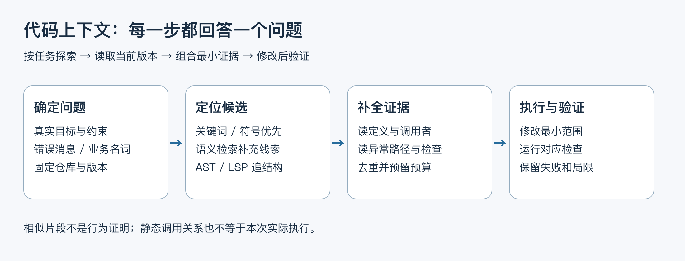
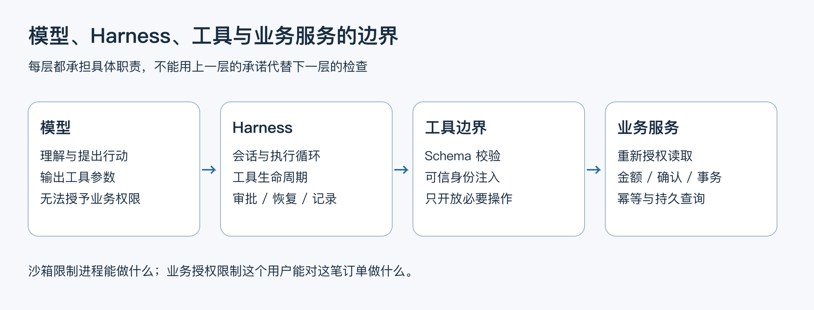

# 08.10｜选修：Coding Agent 怎样找代码、执行并验证

面试官问“几十万行代码放不进上下文怎么办”，并不是要求背出向量数据库、AST 和调用链三个名词。真正的问题是：当前任务需要哪些证据，如何找到它们，能否在有限上下文内修改正确的位置，并用检查证明修改有效。

本项目是客服 Agent，没有实现大型仓库索引或 Coding Agent。下面用 dave-agent 自身作为阅读对象，练习“搜索 → 补全证据 → 修改 → 验证”的方法。关键词搜索可以直接使用；向量索引、语法分析和调用图是本课讨论的设计选项，不是本项目已交付的能力。



图 1：检索只产生候选，必须通过读取定义、调用者与检查补成当前任务的证据。预算不足时逐步探索，不把整个仓库塞入请求。

## 1. 先把任务变成可搜索的线索

例如“退款重复确认会不会产生第二条记录”，先从业务名词寻找确认入口、RefundStore 和幂等检查。已知精确符号时，用关键词或符号查询比向量召回更直接；只知道“网络断开后不能再退款”这类自然语言描述时，语义检索可能提供线索，但召回片段本身不能证明行为。

```sh
rg -n 'confirmRefund|confirm\(|class .*Refund|succeeded' src/refunds.ts src/refund-entry.ts src/qq-agent.ts scripts
rg -n 'commit\(|rollback\(|FOR UPDATE|refunds' src/refunds.ts
rg -n 'checkAtomicRefundRecovery|atomic-refund-recovery|refund-crash-window' scripts docs
```

命令需在仓库根目录执行。某个路径或符号随版本改名时，先用 `rg --files src scripts` 定位；无匹配是需要调整搜索线索的结果，不能凭旧文档补造实现。阅读时记录当前提交和未提交差异，避免把另一分支的片段拼成同一个运行系统。

第一轮只找入口。第二轮读函数周围的控制流和异常处理。第三轮追调用者、依赖与检查，弄清返回值在哪一层展示、失败后是否重试，以及工具和宿主谁持有授权。每次读取应回答一个明确问题，避免无限扩大上下文。

## 2. 四类技术分别解决什么

| 方法 | 擅长什么 | 主要限制 |
| --- | --- | --- |
| 关键词 / 文件搜索 | 精确标识符、错误消息、配置名、SQL 表名 | 用户描述与代码命名不同会漏召回 |
| 向量检索 | 自然语言与不同命名之间的语义线索 | 相似不等于适用，需回读当前源文件；索引可能过期 |
| AST 分析 | AST 是抽象语法树，可识别函数、类、导入、语法范围，辅助结构化改写 | 语法树本身不能完整解析跨模块类型或运行时调用 |
| LSP / 静态引用分析 | LSP 是语言服务器协议，可向语言服务查询定义、引用、类型及调用层次 | 具体能力依赖语言服务与工程配置；反射、动态分派和生成代码仍有盲点 |

运行时追踪回答“这次请求实际调用了谁”，静态调用图回答“哪些路径可能可达”。两者不能互相替代：一次追踪没经过某条分支，不代表那条分支不存在；静态图可达，也不代表此次发生了调用。

对当前小型 TypeScript 仓库，文件与关键词搜索、类型检查和专项检查已能完成大量任务。只有出现明确漏召回和阅读成本证据，才值得引入长期索引。索引方案还需要说明仓库、分支、提交、文件哈希、增量更新和删除；不能把旧分支的嵌入结果当当前实现。

## 3. 怎样组装当前任务的上下文

优先放入：用户的真实目标与约束、被修改的定义、关键调用者、相关类型、失败证据、需要保持的业务不变量，以及最小相关检查。完整日志和大文件可以留在工具中按需再读，不必一次全部发送。

组装时按文件与范围去重，保留路径、行号和版本；读取片段太短导致缺少异常处理时补读上下文，而不是让模型猜。给输出和后续工具结果预留空间，超预算时缩小探索步骤，不能删除身份、金额和幂等约束换取更多代码。

修改后至少追问：调用者是否仍满足新契约，失败路径是否改变，检查能否捕获原始缺陷。针对退款事务，还需要真实数据库的事务与故障窗口验证；TypeScript 编译通过不能证明提交后断连安全。

## 4. Harness 到底负责什么



图 2：模型提出行动；Harness 管理会话、工具、执行、恢复与权限交互；业务服务继续负责身份、金额和幂等。不同层的职责不能通过一张工具白名单互相替代。

Harness 可以理解为让模型持续执行任务的运行环境。它负责把对话、工具结果和执行状态送回模型，并处理工具调用与人类交互。模型有工具调用能力，不等于已经具备可靠恢复、权限控制和正确验证。恢复会话、限制命令执行、要求操作审批，也不意味着底层业务服务可以省略订单归属和幂等检查。

| 对象 | 官方资料描述的重点 | 学习时应检查的具体问题 |
| --- | --- | --- |
| Claude Code | 收集上下文、行动、验证的循环；使用文件、搜索、终端等工具，并提供权限规则 | 工具请求怎样获准，哪些操作受沙箱约束，何时读取更多文件与执行检查 |
| OpenCode | 可配置工具与 allow / ask / deny 权限；文档提供需启用的实验性 LSP 工具 | 工具是否启用、权限具体应用到哪里、语言服务是否正确初始化 |
| Codex | Harness 用于 app、CLI、IDE；app-server 提供线程、轮次、事件与审批协议；沙箱与审批分工 | 宿主接入哪些协议事件，如何设置执行边界，重连后如何恢复可见状态 |
| dave-agent 复用 Pi | 复用模型 / 工具循环和会话生命周期，宿主只注册客服工具 | 哪些来自 SDK，哪些是自己实现的可信身份、业务状态、展示确认与评测 |

此表比较职责，不比较谁“最强”。官方提供某个工具，不等于自动拥有完整仓库调用图；配置工具白名单，也不等于操作系统沙箱。尤其不要把 Claude Code 笼统称作开源 Harness；引用源码时必须先核对具体仓库、组件与许可证。

对 dave-agent，个人实现聚焦可信身份、业务控制、工具边界、证据接收、售后恢复和评测；模型与工具循环、会话生命周期复用 Pi。面试时可以解释这些宿主工程为何重要，但不要把客服工具注册说成自己实现了文件检索、命令沙箱或 Coding Agent。

## 5. 带着问题读一条源码链

以“同一退款方案重复确认会不会生成第二条退款”为例，不能看到函数名包含 `confirm` 就结束。需要先找到宿主接收用户确认的入口，再读数据库写入路径，最后检查返回结果如何呈现。

当前入口 `confirmRefundReply` 只接受完整的“确认退款 操作编号”，然后调用 `RefundStore.confirm`。确认函数把真正的写入作为回调交给 `withOperation`。下面是这个共享入口的完整源码：

```ts
private async withOperation(identity: QQIdentity, sourceKey: string, operationId: string,
  action: (connection: PoolConnection, order: RowDataPacket, row: RowDataPacket) => Promise<RefundOperation>): Promise<RefundOperation> {
  validate(identity, sourceKey);
  if (!uuid.test(operationId)) throw new BusinessError(unavailable);
  return this.controlled(async () => {
    const [lookup] = await this.pool.execute<RowDataPacket[]>("SELECT order_id FROM refund_operations WHERE operation_id = ?", [operationId]);
    if (!lookup[0]) throw new BusinessError(unavailable);
    return this.transaction(async connection => {
      const order = await this.lockOrder(connection, identity, lookup[0]!.order_id as string);
      const row = await this.current(connection, identity, sourceKey, order);
      if (!row || row.operation_id !== operationId) throw new BusinessError(unavailable);
      if (row.status === "succeeded") return operation(row);
      if (!row.valid) throw new BusinessError("退款方案已过期，请重新获取方案并确认新的操作编号。");
      return action(connection, order, row);
    });
  });
}
```

第一条查询只是用操作编号找到订单，尚未授予权限。进入事务后，`lockOrder` 重新核对可信身份与订单归属；`current` 还会核对退款方案的客户、应用、发送者及会话来源。操作编号相同且状态已成功时，直接返回既有结果，不再进入退款写入回调。只有未成功、未过期的当前方案才继续执行。

读到这里还不能断言并发确认安全：两个请求可能同时看到“未成功”。所以下一步必须追到 `lockOrder`，看它是否真的取得数据库锁，而不是相信函数名字：

```ts
private async lockOrder(connection: PoolConnection, identity: QQIdentity, orderId: string) {
  // Every D2 mutation first locks the same order; concurrent confirmations cannot both execute.
  const [rows] = await connection.execute<RowDataPacket[]>(`SELECT o.* FROM orders o
    JOIN qq_identities q ON q.customer_id = o.customer_id JOIN merchant_demo_scenarios s ON s.order_id = o.id
    WHERE o.id = ? AND q.app_id = ? AND q.sender_id = ? FOR UPDATE OF o FOR SHARE OF q, s`, [orderId, identity.appId, identity.senderId]);
  if (!rows[0]) throw new BusinessError(unavailable);
  return rows[0];
}
```

`FOR UPDATE OF o` 让同一订单的写入按顺序取得订单行锁；身份关联表同时被读取和锁定。前一个事务提交后，后一个请求才能继续，在事务内重新读取方案状态。真正执行退款时，退款记录、订单、券与操作状态在同一事务中更新。这是并发幂等所依赖的范围，不能推广为外部支付接口也“恰好执行一次”。

最后还要读事务提交、回滚和入口的失败提示。数据库已提交但回执未返回时，用户看到超时并不等于没有退款；正确动作是按订单查询持久结果。只有把入口、锁、状态、写入和失败提示放在一起，才组成回答这个问题所需的代码上下文。

这就是按任务取证的含义：没有把整个仓库读一遍，但也没有只拿一个相似代码块就宣布结论。上述退款与事务代码是本项目已有实现；用向量索引或语言服务自动完成这条探索链仍是设计练习。

## 6. 最小练习：从证据到可验证结论

1. 用搜索找精确确认的宿主入口，解释为什么模型工具不能自行确认。
2. 追到事务，写出身份、归属、批准期限、金额和当前状态的检查顺序。
3. 找出退款记录与操作状态怎样一同提交，再读重复请求如何返回同一结果。
4. 找到成功检查与失败检查；区别正常重启查询和事务提交窗口的进程终止验证。
5. 记录一条结论及局限，例如“本地 MySQL 合成退款验证幂等，不代表真实支付网关 exactly-once”。

交付只需一页源码路线与检查结果。若为了这项练习先搭一个向量服务、图数据库和多 Agent 调度器，投入尚没有对应收益。未来仓库规模与失败证据确实需要它们时，再用检索召回率、定位时间和修改正确率比较增量价值。

面试时可以这样回答：“我会先把任务变成符号、错误信息和业务约束，用文件搜索定位入口；缺少线索时再用语义召回。候选片段要回读当前源文件，补上调用者、异常路径和检查。AST 或语言服务帮助找结构，但不能代替运行结果。修改后按影响范围验证，涉及事务就补数据库检查。我的客服项目实现了业务边界与评测，没有实现大型仓库索引，后者是基于这些经验提出的设计方案。”

## 参考与实现边界

本仓库入口：`src/agent.ts`、`src/qq-agent.ts`、`src/refunds.ts`、`scripts/atomic-refund-recovery-db-check.ts`、`scripts/refund-crash-window-check.ts`；后者的两个真实 MySQL 受控终止窗口已有[独立结果](../../refund-crash-window-validation.md)，不与正常退出后查询混算。实际检查以对应冻结源码和记录为准。外部产品仅作职责比较，不是本项目已实现能力、实测结果或对招聘公司的内部系统描述。

外部资料于 2026-10-10 查阅，均为可能继续更新的官方文档；本课没有安装或横向测评这些产品，不给出固定版本性能排名。[Claude Code 的运行说明](https://code.claude.com/docs/en/how-claude-code-works)和[权限文档](https://code.claude.com/docs/en/permissions)介绍循环与权限；[OpenCode 工具文档](https://docs.opencode.ai/docs/tools/)介绍工具权限及实验性 LSP 范围；[Codex 官方 Harness 文章](https://developers.openai.com/blog/codex-as-a-platform)介绍 app-server 与宿主职责，[沙箱说明](https://learn.chatgpt.com/docs/sandboxing)区分执行边界和审批。
